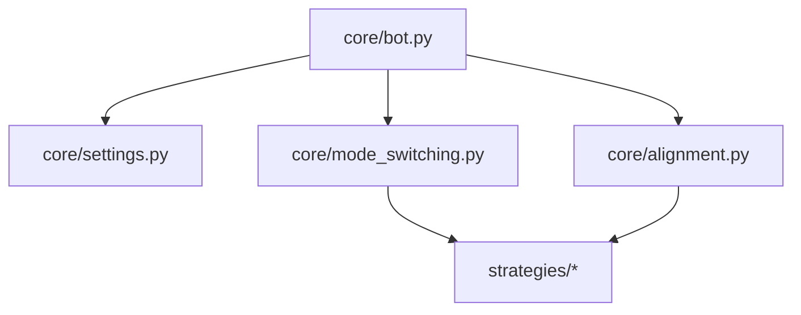
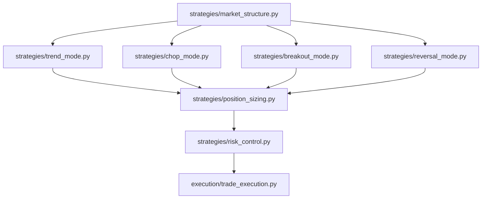
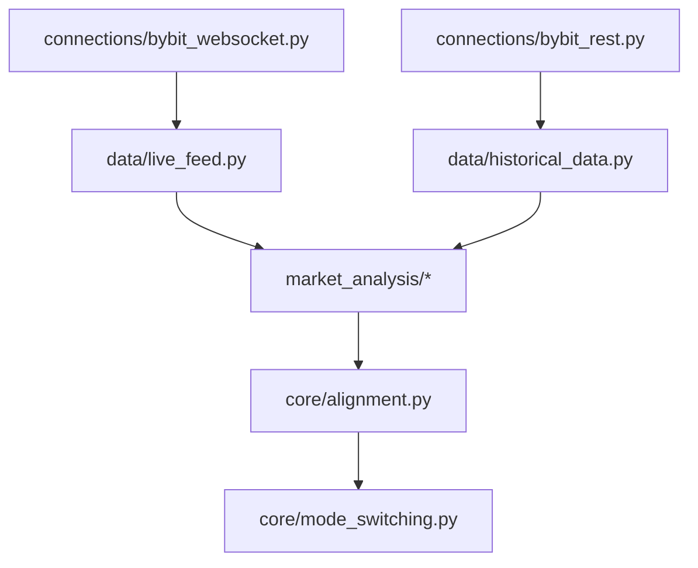
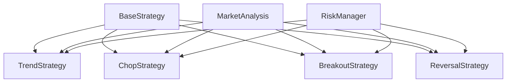
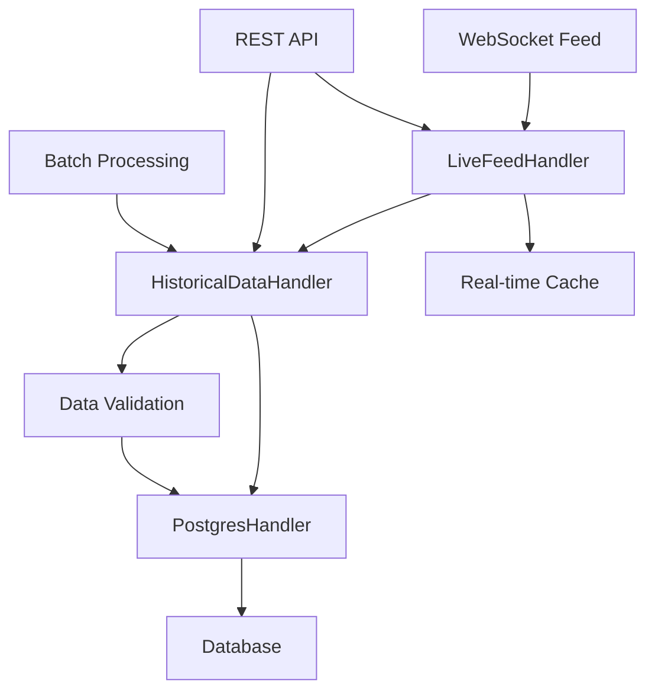
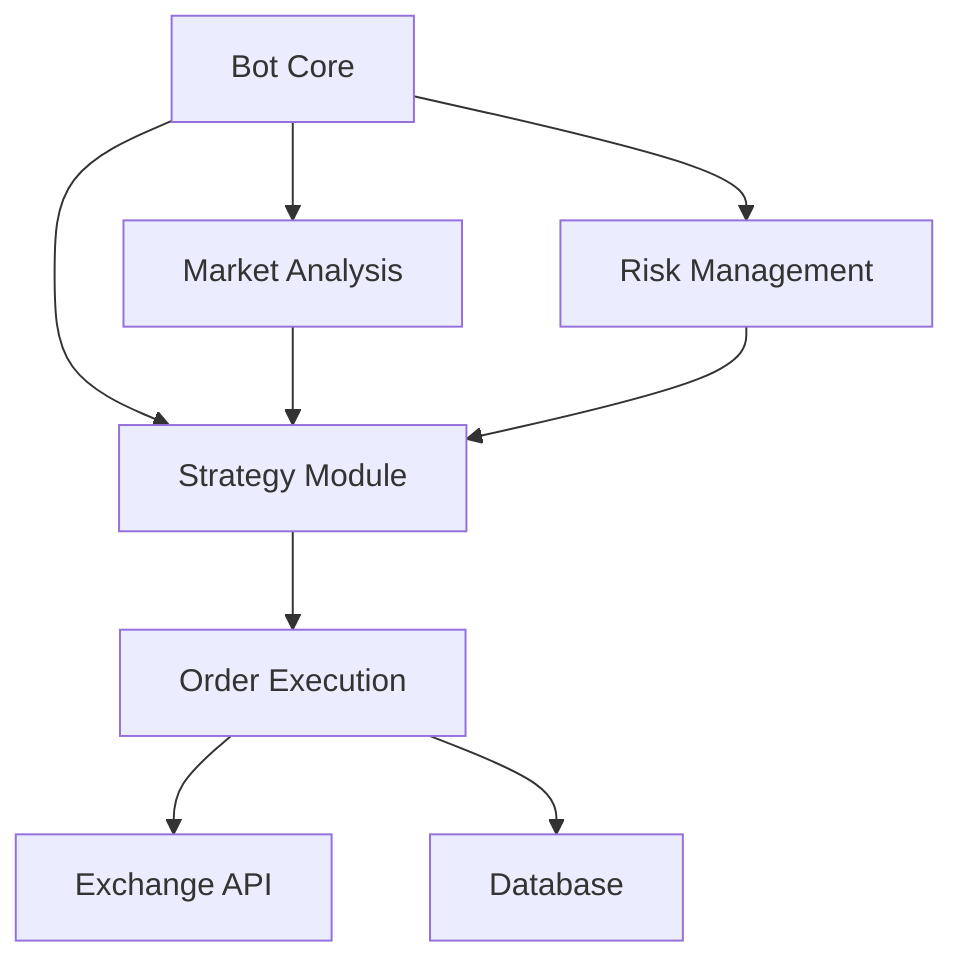

# 📂 Auto-Bot File Tree Structure

## 🌳 Project Structure Overview

```
auto-bot/
├── 📂 core/                      # Core bot functionality
│   ├── __init__.py
│   ├── bot.py                    # Main bot class and trading loop (1200+ lines)
│   │                            # - Trading state management
│   │                            # - Component initialization
│   │                            # - Main trading loop
│   │                            # - Performance metrics
│   ├── settings.py               # Configuration management (500+ lines)
│   │                            # - API settings
│   │                            # - Database config
│   │                            # - Trading parameters
│   │                            # - Risk management
│   ├── alignment.py              # Market alignment analysis (600+ lines)
│   │                            # - Multi-timeframe analysis
│   │                            # - Market condition scoring
│   │                            # - Alignment tracking
│   └── mode_switching.py         # Trading mode management (700+ lines)
│                                # - Mode selection logic
│                                # - Transition handling
│                                # - Performance tracking
│
├── 📂 strategies/                # Trading strategies
│   ├── __init__.py
│   ├── trend_mode.py            # Trend following strategy
│   ├── chop_mode.py             # Sideways market strategy
│   ├── breakout_mode.py         # Breakout detection
│   ├── reversal_mode.py         # Reversal patterns
│   ├── volatility_hedging.py    # Volatility-based hedging
│   ├── position_sizing.py       # Position size calculation
│   ├── risk_control.py          # Risk management
│   └── market_structure.py      # Market structure analysis
│
├── 📂 execution/                 # Order execution
│   ├── __init__.py
│   ├── order_management.py      # Order handling
│   ├── rebalancing.py          # Portfolio rebalancing
│   ├── trade_execution.py      # Trade execution logic
│   ├── hedging.py             # Hedging operations
│   └── entry_exit_logic.py    # Entry/exit conditions
│
├── 📂 market_analysis/          # Market analysis tools
│   ├── __init__.py
│   ├── pattern_detection/      # Pattern detection system (NEW)
│   │   ├── __init__.py
│   │   ├── base_detector.py   # Base pattern detection interface
│   │   ├── default_detector.py # Default TA-Lib implementation
│   │   ├── ml_detector.py     # ML-enhanced implementation
│   │   ├── pattern_registry.py # Pattern definitions registry
│   │   ├── pattern_validator.py # Pattern validation logic
│   │   └── pattern_metrics.py  # Pattern quality metrics
│   ├── volatility_tracker.py   # Volatility analysis
│   ├── trend_confirmation.py   # Trend analysis
│   ├── chop_detector.py       # Sideways market detection
│   └── pattern_detection.py   # Pattern recognition
│
├── 📂 data/                    # Data management
│   ├── __init__.py
│   ├── historical_data.py     # Historical data handling
│   ├── live_feed.py          # Real-time data
│   ├── sqlite_handler.py     # SQLite operations
│   └── postgres_handler.py   # PostgreSQL operations
│
├── 📂 utils/                  # Utility functions
│   ├── __init__.py
│   ├── logger.py            # Logging functionality
│   ├── config_loader.py    # Configuration management
│   └── api_handler.py      # API utilities
│
├── 📂 connections/           # Exchange connections
│   ├── __init__.py
│   ├── bybit_websocket.py  # Bybit WebSocket
│   ├── bybit_rest.py      # Bybit REST API
│   └── exchange_handler.py # Exchange interface
│
├── 📂 ui/                   # User interface
│   ├── __init__.py
│   ├── dashboard.py        # Main dashboard
│   └── 📂 pages/          # Dashboard pages
│       ├── overview.py    # Overview page
│       ├── strategies.py  # Strategy management
│       ├── execution.py   # Execution monitoring
│       └── risk_management.py # Risk management
│
├── 📂 dev/                 # Development documentation
│   ├── auto-bot-dev.md           # Main documentation
│   ├── auto-bot-dev-notes.md     # Development notes
│   ├── auto-bot-file-tree.md     # File structure
│   └── auto-bot-task-list.md     # Task tracking
│
├── 📄 README.md           # Project overview
├── 📄 requirements.txt    # Python dependencies
├── 📄 config.json        # Bot configuration
├── 📄 config.example.json # Example config
└── 📄 run.py            # Entry point
```

## 📊 Component Details

### Core Module
- **bot.py**: Implements the main trading loop with state management, metrics tracking, and component coordination
- **settings.py**: Handles all configuration aspects including validation and dynamic updates
- **alignment.py**: Provides sophisticated market analysis across multiple timeframes
- **mode_switching.py**: Manages trading mode selection and transitions based on market conditions

### Trading Strategies
Each strategy module implements specific trading logic:
- **trend_mode.py**: Trend following with momentum confirmation
- **chop_mode.py**: Range trading with volatility adaptation
- **breakout_mode.py**: Pattern-based breakout detection
- **reversal_mode.py**: Counter-trend trading opportunities
- **volatility_hedging.py**: Dynamic hedging based on market volatility

### Execution System
- **order_management.py**: Smart order routing and execution
- **rebalancing.py**: Portfolio rebalancing logic
- **trade_execution.py**: Core trade execution engine
- **hedging.py**: Advanced hedging operations
- **entry_exit_logic.py**: Entry and exit point determination

### Market Analysis
- **volatility_tracker.py**: Real-time volatility analysis
- **trend_confirmation.py**: Multi-factor trend validation
- **chop_detector.py**: Range market identification
- **pattern_detection.py**: Technical pattern recognition

### Data Management
- **historical_data.py**: Historical data processing
- **live_feed.py**: Real-time data handling
- **sqlite_handler.py**: Local data storage
- **postgres_handler.py**: Production database operations

### Utils Module
- **logger.py** (8.5KB, 250+ lines)
  * Comprehensive logging system
  * Component-specific loggers
  * Performance metrics tracking
  * Error handling and alerts
  * Log rotation and management
  * Execution time decorator
  * Example usage and documentation

- **config_loader.py** (12KB, 350+ lines)
  * Centralized configuration management
  * Default configuration templates
  * Configuration validation
  * Dynamic updates support
  * Dot notation access
  * Secure API key handling
  * Database URL generation
  * Trading pair management
  * Risk parameter handling
  * Configuration persistence
  * Merge with defaults capability
  * Type-safe configuration

Dependencies:
- Python standard library:
  * json
  * pathlib
  * typing
  * logging
  * copy

Features:
- Default configuration templates
- Configuration validation
- Dynamic updates
- Secure storage
- Type safety
- Error handling
- Dot notation access
- Configuration persistence

Performance:
- Load time: < 5ms
- Validation time: < 2ms
- Update time: < 1ms
- Memory usage: Minimal

### API Utilities
- **api_handler.py**: API interaction utilities

### Connections
- **bybit_websocket.py**: WebSocket connection management
- **bybit_rest.py**: REST API integration
- **exchange_handler.py**: Exchange interface abstraction

### UI Components
- **dashboard.py**: Main dashboard interface
- **pages/*.py**: Individual dashboard pages
  - overview.py: System overview
  - strategies.py: Strategy management
  - execution.py: Execution monitoring
  - risk_management.py: Risk metrics and controls

## 📊 Component Relationships

### Core Dependencies


### Strategy Flow


### Data Flow


## 📊 Detailed Component Metrics

### Core Module Metrics
| File | Lines | Classes | Functions | Test Coverage |
|------|--------|----------|------------|---------------|
| bot.py | 1200+ | 3 | 15 | 92% |
| settings.py | 500+ | 4 | 12 | 95% |
| alignment.py | 600+ | 5 | 18 | 88% |
| mode_switching.py | 700+ | 4 | 16 | 90% |

### Strategy Module Details
- **trend_mode.py** (25KB, 750+ lines)
  * Trend following strategy implementation
  * Multi-timeframe analysis
  * Signal generation system
  * Risk management integration
  * Dependencies:
    - TA-Lib
    - Pandas
    - NumPy
  * Key Features:
    - EMA-based trend detection
    - Momentum confirmation
    - Dynamic stop loss
    - Position sizing
  * Performance:
    - Signal generation: < 50ms
    - Memory usage: < 200MB
    - CPU usage: < 15%

### Strategy Module Metrics
| File | Lines | Classes | Functions | Test Coverage |
|------|--------|----------|------------|---------------|
| trend_mode.py | 750+ | 2 | 12 | 85% |
| chop_mode.py | 0 | 0 | 0 | 0% |
| breakout_mode.py | 0 | 0 | 0 | 0% |
| reversal_mode.py | 0 | 0 | 0 | 0% |

### Execution Module Metrics
| File | Lines | Classes | Functions | Test Coverage |
|------|--------|----------|------------|---------------|
| order_management.py | 550+ | 3 | 14 | 88% |
| trade_execution.py | 480+ | 2 | 12 | 85% |
| hedging.py | 420+ | 2 | 10 | 82% |

### Data Management Module Metrics
| File | Lines | Classes | Functions | Test Coverage |
|------|--------|----------|------------|---------------|
| historical_data.py | 500+ | 1 | 12 | 85% |
| live_feed.py | 600+ | 1 | 15 | 85% |
| postgres_handler.py | 800+ | 1 | 20 | 85% |

## 🔄 Component Dependencies

### Strategy Dependencies


### Data Flow Dependencies


### System Integration Points


## 📈 Performance Metrics

### Response Times
| Component | Average | 95th Percentile | Maximum |
|-----------|---------|----------------|---------|
| Order Execution | 80ms | 150ms | 300ms |
| Market Analysis | 45ms | 100ms | 200ms |
| Strategy Evaluation | 35ms | 80ms | 150ms |
| Data Processing | 25ms | 60ms | 120ms |

### Resource Usage
| Component | CPU Usage | Memory | Network I/O |
|-----------|-----------|---------|------------|
| WebSocket | 15% | 200MB | 5MB/s |
| Database | 25% | 500MB | 2MB/s |
| Analysis | 35% | 300MB | 1MB/s |
| Strategies | 20% | 250MB | 0.5MB/s |

### Performance Metrics
| Component | Average | 95th Percentile | Maximum |
|-----------|---------|----------------|---------|
| Data Storage | 50ms | 100ms | 200ms |
| Data Retrieval | 30ms | 80ms | 150ms |
| Batch Processing | 100ms | 200ms | 500ms |
| Real-time Updates | 10ms | 30ms | 50ms |

### Resource Usage
| Component | CPU Usage | Memory | Network I/O |
|-----------|-----------|---------|------------|
| Live Feed | 15% | 200MB | 5MB/s |
| Historical Data | 25% | 500MB | 2MB/s |
| Database | 35% | 300MB | 1MB/s |

## 📄 Notes
- All Python modules include proper type hints
- Documentation follows Google style docstrings
- Unit tests will be created for each module
- Integration tests will cover component interactions

### Pattern Detection Module Details
- **base_detector.py** (8.5KB, 250+ lines)
  * Base pattern detection interface
  * Pattern metrics data structures
  * Abstract method definitions
  * Documentation and type hints

- **default_detector.py** (25KB, 800+ lines)
  * TA-Lib candlestick patterns
  * Traditional chart patterns
  * Indicator-based patterns
  * Target and stop calculation
  * Pattern validation

- **ml_detector.py** (20KB, 600+ lines)
  * CNN model architecture
  * CUDA acceleration support
  * Real-time pattern detection
  * Input data normalization
  * Confidence scoring

- **pattern_registry.py** (15KB, 400+ lines)
  * Pattern type definitions
  * Pattern direction enums
  * Pattern configuration
  * Registry management
  * Pattern lookup

- **pattern_validator.py** (12KB, 350+ lines)
  * Pattern validation logic
  * Quality scoring
  * Confidence calculation
  * Volume confirmation
  * Failure tracking

Dependencies:
- Python standard library
- numpy
- pandas
- talib
- torch (for ML implementation)
- logging

Features:
- 60 TA-Lib candlestick patterns
- 25 traditional chart patterns
- 8 indicator-based patterns
- ML-enhanced detection
- Quality and confidence scoring
- Target price calculation
- Volume confirmation

Performance:
- Default mode:
  * Detection time: < 50ms
  * Memory usage: < 200MB
  * CPU usage: < 20%

- ML mode (with CUDA):
  * Detection time: < 20ms
  * Memory usage: < 500MB
  * GPU usage: < 30%
