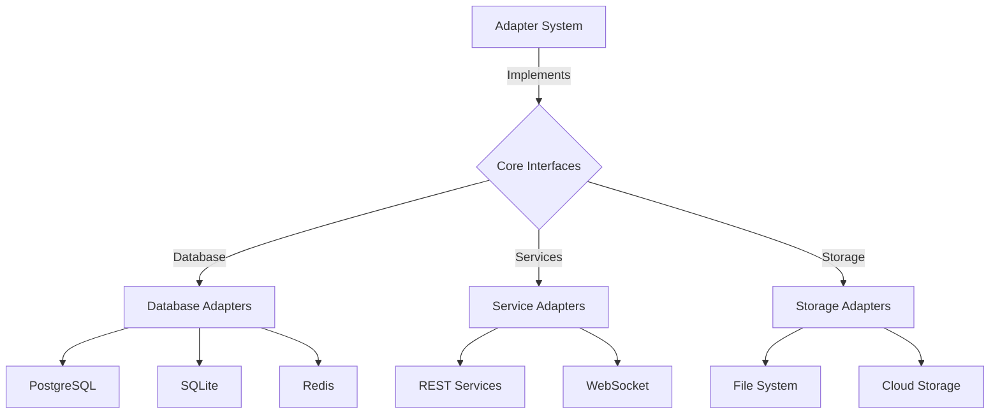
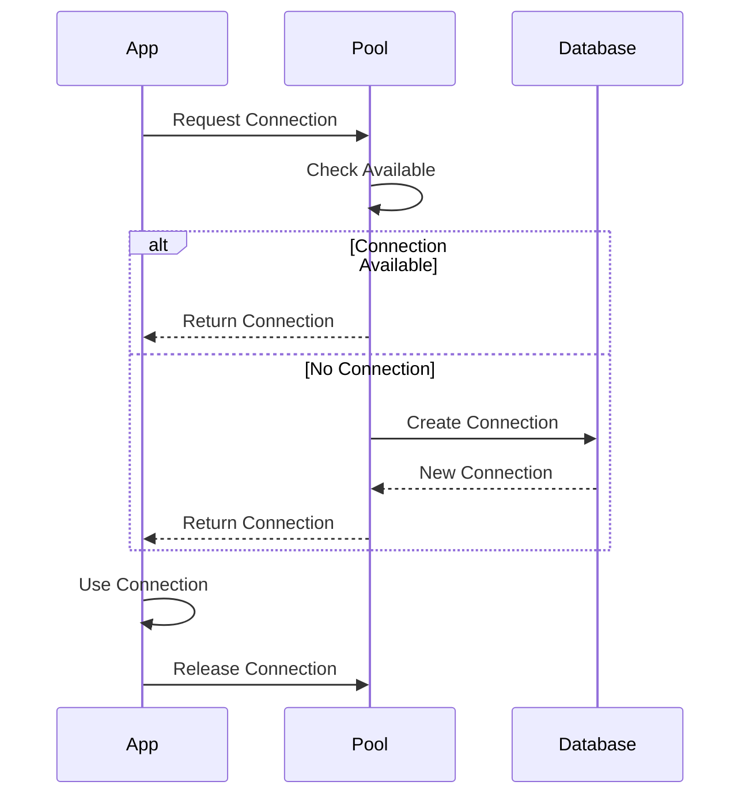
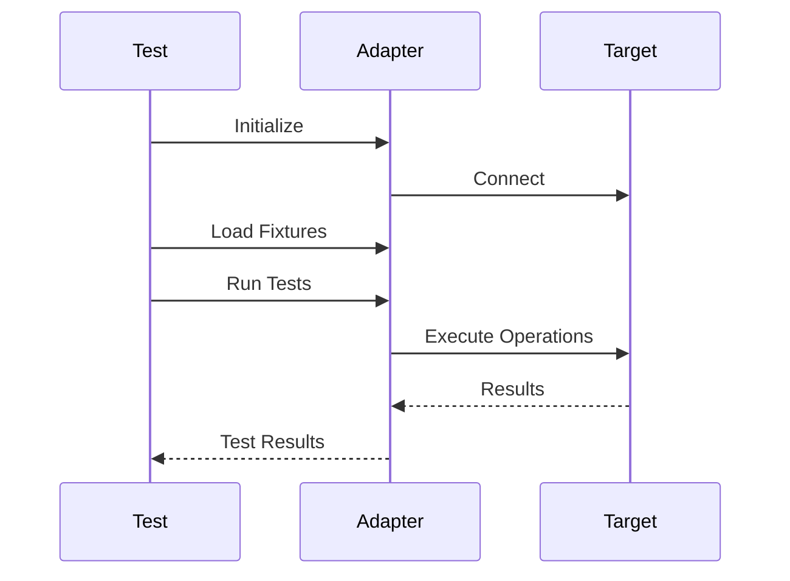

# 🔌 Eliza Adapter Development Guide

## 📚 Table of Contents
1. [Overview](#overview)
2. [Adapter Architecture](#architecture)
3. [Database Adapters](#database-adapters)
4. [Integration Adapters](#integration-adapters)
5. [Development](#development)
6. [Testing](#testing)
7. [Examples](#examples)

## 🌟 Overview

Eliza's Adapter System provides a flexible interface layer for connecting to various databases, services, and external systems. The adapter framework ensures consistent data access and integration patterns across the platform.

### 🎯 Key Features
- Pluggable database support
- Standardized interfaces
- Connection pooling
- Query optimization
- Error handling

## 🏗️ Adapter Architecture



### 📂 Adapter File Structure
```
adapters/
├── database/
│   ├── postgres/
│   │   ├── index.ts
│   │   ├── connection.ts
│   │   └── queries.ts
│   ├── sqlite/
│   │   ├── index.ts
│   │   └── connection.ts
│   └── redis/
│       ├── index.ts
│       └── client.ts
├── storage/
│   ├── fs/
│   └── cloud/
└── services/
    ├── rest/
    └── websocket/
```

## 💾 Database Adapters

### 🛠️ Core Interface
```typescript
interface DatabaseAdapter {
  connect(): Promise<void>;
  disconnect(): Promise<void>;
  query<T>(sql: string, params?: any[]): Promise<T[]>;
  transaction<T>(callback: (trx: Transaction) => Promise<T>): Promise<T>;
}

interface Transaction {
  query<T>(sql: string, params?: any[]): Promise<T[]>;
  commit(): Promise<void>;
  rollback(): Promise<void>;
}
```

### 📊 Connection Management



### 🔧 Configuration Examples

1. PostgreSQL Adapter
```typescript
interface PostgresConfig {
  host: string;
  port: number;
  database: string;
  user: string;
  password: string;
  pool: {
    min: number;
    max: number;
    idleTimeout: number;
  };
  ssl?: {
    rejectUnauthorized: boolean;
    ca?: string;
    key?: string;
    cert?: string;
  };
}

class PostgresAdapter implements DatabaseAdapter {
  constructor(config: PostgresConfig) {
    // Initialize adapter
  }
  
  async connect() {
    // Connection logic
  }
  
  async query<T>(sql: string, params?: any[]): Promise<T[]> {
    // Query execution logic
  }
}
```

2. Redis Adapter
```typescript
interface RedisConfig {
  host: string;
  port: number;
  password?: string;
  db?: number;
  cluster?: {
    nodes: Array<{host: string; port: number}>;
    options?: Record<string, any>;
  };
}

class RedisAdapter {
  async set(key: string, value: any, ttl?: number): Promise<void> {
    // Set value logic
  }
  
  async get<T>(key: string): Promise<T | null> {
    // Get value logic
  }
}
```

## 🔌 Integration Adapters

### 🌐 REST Service Adapter
```typescript
interface RESTAdapter {
  get<T>(path: string, params?: Record<string, any>): Promise<T>;
  post<T>(path: string, data: any): Promise<T>;
  put<T>(path: string, data: any): Promise<T>;
  delete<T>(path: string): Promise<T>;
}

class HTTPAdapter implements RESTAdapter {
  constructor(config: HTTPConfig) {
    // Initialize adapter
  }
  
  async get<T>(path: string, params?: Record<string, any>): Promise<T> {
    // GET request implementation
  }
}
```

### 📡 WebSocket Adapter
```typescript
interface WebSocketAdapter {
  connect(): Promise<void>;
  subscribe(channel: string, handler: MessageHandler): void;
  unsubscribe(channel: string): void;
  send(data: any): Promise<void>;
}

class WSAdapter implements WebSocketAdapter {
  constructor(config: WSConfig) {
    // Initialize adapter
  }
  
  async connect() {
    // Connection logic
  }
}
```

## 📝 Development Guide

### 🏗️ Creating a New Adapter

1. Define Interface
```typescript
interface CustomAdapter {
  initialize(): Promise<void>;
  execute<T>(command: Command): Promise<T>;
  cleanup(): Promise<void>;
}
```

2. Implement Adapter
```typescript
class MyCustomAdapter implements CustomAdapter {
  constructor(config: Config) {
    // Initialize
  }
  
  async initialize() {
    // Setup logic
  }
  
  async execute<T>(command: Command): Promise<T> {
    // Execution logic
  }
}
```

### 🔄 Error Handling
```typescript
class AdapterError extends Error {
  constructor(
    message: string,
    public code: string,
    public retryable: boolean
  ) {
    super(message);
  }
}

function handleAdapterError(error: Error) {
  if (error instanceof AdapterError) {
    if (error.retryable) {
      // Implement retry logic
    }
  }
  throw error;
}
```

## 🧪 Testing

### 📊 Test Configuration
```typescript
interface TestConfig {
  adapter: DatabaseAdapter;
  fixtures: any[];
  assertions: Array<() => Promise<void>>;
}

class AdapterTester {
  constructor(config: TestConfig) {
    // Initialize tester
  }
  
  async runTests() {
    // Test execution logic
  }
}
```

### 🔍 Validation Process



## 💡 Examples

### 1. Database Operations
```typescript
// Using PostgreSQL adapter
const pgAdapter = new PostgresAdapter(config);
await pgAdapter.connect();

// Query execution
const results = await pgAdapter.query<User>(
  'SELECT * FROM users WHERE active = $1',
  [true]
);

// Transaction example
await pgAdapter.transaction(async (trx) => {
  await trx.query('INSERT INTO users (name) VALUES ($1)', ['John']);
  await trx.query('UPDATE counters SET value = value + 1');
});
```

### 2. Cache Operations
```typescript
// Using Redis adapter
const redisAdapter = new RedisAdapter(config);

// Set cache
await redisAdapter.set('user:1', userData, 3600);

// Get cache
const cached = await redisAdapter.get<UserData>('user:1');
```

## 📚 Best Practices

### 1. Connection Management
- Use connection pooling
- Implement retry logic
- Handle timeouts
- Monitor connections
- Clean up resources

### 2. Error Handling
- Define error types
- Implement retries
- Log errors properly
- Handle edge cases
- Provide clear messages

### 3. Performance
- Optimize queries
- Use prepared statements
- Implement caching
- Monitor performance
- Handle backpressure

## 🔍 Monitoring

### 📊 Metrics to Track
1. Connection Stats
   - Pool size
   - Active connections
   - Wait time
   - Timeouts
   
2. Performance Metrics
   - Query time
   - Throughput
   - Error rate
   - Cache hits/misses
   
3. Resource Usage
   - Memory usage
   - CPU usage
   - Network I/O
   - Disk I/O

## 🛠️ Troubleshooting

### Common Issues
1. Connection Problems
   - Connection timeouts
   - Pool exhaustion
   - Network issues
   
2. Performance Issues
   - Slow queries
   - Memory leaks
   - Resource contention
   
3. Data Issues
   - Consistency problems
   - Transaction failures
   - Deadlocks

---

*This documentation is continuously updated as the Adapter System evolves.* 