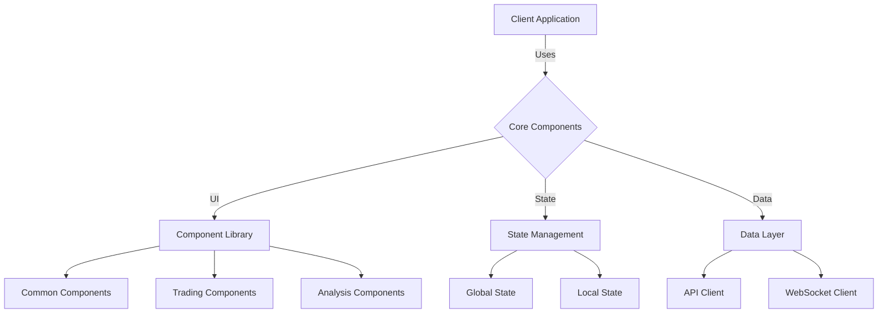
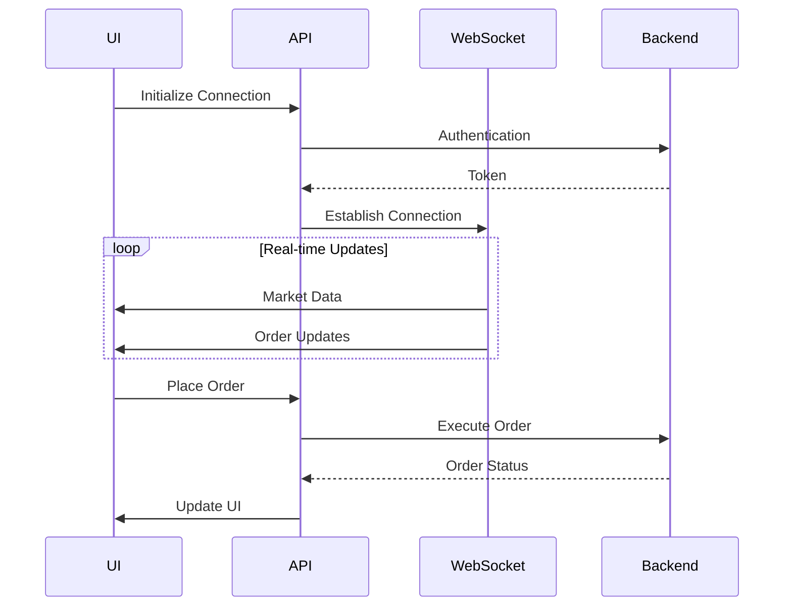

# 🖥️ Eliza Client Development Guide

## 📚 Table of Contents
1. [Overview](#overview)
2. [Architecture](#architecture)
3. [Component System](#components)
4. [State Management](#state-management)
5. [Integration](#integration)
6. [Development](#development)
7. [Testing](#testing)
8. [Examples](#examples)

## 🌟 Overview

Eliza's Client Application is a modern, React-based web interface that provides real-time market data visualization, trading controls, and system monitoring capabilities. The client is built with performance, extensibility, and user experience in mind.

### 🎯 Key Features
- Real-time data visualization
- Interactive trading controls
- Plugin integration
- Responsive design
- Performance optimization

## 🏗️ Architecture



### 📂 Client Structure
```
client/
├── src/
│   ├── components/
│   │   ├── common/
│   │   ├── trading/
│   │   └── analysis/
│   ├── hooks/
│   │   ├── common/
│   │   ├── trading/
│   │   └── data/
│   ├── lib/
│   │   ├── api/
│   │   ├── websocket/
│   │   └── utils/
│   ├── routes/
│   │   ├── dashboard/
│   │   ├── trading/
│   │   └── settings/
│   ├── types/
│   │   ├── common.ts
│   │   ├── trading.ts
│   │   └── api.ts
│   ├── App.tsx
│   └── main.tsx
├── public/
└── dist/
```

## 🧩 Component System

### 📦 Core Components

1. Common Components
```typescript
// Button component with loading state
interface ButtonProps {
  variant: 'primary' | 'secondary' | 'danger';
  loading?: boolean;
  disabled?: boolean;
  onClick?: () => void;
  children: React.ReactNode;
}

// Data display component
interface DataCardProps {
  title: string;
  value: string | number;
  change?: number;
  trend?: 'up' | 'down' | 'neutral';
}
```

2. Trading Components
```typescript
// Order form component
interface OrderFormProps {
  symbol: string;
  side: 'buy' | 'sell';
  onSubmit: (order: Order) => Promise<void>;
}

// Position display
interface PositionCardProps {
  position: Position;
  onClose?: () => void;
}
```

### 🎨 Styling System
```typescript
// Theme configuration
const theme = {
  colors: {
    primary: '#007AFF',
    secondary: '#5856D6',
    success: '#34C759',
    danger: '#FF3B30',
    warning: '#FF9500',
    background: '#000000',
    surface: '#1C1C1E',
    text: '#FFFFFF'
  },
  spacing: {
    xs: '0.25rem',
    sm: '0.5rem',
    md: '1rem',
    lg: '1.5rem',
    xl: '2rem'
  }
};
```

## 🔄 State Management

### 🌐 Global State
```typescript
interface GlobalState {
  trading: {
    positions: Position[];
    orders: Order[];
    balance: Balance;
  };
  market: {
    prices: Record<string, Price>;
    orderbooks: Record<string, Orderbook>;
  };
  system: {
    connected: boolean;
    notifications: Notification[];
  };
}
```

### 🎯 Local State Management
```typescript
// Component state hook
function useOrderForm(symbol: string) {
  const [order, setOrder] = useState<Order>({
    symbol,
    side: 'buy',
    type: 'limit',
    quantity: 0,
    price: 0
  });
  
  // Order form logic
}
```

## 🔌 Integration

### 🌐 API Integration



### 📡 WebSocket Integration
```typescript
interface WSConfig {
  url: string;
  channels: string[];
  onMessage: (data: any) => void;
  onError: (error: Error) => void;
}

class WebSocketClient {
  constructor(config: WSConfig) {
    // Initialize WebSocket
  }
  
  connect() {
    // Connection logic
  }
  
  subscribe(channel: string) {
    // Subscription logic
  }
}
```

## 🛠️ Development

### 🔧 Setup Requirements
```json
{
  "dependencies": {
    "react": "^18.2.0",
    "react-dom": "^18.2.0",
    "vite": "^5.0.0",
    "tailwindcss": "^3.3.0",
    "@tanstack/react-query": "^5.0.0",
    "zustand": "^4.4.0"
  }
}
```

### 📝 Development Workflow
1. Local Development
```bash
# Install dependencies
pnpm install

# Start development server
pnpm dev

# Build for production
pnpm build

# Run tests
pnpm test
```

## 🧪 Testing

### 📊 Component Testing
```typescript
// Button component test
describe('Button', () => {
  it('renders correctly', () => {
    render(<Button variant="primary">Click me</Button>);
    expect(screen.getByText('Click me')).toBeInTheDocument();
  });
  
  it('handles click events', () => {
    const onClick = jest.fn();
    render(<Button variant="primary" onClick={onClick}>Click me</Button>);
    fireEvent.click(screen.getByText('Click me'));
    expect(onClick).toHaveBeenCalled();
  });
});
```

### 🔄 Integration Testing
```typescript
// API integration test
describe('API Client', () => {
  it('fetches market data', async () => {
    const client = new APIClient();
    const data = await client.getMarketData('BTC/USDT');
    expect(data).toBeDefined();
  });
});
```

## 💡 Examples

### 1. Creating a Trading View

```typescript
// Trading view component
function TradingView({ symbol }: { symbol: string }) {
  const { data: marketData } = useMarketData(symbol);
  const { positions } = usePositions();
  const { placeOrder } = useOrderExecution();
  
  return (
    <div className="trading-view">
      <MarketData data={marketData} />
      <OrderForm onSubmit={placeOrder} />
      <PositionList positions={positions} />
    </div>
  );
}
```

### 2. Implementing Real-time Updates

```typescript
// Real-time price hook
function usePriceStream(symbol: string) {
  const [price, setPrice] = useState<Price | null>(null);
  
  useEffect(() => {
    const ws = new WebSocketClient({
      url: WS_URL,
      channels: [`price:${symbol}`],
      onMessage: (data) => setPrice(data)
    });
    
    ws.connect();
    return () => ws.disconnect();
  }, [symbol]);
  
  return price;
}
```

## 📚 Best Practices

### 1. Performance Optimization
- Use React.memo for expensive components
- Implement virtualization for large lists
- Optimize re-renders
- Use proper key props
- Implement code splitting

### 2. State Management
- Use appropriate state solutions
- Implement proper caching
- Handle loading states
- Manage side effects
- Handle errors gracefully

### 3. Component Design
- Follow atomic design principles
- Maintain proper component hierarchy
- Implement proper prop types
- Use proper naming conventions
- Document components

## 🔍 Monitoring

### 📊 Performance Metrics
1. Loading Times
   - Initial load time
   - Component render time
   - Data fetch latency
   - Animation performance
   
2. Resource Usage
   - Memory consumption
   - CPU usage
   - Network requests
   - Cache utilization
   
3. Error Tracking
   - API errors
   - UI exceptions
   - WebSocket disconnects
   - State inconsistencies

## 🛠️ Troubleshooting

### Common Issues
1. Performance Problems
   - Slow component renders
   - Memory leaks
   - Network latency
   - State updates
   
2. Integration Issues
   - API connectivity
   - WebSocket stability
   - Authentication
   - Data synchronization
   
3. UI Issues
   - Layout problems
   - Rendering artifacts
   - State inconsistencies
   - Event handling

---

*This documentation is continuously updated as the Client Application evolves.* 