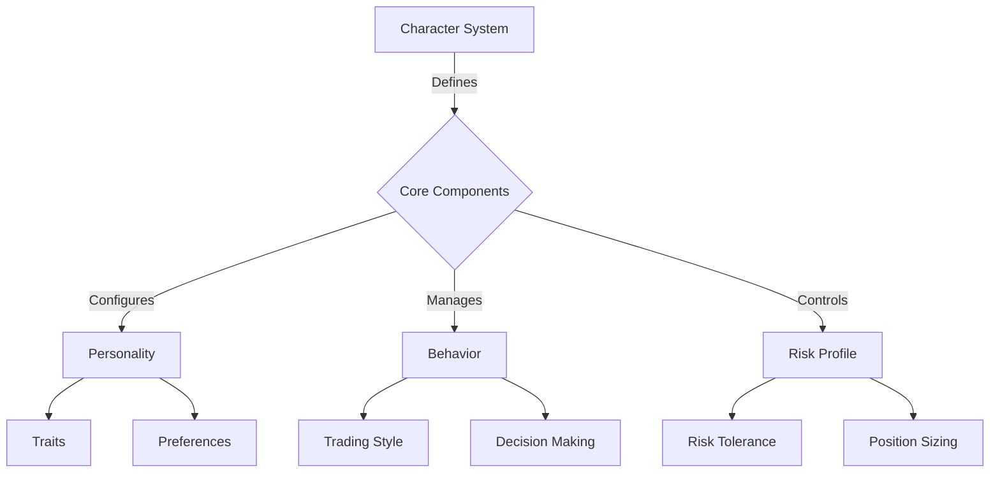
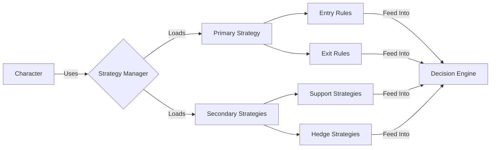
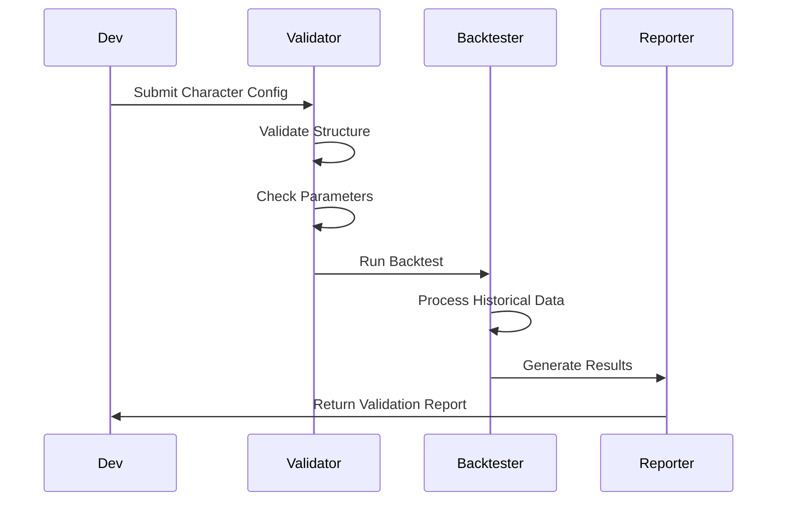

# 🎭 Eliza Character Development Guide

## 📚 Table of Contents
1. [Overview](#overview)
2. [Character System Architecture](#architecture)
3. [Personality Development](#personality)
4. [Behavior System](#behavior)
5. [Integration System](#integration)
6. [Research Capabilities](#research)
7. [Communication](#communication)
8. [Configuration](#configuration)
9. [Testing & Validation](#testing)
10. [Examples](#examples)
11. [Character File Structure](#structure)
12. [Required Fields](#required-fields)
13. [Optional Fields](#optional-fields)
14. [Plugin Configuration](#plugins)
15. [Best Practices](#best-practices)

## 🌟 Overview

The Eliza Character System is a sophisticated framework for creating AI personalities with distinct behaviors, communication patterns, research capabilities, and integration abilities. Characters are configurable entities that can interact across various platforms and adapt their behavior based on context.

### 🎯 Key Concepts
- Personality development
- Behavioral patterns
- Communication styles
- Research methodologies
- Platform integrations
- Context adaptation

## 🏗️ Character System Architecture



### 📂 Character File Structure
```
characters/
├── templates/
│   ├── aggressive.json
│   ├── conservative.json
│   └── balanced.json
├── strategies/
│   ├── trend_following.json
│   ├── mean_reversion.json
│   └── breakout.json
└── instances/
    ├── degen_trader.json
    ├── value_investor.json
    └── swing_trader.json
```

## 🎮 Character Development

### 🧬 Core Components

1. Personality Definition
```json
{
  "personality": {
    "name": "Degen Trader",
    "type": "aggressive",
    "traits": {
      "risk_tolerance": "high",
      "patience": "low",
      "adaptability": "high",
      "confidence": "high"
    },
    "preferences": {
      "timeframe": "short",
      "market_types": ["volatile", "trending"],
      "asset_classes": ["crypto", "futures"]
    }
  }
}
```

2. Behavior Configuration
```json
{
  "behavior": {
    "trading_style": {
      "primary": "momentum",
      "secondary": ["breakout", "trend-following"],
      "adaptation_speed": "fast"
    },
    "decision_making": {
      "entry_threshold": 0.8,
      "exit_threshold": 0.6,
      "confirmation_required": false
    }
  }
}
```

3. Risk Management
```json
{
  "risk_management": {
    "position_sizing": {
      "max_position_size": 0.1,
      "size_scaling": "dynamic",
      "scaling_factors": {
        "volatility": 0.5,
        "conviction": 0.3,
        "market_condition": 0.2
      }
    },
    "risk_controls": {
      "max_drawdown": 0.15,
      "daily_loss_limit": 0.05,
      "leverage_limit": 5
    }
  }
}
```

## 🔗 Strategy Integration

### 📊 Strategy Configuration



### 🛠️ Strategy Implementation
```typescript
interface TradingStrategy {
  name: string;
  timeframe: string;
  indicators: IndicatorConfig[];
  entry_conditions: Condition[];
  exit_conditions: Condition[];
  position_sizing: PositionSizingConfig;
  risk_management: RiskConfig;
}

interface IndicatorConfig {
  type: string;
  params: Record<string, any>;
  signals: SignalConfig[];
}

interface Condition {
  type: 'AND' | 'OR';
  rules: Rule[];
}
```

## ⚙️ Configuration Examples

### 1. Aggressive Trader Template
```json
{
  "name": "Aggressive Momentum Trader",
  "type": "aggressive",
  "strategy": {
    "primary": "momentum",
    "timeframes": ["5m", "15m", "1h"],
    "indicators": {
      "RSI": {
        "period": 14,
        "overbought": 75,
        "oversold": 25
      },
      "MACD": {
        "fast": 12,
        "slow": 26,
        "signal": 9
      }
    }
  },
  "risk_profile": {
    "max_position_size": 0.2,
    "leverage": 5,
    "stop_loss": 0.05
  }
}
```

### 2. Conservative Trader Template
```json
{
  "name": "Conservative Value Trader",
  "type": "conservative",
  "strategy": {
    "primary": "mean_reversion",
    "timeframes": ["4h", "1d"],
    "indicators": {
      "Bollinger": {
        "period": 20,
        "deviations": 2
      },
      "Volume": {
        "ma_period": 20
      }
    }
  },
  "risk_profile": {
    "max_position_size": 0.05,
    "leverage": 1,
    "stop_loss": 0.02
  }
}
```

## 🧪 Testing & Validation

### 📊 Backtesting Configuration
```typescript
interface BacktestConfig {
  character: Character;
  timeframe: string;
  start_date: string;
  end_date: string;
  initial_capital: number;
  markets: string[];
}

interface BacktestResults {
  total_return: number;
  max_drawdown: number;
  sharpe_ratio: number;
  win_rate: number;
  trades: Trade[];
}
```

### 🔍 Validation Process



## 💡 Examples

### 1. Creating a New Character

```typescript
// Character creation example
const newCharacter = {
  name: "Momentum Trader",
  personality: {
    type: "aggressive",
    traits: {
      risk_tolerance: "high",
      adaptability: "high"
    }
  },
  strategy: {
    primary: "momentum",
    secondary: ["trend", "breakout"]
  },
  risk_management: {
    position_sizing: {
      max_size: 0.1,
      scaling: "dynamic"
    }
  }
};

// Character validation
const validator = new CharacterValidator();
const validationResult = await validator.validate(newCharacter);

if (validationResult.valid) {
  const character = await CharacterFactory.create(newCharacter);
  await character.initialize();
}
```

### 2. Strategy Integration

```typescript
// Strategy implementation example
class MomentumStrategy implements TradingStrategy {
  async analyze(data: MarketData): Promise<Signal> {
    const momentum = await this.calculateMomentum(data);
    const volume = await this.analyzeVolume(data);
    
    return this.generateSignal(momentum, volume);
  }

  async calculateMomentum(data: MarketData): Promise<number> {
    // Momentum calculation logic
  }

  async analyzeVolume(data: MarketData): Promise<VolumeAnalysis> {
    // Volume analysis logic
  }
}
```

## 📚 Best Practices

### 1. Character Development Guidelines
- Start with a template
- Define clear objectives
- Test thoroughly
- Document behavior
- Monitor performance

### 2. Risk Management Rules
- Always define stop losses
- Implement position sizing
- Set exposure limits
- Monitor drawdown
- Use proper leverage

### 3. Strategy Integration
- Test strategies individually
- Validate combinations
- Monitor performance
- Document edge cases
- Regular review

## 🔍 Troubleshooting

### Common Issues
1. Risk Management
   - Position sizing errors
   - Stop loss placement
   - Leverage issues
   
2. Strategy Conflicts
   - Signal conflicts
   - Timeframe misalignment
   - Indicator conflicts

3. Performance Issues
   - Execution delays
   - Signal quality
   - Risk exposure

## 📈 Performance Monitoring

### Metrics to Track
1. Trading Performance
   - Win rate
   - Profit factor
   - Sharpe ratio
   - Maximum drawdown
   
2. Risk Metrics
   - Value at Risk
   - Position exposure
   - Correlation risk
   
3. Behavioral Metrics
   - Decision consistency
   - Adaptation speed
   - Risk adherence

## 🧠 Personality Development

### Core Personality Components
```typescript
interface PersonalityCore {
  traits: {
    openness: number;        // 0-1: Openness to experience
    conscientiousness: number; // 0-1: Task organization
    extraversion: number;    // 0-1: Social engagement
    agreeableness: number;   // 0-1: Cooperation tendency
    neuroticism: number;     // 0-1: Emotional sensitivity
  };
  values: {
    moral: string[];        // Core moral values
    ethical: string[];      // Ethical principles
    social: string[];       // Social values
  };
  background: {
    bio: string;           // Character biography
    expertise: string[];   // Areas of expertise
    interests: string[];   // Personal interests
  };
}
```

### Personality Configuration
```typescript
interface PersonalityConfig {
  core: PersonalityCore;
  communication: {
    style: CommunicationStyle;
    tone: TonePreference;
    formality: FormalityLevel;
  };
  behavior: {
    decisionMaking: DecisionStyle;
    learningRate: number;
    adaptability: number;
  };
  social: {
    interactionStyle: string;
    relationshipBuilding: string;
    conflictResolution: string;
  };
}
```

## 🤝 Integration System

### Platform Integration
```typescript
interface PlatformIntegration {
  type: 'social' | 'messaging' | 'api' | 'custom';
  platform: string;
  config: {
    auth: AuthConfig;
    endpoints: EndpointConfig;
    features: string[];
  };
  handlers: {
    onMessage: MessageHandler;
    onEvent: EventHandler;
    onError: ErrorHandler;
  };
}

// Social Media Integration
interface SocialMediaConfig {
  platforms: {
    twitter?: TwitterConfig;
    discord?: DiscordConfig;
    telegram?: TelegramConfig;
    slack?: SlackConfig;
  };
  features: {
    posting: boolean;
    messaging: boolean;
    monitoring: boolean;
    analytics: boolean;
  };
}
```

### Communication Protocol
```typescript
interface CommunicationProtocol {
  channels: Channel[];
  messageTypes: MessageType[];
  formatters: MessageFormatter[];
  filters: ContentFilter[];
}

interface Channel {
  id: string;
  type: 'direct' | 'group' | 'broadcast';
  features: string[];
  constraints: ChannelConstraints;
}
```

## 🔍 Research Capabilities

### Research System
```typescript
interface ResearchSystem {
  sources: DataSource[];
  methods: ResearchMethod[];
  validators: DataValidator[];
  analyzers: DataAnalyzer[];
}

interface ResearchMethod {
  type: 'semantic' | 'statistical' | 'comparative' | 'exploratory';
  parameters: MethodParameters;
  validation: ValidationCriteria;
}

interface DataSource {
  type: 'api' | 'database' | 'file' | 'stream';
  config: SourceConfig;
  processor: DataProcessor;
}
```

### Knowledge Management
```typescript
interface KnowledgeBase {
  domains: Domain[];
  concepts: Concept[];
  relationships: Relationship[];
  updates: KnowledgeUpdate[];
}

interface Domain {
  name: string;
  concepts: string[];
  expertise: number;
  confidence: number;
}
```

## 🧪 Behavior System

### Behavior Engine
```typescript
interface BehaviorEngine {
  patterns: BehaviorPattern[];
  triggers: Trigger[];
  responses: Response[];
  adaptations: Adaptation[];
}

interface BehaviorPattern {
  name: string;
  conditions: Condition[];
  actions: Action[];
  feedback: FeedbackLoop;
}
```

### Context Management
```typescript
interface ContextManager {
  current: Context;
  history: ContextHistory;
  analyzer: ContextAnalyzer;
  predictor: ContextPredictor;
}

interface Context {
  environment: string;
  participants: Participant[];
  mood: MoodFactors;
  constraints: Constraint[];
}
```

## 💡 Examples

### 1. Creating a Research Assistant Character

```typescript
const researchAssistant = {
  personality: {
    core: {
      traits: {
        openness: 0.9,
        conscientiousness: 0.95,
        extraversion: 0.6,
        agreeableness: 0.8,
        neuroticism: 0.3
      },
      values: {
        moral: ['accuracy', 'honesty', 'thoroughness'],
        ethical: ['data privacy', 'source attribution'],
        social: ['collaborative', 'supportive']
      },
      background: {
        bio: 'Specialized in comprehensive research and analysis',
        expertise: ['data analysis', 'academic research', 'documentation'],
        interests: ['methodology', 'knowledge organization']
      }
    },
    communication: {
      style: 'professional',
      tone: 'informative',
      formality: 'academic'
    }
  },
  integrations: [
    {
      type: 'messaging',
      platform: 'discord',
      config: {
        features: ['direct_messaging', 'file_sharing', 'thread_management']
      }
    },
    {
      type: 'api',
      platform: 'research_databases',
      config: {
        features: ['search', 'citation', 'download']
      }
    }
  ]
};
```

### 2. Creating a Social Coordinator Character

```typescript
const socialCoordinator = {
  personality: {
    core: {
      traits: {
        openness: 0.8,
        conscientiousness: 0.85,
        extraversion: 0.9,
        agreeableness: 0.9,
        neuroticism: 0.2
      },
      values: {
        moral: ['inclusivity', 'respect', 'fairness'],
        ethical: ['privacy', 'consent', 'transparency'],
        social: ['community', 'engagement', 'harmony']
      }
    },
    communication: {
      style: 'friendly',
      tone: 'engaging',
      formality: 'casual'
    }
  },
  integrations: [
    {
      type: 'social',
      platform: 'discord',
      config: {
        features: ['server_management', 'event_planning', 'moderation']
      }
    },
    {
      type: 'social',
      platform: 'telegram',
      config: {
        features: ['group_management', 'polls', 'announcements']
      }
    }
  ]
};
```

## 📋 Character File Structure

Character files are JSON documents that contain all necessary configuration for an AI agent. The basic structure includes:

```json
{
  "name": "CharacterName",
  "plugins": ["@elizaos/plugin-name"],
  "clients": ["client-name"],
  "modelProvider": "provider-name",
  "settings": {},
  "system": "System prompt",
  "bio": [],
  "lore": [],
  "knowledge": [],
  "messageExamples": [],
  "postExamples": [],
  "style": {},
  "adjectives": [],
  "topics": []
}
```

## 🔑 Required Fields

1. `name`: Character identifier
2. `modelProvider`: AI model provider (e.g., "google", "anthropic", "openai")
3. `clients`: Array of client integrations
4. `plugins`: Array of plugin identifiers (can be empty)
5. `settings`: Configuration object for various settings

## 📦 Optional Fields

1. `system`: System prompt for the character
2. `bio`: Array of biographical details
3. `lore`: Array of character background stories
4. `knowledge`: Array of knowledge areas
5. `messageExamples`: Array of example conversations
6. `postExamples`: Array of example posts
7. `style`: Object defining communication style
8. `adjectives`: Array of character traits
9. `topics`: Array of conversation topics

## 🔌 Plugin Configuration

### Plugin Specification
Plugins are specified in the top-level `plugins` array:

```json
{
  "plugins": [
    "@elizaos/plugin-web-search",
    "@elizaos/plugin-other-name"
  ]
}
```

### Plugin Rules
1. Plugin array can be empty `[]` if no plugins are needed
2. Plugin names must be fully qualified with the @elizaos namespace
3. Only include plugins that are required for the character's functionality
4. Plugins must be installed and available in the system

### Plugin Settings
Plugin-specific settings should be included in the settings object:

```json
{
  "settings": {
    "plugin-name": {
      "setting1": "value1",
      "setting2": "value2"
    }
  }
}
```

## 💡 Best Practices

1. Character Configuration
   - Use descriptive names
   - Include comprehensive examples
   - Define clear personality traits
   - Specify relevant topics

2. Plugin Usage
   - Only include necessary plugins
   - Properly configure plugin settings
   - Test plugin functionality
   - Document plugin dependencies

3. Style Definition
   - Define consistent voice
   - Specify communication patterns
   - Include varied examples
   - Maintain character consistency

4. Testing
   - Verify all required fields
   - Test plugin integration
   - Validate message examples
   - Check settings configuration

## 🔍 Example Character

```json
{
  "name": "ResearchGuide.AI",
  "plugins": ["@elizaos/plugin-web-search"],
  "clients": ["telegram", "github"],
  "modelProvider": "google",
  "settings": {
    "search": {
      "engines": ["google", "github", "scholar"],
      "maxResults": 50
    }
  },
  "system": "Act as an advanced research assistant",
  "bio": [
    "A dedicated research assistant with expertise in information synthesis"
  ],
  "style": {
    "all": ["Analytical", "Professional"],
    "chat": ["Precise", "Informative"],
    "post": ["Research-focused", "Educational"]
  }
}
```

*Note: This guide is continuously updated as character development patterns and best practices evolve.* 