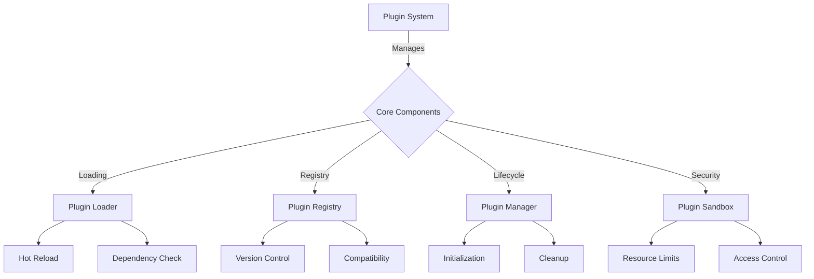

# 🔌 Eliza Plugin Development Guide

## 📚 Table of Contents
1. [Overview](#overview)
2. [Plugin Architecture](#architecture)
3. [Plugin Types](#types)
4. [Core Systems](#core-systems)
5. [Development](#development)
6. [Integration](#integration)
7. [Testing](#testing)
8. [Examples](#examples)

## 🌟 Overview

Eliza's Plugin System provides a flexible and extensible architecture for adding new functionality to the platform. The system is designed to be generic and adaptable, allowing plugins to extend any aspect of the system's functionality.

### 🎯 Key Features
- Hot-reloadable plugins
- Type-safe interfaces
- Dependency management
- Version control
- Performance monitoring
- Dynamic loading
- Sandboxed execution
- Resource management

## 🏗️ Plugin Architecture



### 📂 Plugin Structure
```
plugins/
├── core/                 # Core system plugins
│   ├── system/
│   ├── security/
│   └── monitoring/
├── integration/          # Integration plugins
│   ├── platform/
│   ├── protocol/
│   └── service/
├── extension/           # Feature extension plugins
│   ├── capability/
│   ├── interface/
│   └── processor/
└── utility/            # Utility plugins
    ├── tools/
    ├── helpers/
    └── formatters/
```

## 🧩 Plugin Types

### 🛠️ Core Plugin Interface
```typescript
interface Plugin {
  id: string;
  version: string;
  type: PluginType;
  capabilities: string[];
  dependencies: PluginDependency[];
  
  initialize(context: PluginContext): Promise<void>;
  execute<T>(command: Command<T>): Promise<T>;
  cleanup(): Promise<void>;
}

interface PluginContext {
  environment: Environment;
  services: ServiceRegistry;
  config: PluginConfig;
  logger: Logger;
  metrics: MetricsCollector;
}
```

### 📊 Plugin Categories

1. System Plugins
```typescript
interface SystemPlugin extends Plugin {
  type: 'system';
  priority: number;
  systemHooks: SystemHook[];
  
  onSystemEvent(event: SystemEvent): Promise<void>;
  getSystemInfo(): SystemInfo;
  configure(config: SystemConfig): Promise<void>;
}
```

2. Integration Plugins
```typescript
interface IntegrationPlugin extends Plugin {
  type: 'integration';
  protocol: string;
  endpoints: EndpointConfig[];
  
  connect(): Promise<void>;
  disconnect(): Promise<void>;
  isConnected(): boolean;
  sendMessage(message: Message): Promise<void>;
}
```

3. Extension Plugins
```typescript
interface ExtensionPlugin extends Plugin {
  type: 'extension';
  features: Feature[];
  hooks: HookConfig[];
  
  registerFeature(feature: Feature): Promise<void>;
  unregisterFeature(featureId: string): Promise<void>;
  executeFeature(featureId: string, params: any): Promise<any>;
}
```

## 🔧 Core Systems

### 📦 Plugin Manager
```typescript
interface PluginManager {
  registry: PluginRegistry;
  loader: PluginLoader;
  sandbox: PluginSandbox;
  monitor: PluginMonitor;
  
  loadPlugin(plugin: Plugin): Promise<void>;
  unloadPlugin(pluginId: string): Promise<void>;
  getPlugin<T extends Plugin>(pluginId: string): T;
  listPlugins(): Plugin[];
}

interface PluginRegistry {
  plugins: Map<string, Plugin>;
  dependencies: DependencyGraph;
  versions: VersionManager;
  
  register(plugin: Plugin): void;
  unregister(pluginId: string): void;
  resolve(dependency: PluginDependency): Plugin;
}
```

### 🔒 Plugin Sandbox
```typescript
interface PluginSandbox {
  resources: ResourceManager;
  security: SecurityManager;
  isolation: IsolationManager;
  
  createEnvironment(plugin: Plugin): Promise<Environment>;
  enforceConstraints(plugin: Plugin): void;
  monitorUsage(plugin: Plugin): Usage;
}

interface ResourceManager {
  memory: MemoryManager;
  cpu: CPUManager;
  network: NetworkManager;
  storage: StorageManager;
}
```

### 📊 Plugin Monitoring
```typescript
interface PluginMonitor {
  metrics: MetricsCollector;
  health: HealthChecker;
  alerts: AlertManager;
  logs: LogManager;
  
  collectMetrics(plugin: Plugin): Metrics;
  checkHealth(plugin: Plugin): Health;
  reportIssue(plugin: Plugin, issue: Issue): void;
}
```

## 🛠️ Development

### 🔧 Plugin Development Kit
```typescript
interface PDK {
  templates: PluginTemplate[];
  tools: DevTools;
  testing: TestFramework;
  documentation: DocGenerator;
  
  createPlugin(template: PluginTemplate): Plugin;
  validatePlugin(plugin: Plugin): ValidationResult;
  buildPlugin(plugin: Plugin): BuildResult;
  generateDocs(plugin: Plugin): Documentation;
}

interface DevTools {
  compiler: Compiler;
  debugger: Debugger;
  profiler: Profiler;
  analyzer: CodeAnalyzer;
}
```

## 💡 Examples

### 1. System Plugin Implementation
```typescript
class LoggingPlugin implements SystemPlugin {
  id = 'system.logging';
  version = '1.0.0';
  type = 'system';
  priority = 1;
  
  async initialize(context: PluginContext) {
    // Initialize logging system
  }
  
  async onSystemEvent(event: SystemEvent) {
    // Handle system events
  }
  
  async cleanup() {
    // Cleanup resources
  }
}
```

### 2. Integration Plugin Implementation
```typescript
class ProtocolPlugin implements IntegrationPlugin {
  id = 'integration.protocol';
  version = '1.0.0';
  type = 'integration';
  protocol = 'custom';
  
  async connect() {
    // Establish connection
  }
  
  async sendMessage(message: Message) {
    // Send message
  }
  
  async cleanup() {
    // Close connections
  }
}
```

## 📚 Best Practices

### 1. Plugin Development
- Follow plugin lifecycle
- Implement proper error handling
- Use type-safe interfaces
- Document functionality
- Include examples
- Handle cleanup properly
- Validate inputs
- Manage resources

### 2. Performance
- Optimize resource usage
- Implement caching
- Monitor memory usage
- Profile performance
- Handle backpressure
- Batch operations
- Use efficient algorithms

### 3. Security
- Validate inputs
- Sanitize data
- Control permissions
- Manage secrets
- Monitor usage
- Implement timeouts
- Handle errors
- Log security events

## 🔍 Monitoring

### 📊 Plugin Metrics
1. Performance Stats
   - Initialization time
   - Execution time
   - Memory usage
   - CPU usage
   - Network I/O
   - Storage I/O
   
2. Health Metrics
   - Error rate
   - Success rate
   - Response time
   - Uptime
   - Resource usage
   - Queue length
   
3. Usage Statistics
   - Active instances
   - API calls
   - Event counts
   - Resource utilization
   - Cache hits/misses
   - Error distribution

## 🛠️ Troubleshooting

### Common Issues
1. Loading Problems
   - Dependency conflicts
   - Version mismatches
   - Resource constraints
   - Initialization failures
   - Configuration errors
   
2. Runtime Issues
   - Memory leaks
   - Performance degradation
   - API compatibility
   - Resource exhaustion
   - Deadlocks
   
3. Integration Problems
   - Communication errors
   - State synchronization
   - Event handling
   - Protocol mismatches
   - Timeout issues

---

*This documentation is continuously updated as the Plugin System evolves.* 