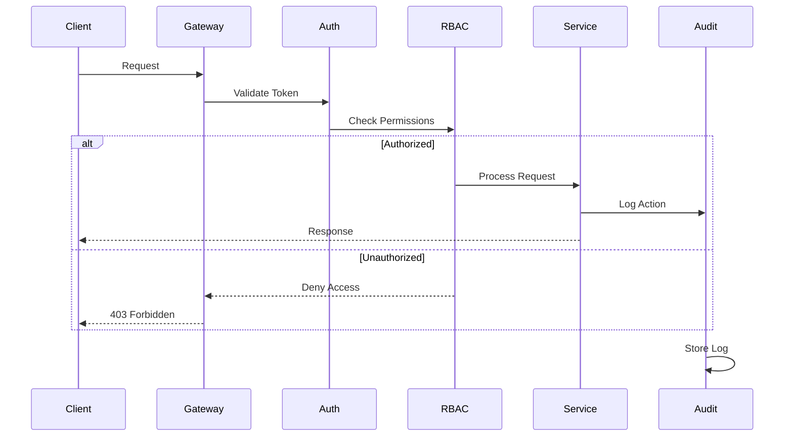
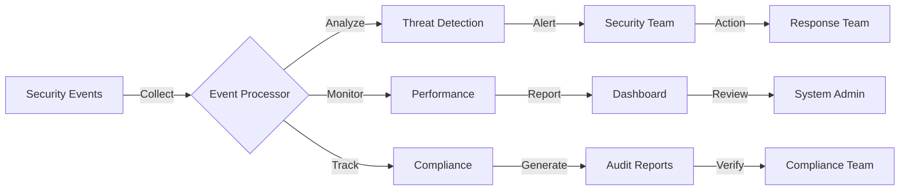

# 🔐 Security Implementation Guide

## 📚 Table of Contents
1. [Overview](#overview)
2. [Architecture](#architecture)
3. [Authentication](#authentication)
4. [Authorization](#authorization)
5. [Data Protection](#data-protection)
6. [Monitoring](#monitoring)
7. [Compliance](#compliance)
8. [Implementation Examples](#implementation-examples)

## 🌟 Overview

The Security Implementation system provides a comprehensive security framework for the Eliza Market Scanner platform, ensuring:

- Robust authentication
- Fine-grained authorization
- Data encryption
- Security monitoring
- Compliance tracking
- Audit logging

## 🏗️ Architecture

### Security Implementation Flow


## 🔑 Authentication

### Authentication System
```typescript
interface AuthenticationConfig {
  providers: AuthProvider[];
  session: {
    duration: number;
    refreshToken: boolean;
    maxConcurrent: number;
  };
  mfa: {
    enabled: boolean;
    methods: MFAMethod[];
    backupCodes: number;
  };
}
```

### Token Management
```typescript
class TokenManager {
  async generateToken(user: User, scope: string[]): Promise<Token> {
    // Token generation logic
  }
  
  async validateToken(token: string): Promise<ValidationResult> {
    // Token validation logic
  }
  
  async revokeToken(token: string): Promise<void> {
    // Token revocation logic
  }
}
```

## 🔒 Authorization

### RBAC System
```typescript
interface Role {
  name: string;
  permissions: Permission[];
  inheritance?: string[];
}

interface Permission {
  resource: string;
  action: 'create' | 'read' | 'update' | 'delete';
  conditions?: Condition[];
}

class RBACManager {
  async checkPermission(user: User, resource: string, action: string): Promise<boolean> {
    // Permission check logic
  }
}
```

## 🛡️ Data Protection

### Encryption System
```typescript
interface EncryptionConfig {
  algorithm: string;
  keySize: number;
  keyRotation: {
    enabled: boolean;
    interval: number;
  };
}

class EncryptionManager {
  async encrypt(data: any): Promise<EncryptedData> {
    // Encryption logic
  }
  
  async decrypt(data: EncryptedData): Promise<any> {
    // Decryption logic
  }
}
```

## 📊 Security Monitoring

### Monitoring Flow


### Security Metrics
```typescript
interface SecurityMetrics {
  authentication: {
    attempts: number;
    failures: number;
    mfaUsage: number;
  };
  authorization: {
    denials: number;
    violations: number;
  };
  threats: {
    detections: number;
    severityLevels: Record<string, number>;
  };
}
```

## 📋 Compliance

### Compliance Tracking
```typescript
interface ComplianceConfig {
  standards: string[];
  requirements: Requirement[];
  auditing: {
    interval: number;
    retention: number;
  };
}

class ComplianceManager {
  async checkCompliance(): Promise<ComplianceReport> {
    // Compliance check logic
  }
  
  async generateReport(): Promise<Report> {
    // Report generation logic
  }
}
```

## 💡 Implementation Examples

### Basic Authentication
```typescript
const auth = new AuthenticationManager({
  providers: ['jwt', 'oauth2'],
  session: {
    duration: 3600,
    refreshToken: true
  },
  mfa: {
    enabled: true,
    methods: ['totp', 'sms']
  }
});

// User authentication
const token = await auth.authenticate({
  username: 'user@example.com',
  password: 'secure_password',
  mfaCode: '123456'
});

// Token validation
const isValid = await auth.validateToken(token);
```

### Authorization Implementation
```typescript
const rbac = new RBACManager({
  roles: {
    admin: {
      permissions: ['*'],
    },
    trader: {
      permissions: [
        { resource: 'trades', actions: ['read', 'create'] },
        { resource: 'orders', actions: ['read', 'create', 'cancel'] }
      ]
    }
  }
});

// Permission check
const canTrade = await rbac.checkPermission(user, 'trades', 'create');
```

## 📚 Best Practices

1. Authentication
   - Implement MFA
   - Use secure password storage
   - Implement rate limiting
   - Monitor failed attempts
   - Regular credential rotation

2. Authorization
   - Principle of least privilege
   - Role-based access control
   - Regular permission audits
   - Access logging
   - Session management

3. Data Protection
   - Encryption at rest
   - Encryption in transit
   - Key management
   - Regular key rotation
   - Secure backup storage

4. Monitoring
   - Real-time alerts
   - Audit logging
   - Threat detection
   - Performance monitoring
   - Compliance tracking

## 🔒 Security Configurations

1. Authentication Configuration
```typescript
const authConfig: AuthConfig = {
  jwt: {
    algorithm: 'RS256',
    expiresIn: '1h',
    refreshToken: true
  },
  mfa: {
    required: true,
    methods: ['totp', 'sms'],
    backupCodes: 10
  },
  rateLimit: {
    maxAttempts: 5,
    windowMs: 15 * 60 * 1000
  }
};
```

2. Encryption Configuration
```typescript
const encryptionConfig: EncryptionConfig = {
  algorithm: 'aes-256-gcm',
  keySize: 256,
  keyRotation: {
    enabled: true,
    interval: 30 * 24 * 60 * 60 * 1000 // 30 days
  },
  storage: {
    type: 'vault',
    config: {
      address: 'vault.example.com',
      token: process.env.VAULT_TOKEN
    }
  }
};
```

## 🔍 Security Monitoring Setup

1. Alert Configuration
```typescript
const alertConfig: AlertConfig = {
  channels: ['email', 'slack', 'pagerduty'],
  thresholds: {
    authFailures: 10,
    suspicious: 5,
    critical: 1
  },
  notifications: {
    immediate: ['critical'],
    digest: ['warning', 'info']
  }
};
```

2. Audit Configuration
```typescript
const auditConfig: AuditConfig = {
  storage: {
    type: 'elasticsearch',
    retention: '90d'
  },
  events: {
    authentication: true,
    authorization: true,
    dataAccess: true,
    configuration: true
  },
  reports: {
    schedule: '0 0 * * *',
    format: ['pdf', 'json']
  }
};
```

## 🛡️ Threat Protection

### Rate Limiting
```typescript
const rateLimiter = new RateLimiter({
  windowMs: 15 * 60 * 1000, // 15 minutes
  max: 100, // limit each IP to 100 requests per windowMs
  message: 'Too many requests from this IP'
});
```

### DDoS Protection
```typescript
const ddosProtection = new DDoSProtection({
  threshold: 1000, // requests per second
  blockDuration: 24 * 60 * 60 * 1000, // 24 hours
  whitelist: ['trusted-ip-1', 'trusted-ip-2']
});
```

### WAF Configuration
```typescript
const wafConfig: WAFConfig = {
  rules: {
    sql_injection: true,
    xss: true,
    csrf: true,
    file_upload: {
      maxSize: '10mb',
      allowedTypes: ['image/*', 'application/pdf']
    }
  },
  actions: {
    block: ['sql_injection', 'xss'],
    alert: ['suspicious_activity']
  }
};
```

---

*Note: This guide is continuously updated as security requirements and best practices evolve.* 