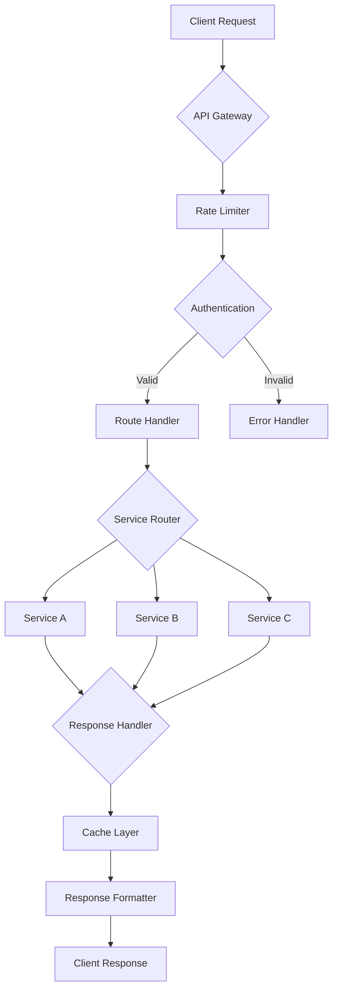
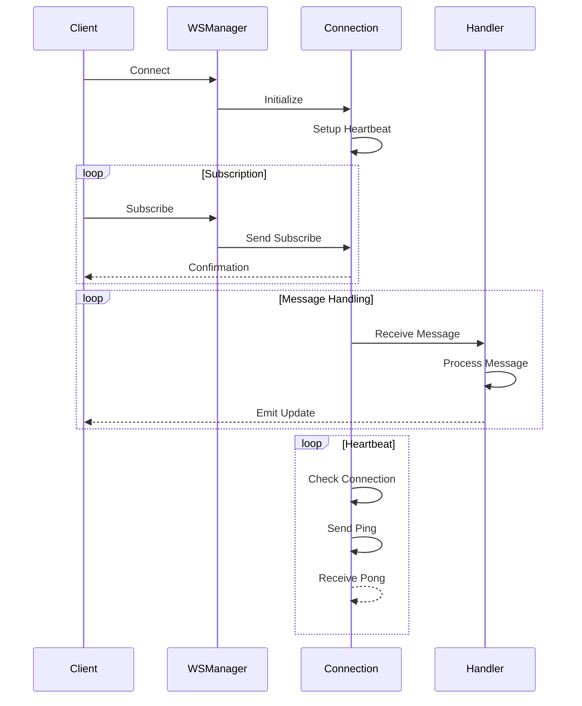
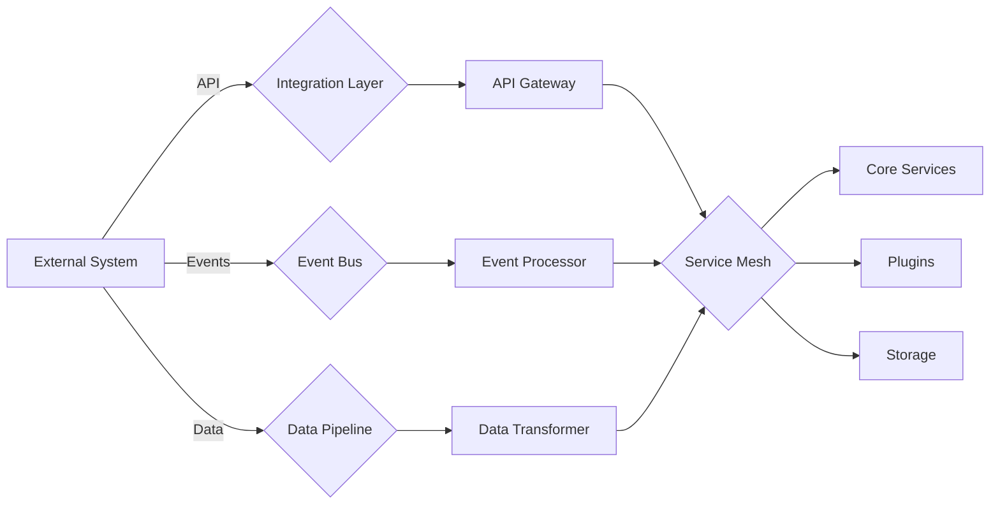
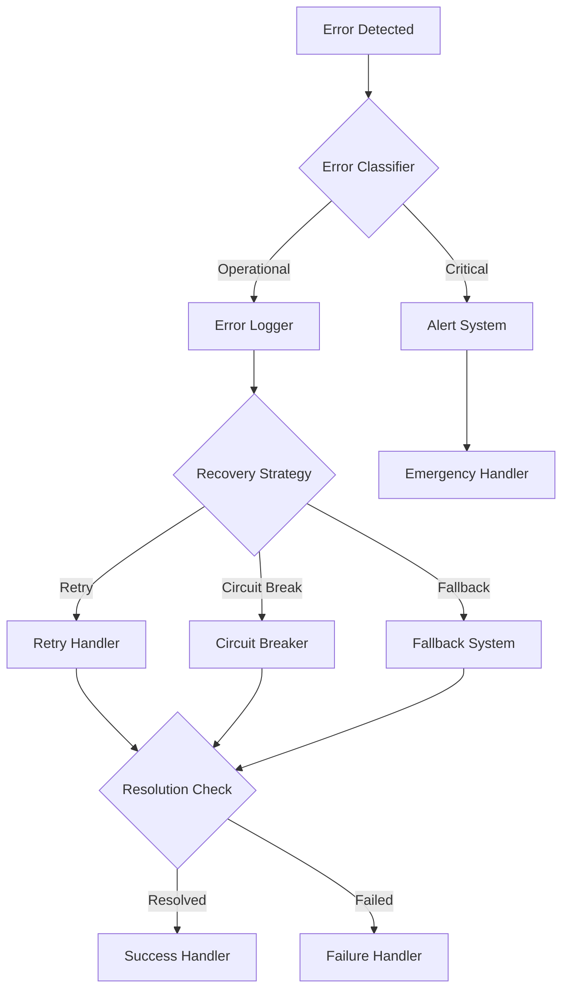
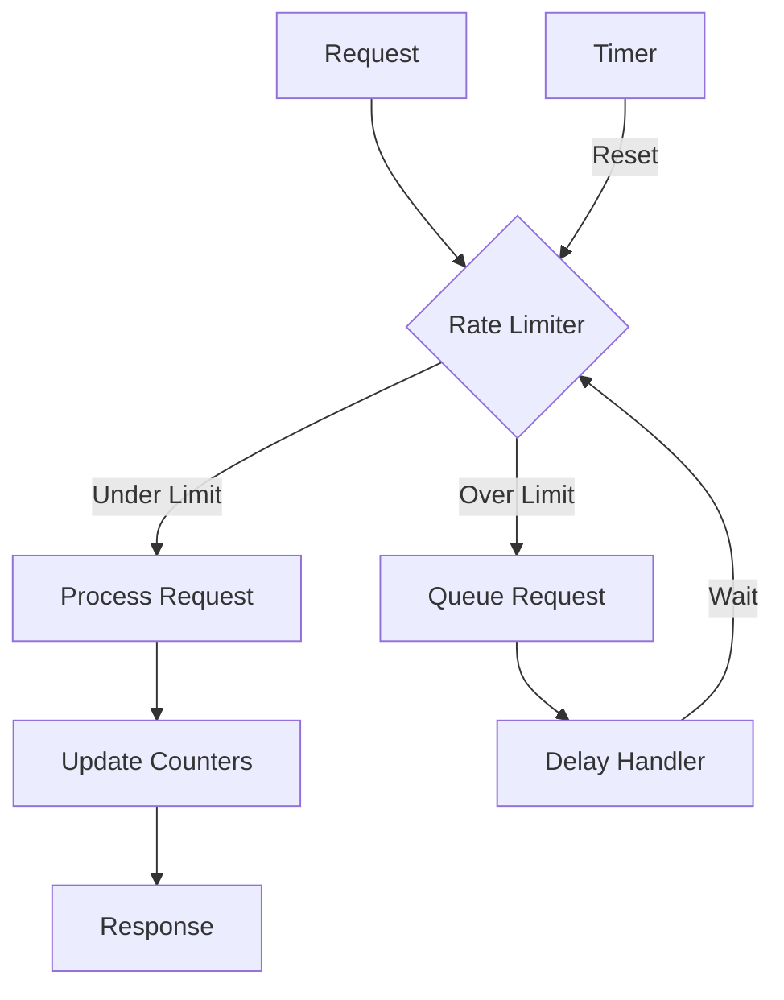

# 🌐 API Integration Guide

## 📚 Table of Contents
1. [Overview](#overview)
2. [Architecture](#architecture)
3. [REST API Integration](#rest-api)
4. [WebSocket Integration](#websocket)
5. [External Services](#external-services)
6. [Error Handling](#error-handling)
7. [Rate Limiting](#rate-limiting)
8. [Implementation Examples](#examples)

## 🌟 Overview

The API Integration system provides a robust and efficient way to interact with various services in the Eliza Market Scanner platform. Key features include:

- REST API client implementation
- WebSocket connection management
- Rate limiting and backoff strategies
- Error handling and retry logic
- Authentication integration
- Response parsing and validation

## 🏗️ Architecture

### API Integration Flow


## 🔌 REST API Integration

### API Client Interface
```typescript
interface APIClient {
  // HTTP methods
  get<T>(path: string, params?: Record<string, unknown>): Promise<T>;
  post<T>(path: string, data: unknown): Promise<T>;
  put<T>(path: string, data: unknown): Promise<T>;
  delete<T>(path: string): Promise<T>;
  
  // Configuration
  config: {
    baseURL: string;
    timeout: number;
    headers: Record<string, string>;
  };
  
  // Middleware
  use(middleware: APIMiddleware): void;
}
```

### Authentication Integration
```typescript
interface APIAuthProvider {
  // Authentication methods
  getAuthHeader(): Promise<Record<string, string>>;
  refreshAuth(): Promise<void>;
  
  // Event handlers
  onAuthError(handler: (error: Error) => Promise<void>): void;
  onAuthRefresh(handler: () => Promise<void>): void;
}
```

## 🔄 WebSocket Integration

### WebSocket Flow


### WebSocket Client
```typescript
interface WebSocketClient {
  // Connection management
  connect(): Promise<void>;
  disconnect(): Promise<void>;
  reconnect(): Promise<void>;
  
  // Message handling
  subscribe(channel: string): Promise<void>;
  unsubscribe(channel: string): Promise<void>;
  send(message: unknown): Promise<void>;
  
  // Event handlers
  onMessage(handler: (data: unknown) => void): void;
  onError(handler: (error: Error) => void): void;
  onClose(handler: () => void): void;
  
  // State
  isConnected(): boolean;
  getState(): WebSocketState;
}
```

## 🌍 External Services

### Service Integration Flow


### Service Integration
```typescript
interface ServiceIntegration {
  // Service lifecycle
  initialize(): Promise<void>;
  connect(): Promise<void>;
  disconnect(): Promise<void>;
  
  // Health checks
  checkHealth(): Promise<ServiceHealth>;
  
  // Configuration
  config: {
    service: string;
    version: string;
    endpoints: Record<string, string>;
  };
}
```

## ⚠️ Error Handling

### Error Flow


### Error Types
```typescript
enum APIErrorType {
  Network = 'NETWORK',
  Authentication = 'AUTH',
  RateLimit = 'RATE_LIMIT',
  Server = 'SERVER',
  Client = 'CLIENT',
  Validation = 'VALIDATION'
}

interface APIError extends Error {
  type: APIErrorType;
  status?: number;
  retryable: boolean;
  context: Record<string, unknown>;
}
```

## 🚦 Rate Limiting

### Rate Limiting Flow


### Rate Limiter
```typescript
interface RateLimiter {
  // Rate limiting methods
  acquire(): Promise<void>;
  release(): void;
  
  // Configuration
  config: {
    maxRequests: number;
    interval: number;
    fairness: boolean;
  };
  
  // State
  getCurrentRate(): number;
  getRemainingTokens(): number;
}
```

## 💡 Implementation Examples

### REST API Client Implementation
```typescript
class RESTAPIClient implements APIClient {
  constructor(
    private readonly config: APIConfig,
    private readonly auth: APIAuthProvider,
    private readonly rateLimiter: RateLimiter
  ) {}
  
  async get<T>(path: string, params?: Record<string, unknown>): Promise<T> {
    await this.rateLimiter.acquire();
    
    try {
      const headers = await this.auth.getAuthHeader();
      
      const response = await fetch(`${this.config.baseURL}${path}`, {
        method: 'GET',
        headers: {
          ...headers,
          'Content-Type': 'application/json'
        },
        params
      });
      
      if (!response.ok) {
        throw new APIError({
          type: this.getErrorType(response.status),
          status: response.status,
          message: await response.text()
        });
      }
      
      return response.json();
    } finally {
      this.rateLimiter.release();
    }
  }
}
```

### WebSocket Implementation
```typescript
class MarketDataWebSocket implements WebSocketClient {
  private ws: WebSocket | null = null;
  private reconnectAttempts = 0;
  
  async connect(): Promise<void> {
    try {
      this.ws = new WebSocket(this.config.url);
      
      this.ws.onmessage = (event) => {
        const data = JSON.parse(event.data);
        this.messageHandlers.forEach(handler => handler(data));
      };
      
      this.ws.onerror = (error) => {
        this.errorHandlers.forEach(handler => handler(error));
        this.handleReconnect();
      };
      
      await new Promise<void>((resolve, reject) => {
        if (!this.ws) return reject(new Error('WebSocket not initialized'));
        
        this.ws.onopen = () => {
          this.reconnectAttempts = 0;
          resolve();
        };
      });
    } catch (error) {
      this.handleReconnect();
      throw error;
    }
  }
}
```

## 📊 API Monitoring

### Metrics Collection
```typescript
interface APIMetrics {
  requests: {
    total: number;
    success: number;
    failed: number;
    latency: number[];
  };
  rateLimit: {
    hits: number;
    remaining: number;
    resetTime: number;
  };
  websocket: {
    connected: boolean;
    messageRate: number;
    reconnects: number;
  };
}
```

### Health Monitoring
```typescript
interface HealthMonitor {
  // Health checks
  checkAPIHealth(): Promise<HealthStatus>;
  checkWebSocketHealth(): Promise<HealthStatus>;
  
  // Alerts
  configureAlerts(config: AlertConfig): void;
  
  // Reporting
  generateHealthReport(): Promise<HealthReport>;
}
```

---

*Note: This guide is continuously updated with new integration patterns and best practices as they are developed.* 