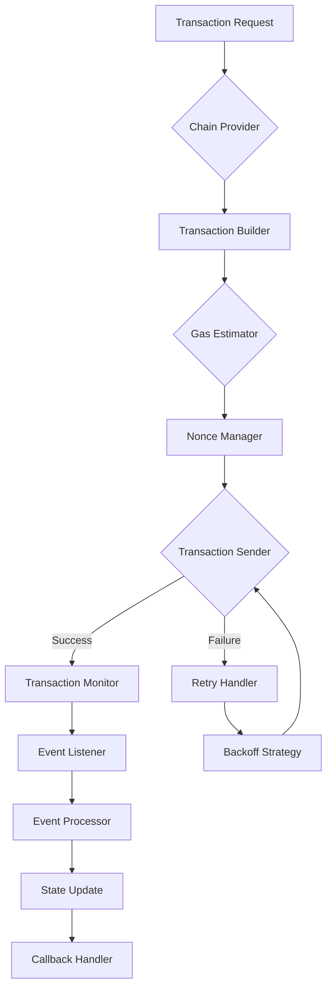
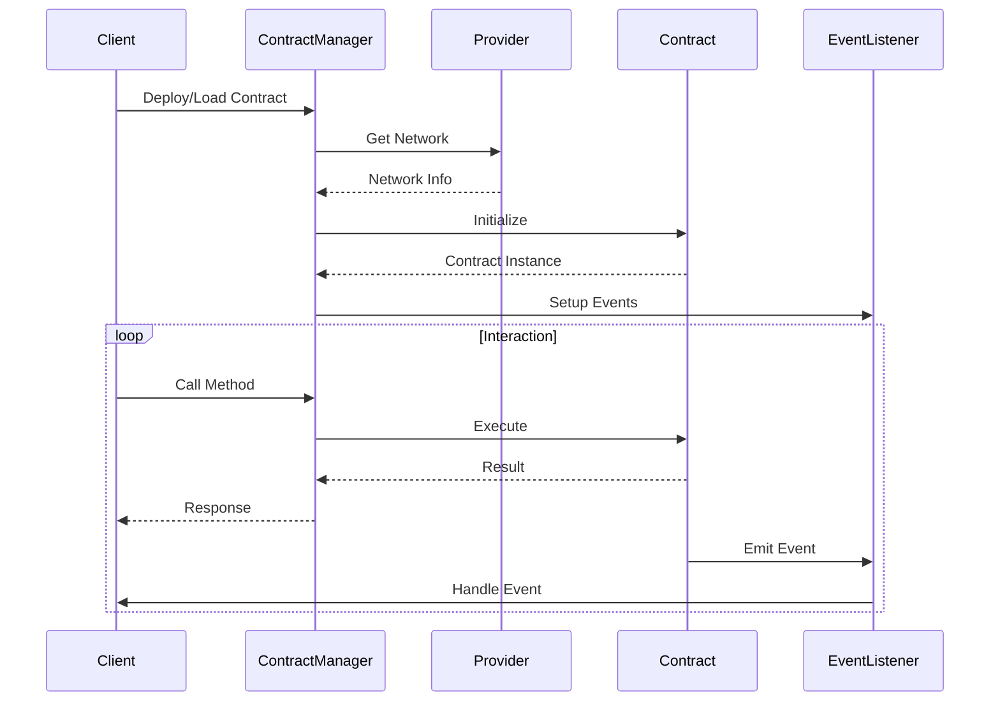
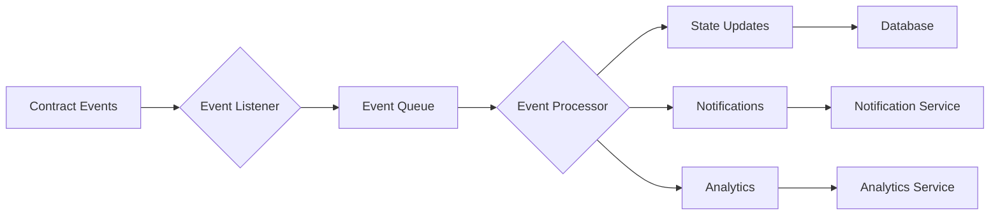
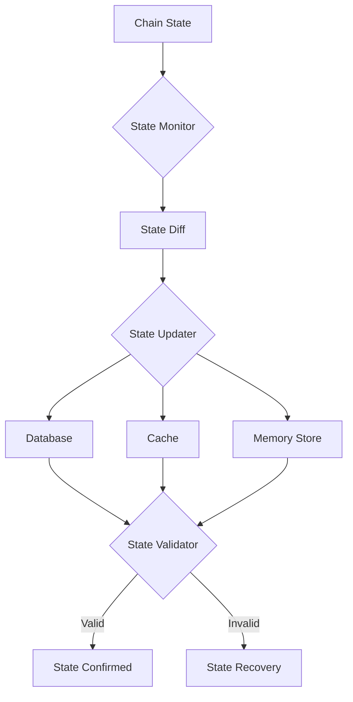
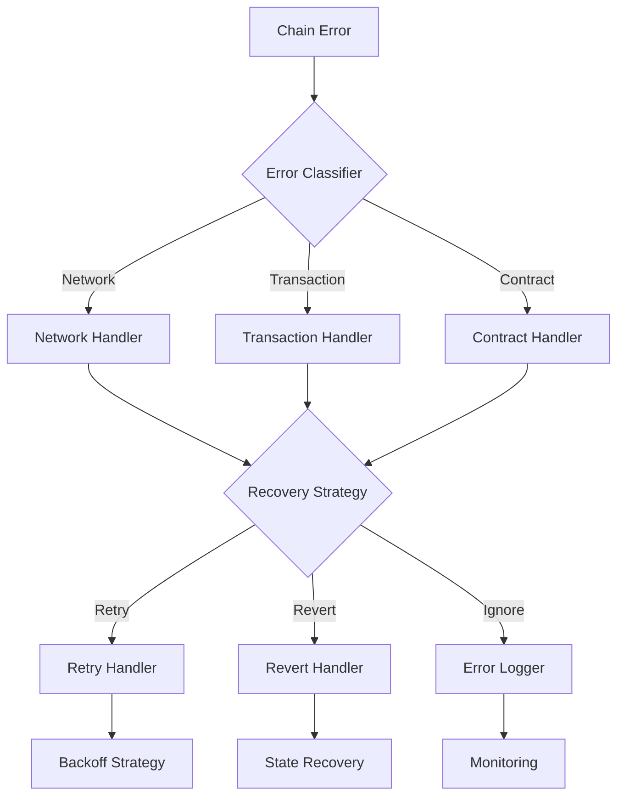

# ⛓️ Chain Integration Guide

## 📚 Table of Contents
1. [Overview](#overview)
2. [Architecture](#architecture)
3. [Transaction Management](#transaction-management)
4. [Contract Integration](#contract-integration)
5. [Event Handling](#event-handling)
6. [State Management](#state-management)
7. [Error Handling](#error-handling)
8. [Implementation Examples](#examples)

## 🌟 Overview

The Chain Integration system provides a robust and efficient way to interact with various blockchain networks in the Eliza Market Scanner platform. Key features include:

- Transaction management
- Smart contract integration
- Event monitoring
- State synchronization
- Gas optimization
- Error handling
- Multi-chain support

## 🏗️ Architecture

### Chain Integration Flow


## 📊 Transaction Management

### Transaction Manager
```typescript
interface TransactionManager {
  // Transaction methods
  buildTransaction(params: TxParams): Promise<Transaction>;
  estimateGas(tx: Transaction): Promise<BigNumber>;
  sendTransaction(tx: Transaction): Promise<string>;
  
  // Transaction monitoring
  getTransaction(hash: string): Promise<TransactionStatus>;
  waitForConfirmation(hash: string): Promise<Receipt>;
  
  // Nonce management
  getNonce(address: string): Promise<number>;
  incrementNonce(address: string): void;
}
```

### Gas Management
```typescript
interface GasManager {
  // Gas estimation
  estimateGas(tx: Transaction): Promise<BigNumber>;
  getGasPrice(): Promise<BigNumber>;
  
  // Gas optimization
  optimizeGas(tx: Transaction): Promise<Transaction>;
  
  // Gas price tracking
  trackGasPrice(): void;
  getGasPriceHistory(): GasPriceHistory;
}
```

## 🔗 Contract Integration

### Contract Flow


### Contract Manager
```typescript
interface ContractManager {
  // Contract deployment
  deploy(abi: ABI, bytecode: string, args: unknown[]): Promise<Contract>;
  
  // Contract interaction
  loadContract(address: string, abi: ABI): Contract;
  callMethod(contract: Contract, method: string, args: unknown[]): Promise<unknown>;
  
  // Event handling
  subscribeToEvents(contract: Contract, events: string[]): void;
  unsubscribeFromEvents(contract: Contract, events: string[]): void;
}
```

## 📡 Event Handling

### Event System Flow


### Event Handler
```typescript
interface EventHandler {
  // Event subscription
  subscribe(eventName: string, callback: EventCallback): void;
  unsubscribe(eventName: string): void;
  
  // Event processing
  processEvent(event: Event): Promise<void>;
  
  // Event filtering
  filterEvents(filter: EventFilter): Event[];
}
```

## 🔄 State Management

### State Sync Flow


### State Manager
```typescript
interface StateManager {
  // State synchronization
  syncState(): Promise<void>;
  validateState(): Promise<boolean>;
  
  // State updates
  updateState(update: StateUpdate): Promise<void>;
  rollbackState(checkpoint: StateCheckpoint): Promise<void>;
  
  // State queries
  getState(): Promise<ChainState>;
  getStateAtBlock(blockNumber: number): Promise<ChainState>;
}
```

## ⚠️ Error Handling

### Error Flow


### Error Types
```typescript
enum ChainErrorType {
  NETWORK = 'NETWORK',
  TRANSACTION = 'TRANSACTION',
  CONTRACT = 'CONTRACT',
  NONCE = 'NONCE',
  GAS = 'GAS'
}

interface ChainError extends Error {
  type: ChainErrorType;
  code: string;
  details: Record<string, unknown>;
  recoverable: boolean;
}
```

## 💡 Implementation Examples

### Transaction Implementation
```typescript
class EthereumTransactionManager implements TransactionManager {
  constructor(
    private readonly provider: Provider,
    private readonly gasManager: GasManager,
    private readonly nonceManager: NonceManager
  ) {}
  
  async sendTransaction(tx: Transaction): Promise<string> {
    const nonce = await this.nonceManager.getNonce(tx.from);
    const gasPrice = await this.gasManager.getGasPrice();
    const gasLimit = await this.gasManager.estimateGas(tx);
    
    const signedTx = await this.provider.signTransaction({
      ...tx,
      nonce,
      gasPrice,
      gasLimit
    });
    
    try {
      const hash = await this.provider.sendTransaction(signedTx);
      this.nonceManager.incrementNonce(tx.from);
      return hash;
    } catch (error) {
      throw new ChainError({
        type: ChainErrorType.TRANSACTION,
        message: 'Transaction failed',
        details: { tx, error }
      });
    }
  }
}
```

### Contract Implementation
```typescript
class SmartContractManager implements ContractManager {
  private contracts: Map<string, Contract> = new Map();
  
  async deploy(
    abi: ABI,
    bytecode: string,
    args: unknown[]
  ): Promise<Contract> {
    const factory = new ContractFactory(abi, bytecode, this.signer);
    
    try {
      const contract = await factory.deploy(...args);
      await contract.deployed();
      
      this.contracts.set(contract.address, contract);
      return contract;
    } catch (error) {
      throw new ChainError({
        type: ChainErrorType.CONTRACT,
        message: 'Contract deployment failed',
        details: { abi, args, error }
      });
    }
  }
  
  async callMethod(
    contract: Contract,
    method: string,
    args: unknown[]
  ): Promise<unknown> {
    try {
      const tx = await contract[method](...args);
      const receipt = await tx.wait();
      return receipt;
    } catch (error) {
      throw new ChainError({
        type: ChainErrorType.CONTRACT,
        message: 'Contract method call failed',
        details: { contract: contract.address, method, args, error }
      });
    }
  }
}
```

## 📊 Chain Monitoring

### Metrics Collection
```typescript
interface ChainMetrics {
  transactions: {
    sent: number;
    confirmed: number;
    failed: number;
    pending: number;
  };
  gas: {
    used: BigNumber;
    price: BigNumber;
    limit: BigNumber;
  };
  blocks: {
    current: number;
    processed: number;
    missed: number;
  };
  events: {
    received: number;
    processed: number;
    errors: number;
  };
}
```

### Health Monitoring
```typescript
interface ChainMonitor {
  // Health checks
  checkNodeHealth(): Promise<HealthStatus>;
  checkSyncStatus(): Promise<SyncStatus>;
  
  // Performance monitoring
  getNetworkStats(): Promise<NetworkStats>;
  getNodePerformance(): Promise<NodePerformance>;
  
  // Alerts
  configureAlerts(config: AlertConfig): void;
  handleAlert(alert: Alert): Promise<void>;
}
```

## 🔒 Security Considerations

### Security Configuration
```typescript
interface SecurityConfig {
  // Transaction security
  maxGasPrice: BigNumber;
  maxTransactionValue: BigNumber;
  
  // Contract security
  allowedContracts: string[];
  methodWhitelist: Record<string, string[]>;
  
  // Network security
  allowedNetworks: number[];
  requiredConfirmations: number;
}
```

### Validation System
```typescript
interface TransactionValidator {
  // Validation methods
  validateTransaction(tx: Transaction): Promise<boolean>;
  validateContractCall(contract: string, method: string): Promise<boolean>;
  
  // Security checks
  checkGasPrice(price: BigNumber): boolean;
  checkValue(value: BigNumber): boolean;
  checkAddress(address: string): boolean;
}
```

---

*Note: This guide is continuously updated as chain integration patterns and best practices evolve.* 