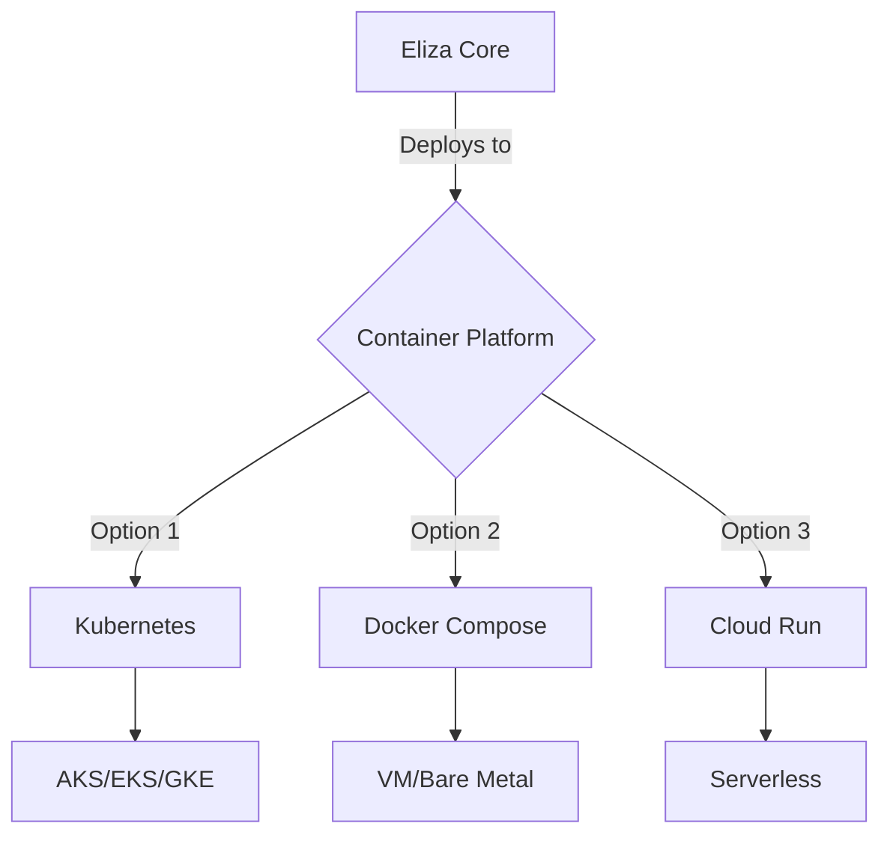
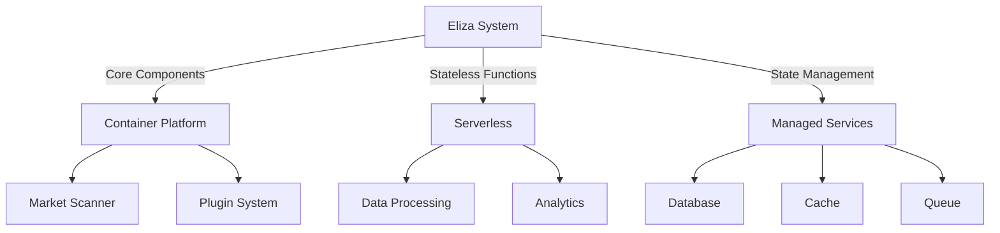
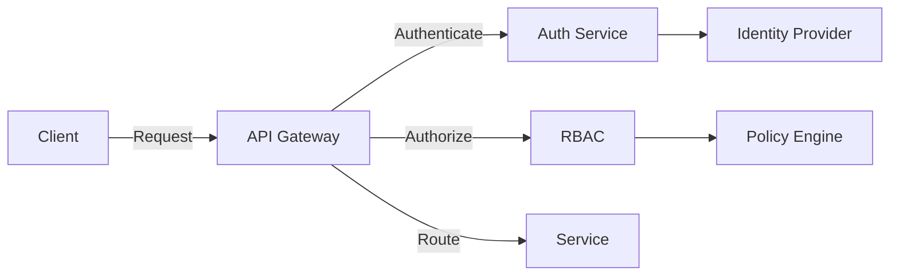
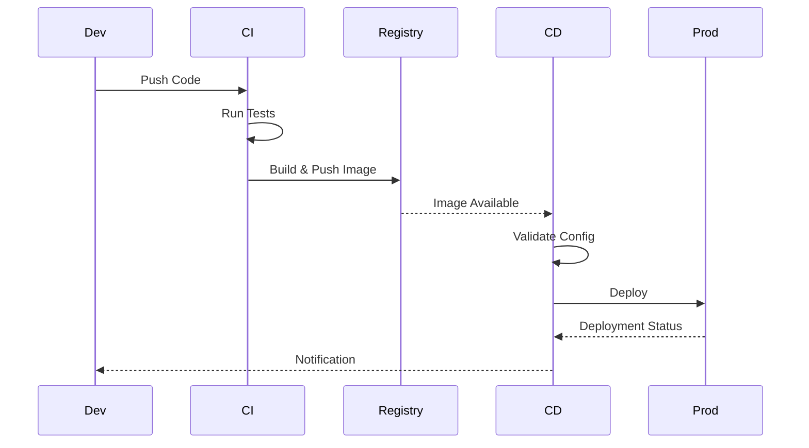

# 🚀 Eliza Market Scanner Deployment Guide

## 📚 Table of Contents
1. [Overview](#overview)
2. [Deployment Options](#deployment-options)
3. [Configuration](#configuration)
4. [Security](#security)
5. [Monitoring](#monitoring)
6. [Maintenance](#maintenance)
7. [Troubleshooting](#troubleshooting)

## 🌟 Overview

This guide covers the deployment process for the Eliza Market Scanner system, including all necessary components, configurations, and best practices for production environments.

### 🎯 Key Components
- Core Market Scanner
- Plugin System
- Database Layer
- API Gateway
- Monitoring System

## 🏗️ Deployment Options

### 1. Container Deployment


#### Kubernetes Deployment
```yaml
apiVersion: apps/v1
kind: Deployment
metadata:
  name: eliza-market-scanner
spec:
  replicas: 3
  selector:
    matchLabels:
      app: eliza-scanner
  template:
    metadata:
      labels:
        app: eliza-scanner
    spec:
      containers:
      - name: eliza-core
        image: eliza/market-scanner:latest
        ports:
        - containerPort: 3000
        env:
        - name: NODE_ENV
          value: "production"
        - name: DB_CONNECTION
          valueFrom:
            secretKeyRef:
              name: eliza-secrets
              key: db-connection
```

#### Docker Compose Setup
```yaml
version: '3.8'
services:
  eliza-core:
    image: eliza/market-scanner:latest
    environment:
      - NODE_ENV=production
    ports:
      - "3000:3000"
    volumes:
      - ./config:/app/config
    depends_on:
      - database
      - redis

  database:
    image: postgres:latest
    environment:
      - POSTGRES_PASSWORD_FILE=/run/secrets/db_password
    volumes:
      - pgdata:/var/lib/postgresql/data
    
  redis:
    image: redis:latest
    volumes:
      - redisdata:/data

volumes:
  pgdata:
  redisdata:
```

### 2. Serverless Deployment
```typescript
// AWS Lambda Handler
export const handler = async (event: APIGatewayEvent): Promise<APIGatewayProxyResult> => {
  const scanner = new ElizaScanner({
    mode: 'serverless',
    config: process.env.SCANNER_CONFIG
  });
  
  return {
    statusCode: 200,
    body: JSON.stringify(await scanner.process(event))
  };
};
```

### 3. Hybrid Deployment


## ⚙️ Configuration

### 1. Environment Configuration
```typescript
interface DeploymentConfig {
  environment: 'production' | 'staging' | 'development';
  scaling: {
    minReplicas: number;
    maxReplicas: number;
    targetCPUUtilization: number;
  };
  resources: {
    cpu: string;
    memory: string;
    storage: string;
  };
  networking: {
    ingress: IngressConfig;
    serviceMesh?: ServiceMeshConfig;
  };
}
```

### 2. Security Configuration
```typescript
interface SecurityConfig {
  authentication: {
    provider: 'oauth' | 'jwt' | 'apiKey';
    config: AuthConfig;
  };
  encryption: {
    atRest: EncryptionConfig;
    inTransit: TLSConfig;
  };
  access: {
    rbac: RBACConfig;
    networkPolicies: NetworkPolicyConfig;
  };
}
```

### 3. Monitoring Configuration
```typescript
interface MonitoringConfig {
  metrics: {
    prometheus: PrometheusConfig;
    customMetrics: MetricsConfig;
  };
  logging: {
    elasticsearch: ElasticsearchConfig;
    logLevel: LogLevel;
  };
  alerting: {
    thresholds: AlertThresholds;
    notifications: NotificationConfig;
  };
}
```

## 🔒 Security

### 1. Authentication & Authorization


### 2. Network Security
```typescript
interface NetworkSecurity {
  ingress: {
    whitelist: string[];
    rateLimit: RateLimitConfig;
    waf: WAFConfig;
  };
  encryption: {
    certificates: CertConfig;
    rotation: RotationPolicy;
  };
  monitoring: {
    ids: IDSConfig;
    logging: AuditConfig;
  };
}
```

## 📊 Monitoring

### 1. Metrics Collection
```typescript
interface MetricsSystem {
  collectors: {
    system: SystemMetrics;
    business: BusinessMetrics;
    custom: CustomMetrics;
  };
  storage: {
    timeseriesDB: TimeseriesConfig;
    retention: RetentionPolicy;
  };
  visualization: {
    dashboards: DashboardConfig;
    alerts: AlertConfig;
  };
}
```

### 2. Logging System
```typescript
interface LoggingSystem {
  collectors: {
    application: AppLogger;
    system: SysLogger;
    audit: AuditLogger;
  };
  processing: {
    filters: LogFilter[];
    enrichment: EnrichmentConfig;
  };
  storage: {
    elasticsearch: ElasticsearchConfig;
    retention: RetentionPolicy;
  };
}
```

## 🔧 Maintenance

### 1. Backup & Recovery
```typescript
interface BackupSystem {
  schedule: {
    full: BackupSchedule;
    incremental: BackupSchedule;
  };
  storage: {
    location: StorageConfig;
    retention: RetentionPolicy;
  };
  recovery: {
    rpo: number; // Recovery Point Objective
    rto: number; // Recovery Time Objective
  };
}
```

### 2. Updates & Patches
```typescript
interface UpdateSystem {
  strategy: {
    rolling: RollingUpdateConfig;
    blueGreen: BlueGreenConfig;
    canary: CanaryConfig;
  };
  automation: {
    schedule: UpdateSchedule;
    validation: ValidationConfig;
  };
  rollback: {
    triggers: RollbackTrigger[];
    procedure: RollbackProcedure;
  };
}
```

## 🔍 Troubleshooting

### 1. Common Issues
1. Connection Issues
   ```typescript
   interface ConnectionTroubleshooting {
     checks: {
       network: NetworkCheck[];
       dns: DNSCheck[];
       tls: TLSCheck[];
     };
     resolution: {
       steps: ResolutionStep[];
       verification: VerificationStep[];
     };
   }
   ```

2. Performance Issues
   ```typescript
   interface PerformanceTroubleshooting {
     diagnostics: {
       cpu: CPUProfile;
       memory: MemoryProfile;
       disk: DiskProfile;
     };
     optimization: {
       suggestions: OptimizationSuggestion[];
       implementation: ImplementationStep[];
     };
   }
   ```

### 2. Debug Tools
```typescript
interface DebugTools {
  profilers: {
    cpu: CPUProfiler;
    memory: MemoryProfiler;
    network: NetworkProfiler;
  };
  analyzers: {
    logs: LogAnalyzer;
    metrics: MetricsAnalyzer;
    traces: TraceAnalyzer;
  };
  utilities: {
    healthCheck: HealthChecker;
    configValidator: ConfigValidator;
    connectivityTest: ConnectivityTester;
  };
}
```

## 📚 Best Practices

### 1. Deployment Checklist
- [ ] Environment Configuration Validation
- [ ] Security Compliance Check
- [ ] Resource Requirements Verification
- [ ] Backup System Validation
- [ ] Monitoring Setup Confirmation
- [ ] Performance Baseline Establishment
- [ ] Rollback Procedure Testing
- [ ] Documentation Update

### 2. Production Guidelines
1. Configuration Management
   - Use environment variables for configuration
   - Implement secrets management
   - Maintain configuration versioning
   - Regular configuration audits

2. Security Measures
   - Regular security updates
   - Access control implementation
   - Network security configuration
   - Encryption at rest and in transit

3. Monitoring Setup
   - Comprehensive metrics collection
   - Log aggregation and analysis
   - Alert configuration
   - Performance monitoring

4. Maintenance Procedures
   - Regular backup scheduling
   - Update management
   - Resource optimization
   - Health checks implementation

## 🔄 Deployment Workflow



## 📈 Scaling Strategy

### 1. Horizontal Scaling
```typescript
interface ScalingStrategy {
  auto: {
    metrics: ScalingMetric[];
    thresholds: ScalingThreshold;
    cooldown: number;
  };
  manual: {
    procedures: ScalingProcedure[];
    validation: ValidationStep[];
  };
  limits: {
    min: number;
    max: number;
    step: number;
  };
}
```

### 2. Resource Management
```typescript
interface ResourceManagement {
  allocation: {
    cpu: CPUAllocation;
    memory: MemoryAllocation;
    storage: StorageAllocation;
  };
  optimization: {
    autoScaling: AutoScalingConfig;
    resourceQuotas: QuotaConfig;
  };
  monitoring: {
    usage: UsageMetrics;
    costs: CostMetrics;
  };
}
```

## 🔗 Additional Resources

### 1. Reference Documentation
- [Kubernetes Documentation](https://kubernetes.io/docs/)
- [Docker Documentation](https://docs.docker.com/)
- [AWS Lambda Documentation](https://docs.aws.amazon.com/lambda/)
- [Monitoring Best Practices](https://prometheus.io/docs/practices/naming/)

### 2. Tools and Utilities
- Deployment Scripts
- Configuration Templates
- Monitoring Dashboards
- Troubleshooting Tools

---

*This guide is continuously updated with new deployment patterns and best practices.* 