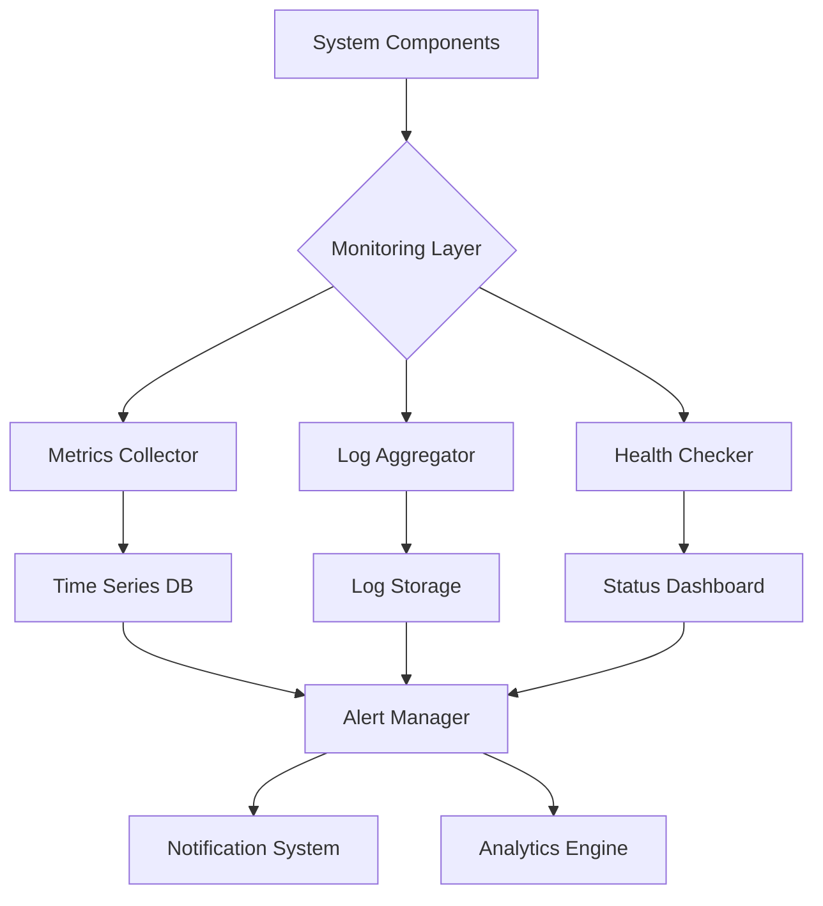

# 📊 System Monitoring Guide

## 📚 Table of Contents
1. [Overview](#overview)
2. [Monitoring Architecture](#architecture)
3. [Metrics Collection](#metrics)
4. [Logging System](#logging)
5. [Alerting](#alerting)
6. [Dashboards](#dashboards)
7. [Performance Monitoring](#performance)
8. [Health Checks](#health-checks)
9. [Implementation Examples](#examples)

## 🌟 Overview

The System Monitoring infrastructure provides comprehensive visibility into the Eliza Market Scanner platform's health, performance, and operational status. Key features include:

- Real-time metrics collection
- Distributed logging
- Intelligent alerting
- Performance monitoring
- Health checking
- Custom dashboards
- Anomaly detection

## 🏗️ Monitoring Architecture

### System Overview


### Component Integration
```typescript
interface MonitoringSystem {
  collectors: {
    metrics: MetricsCollector;
    logs: LogCollector;
    traces: TraceCollector;
  };
  storage: {
    timeseriesDB: TimeSeriesDB;
    logStore: LogStorage;
    traceStore: TraceStorage;
  };
  analysis: {
    alerting: AlertManager;
    analytics: AnalyticsEngine;
    reporting: ReportGenerator;
  };
}
```

## 📊 Metrics Collection

### Core Metrics
```typescript
interface SystemMetrics {
  // Resource metrics
  resources: {
    cpu: CPUMetrics;
    memory: MemoryMetrics;
    disk: DiskMetrics;
    network: NetworkMetrics;
  };
  
  // Application metrics
  application: {
    requests: RequestMetrics;
    latency: LatencyMetrics;
    errors: ErrorMetrics;
    throughput: ThroughputMetrics;
  };
  
  // Business metrics
  business: {
    trades: TradeMetrics;
    orders: OrderMetrics;
    analysis: AnalysisMetrics;
  };
}
```

### Metrics Implementation
```typescript
class MetricsCollector {
  private metrics: Map<string, Metric> = new Map();
  
  // Collect system metrics
  async collectSystemMetrics(): Promise<SystemMetrics> {
    return {
      cpu: await this.collectCPUMetrics(),
      memory: await this.collectMemoryMetrics(),
      disk: await this.collectDiskMetrics(),
      network: await this.collectNetworkMetrics()
    };
  }
  
  // Collect application metrics
  async collectAppMetrics(): Promise<ApplicationMetrics> {
    return {
      requests: this.getRequestMetrics(),
      latency: this.getLatencyMetrics(),
      errors: this.getErrorMetrics(),
      throughput: this.getThroughputMetrics()
    };
  }
}
```

## 📝 Logging System

### Log Configuration
```typescript
interface LoggingConfig {
  // Log levels
  levels: {
    error: 0;
    warn: 1;
    info: 2;
    debug: 3;
    trace: 4;
  };
  
  // Log categories
  categories: {
    system: SystemLogConfig;
    application: AppLogConfig;
    security: SecurityLogConfig;
    audit: AuditLogConfig;
  };
  
  // Storage configuration
  storage: {
    retention: string;
    compression: boolean;
    indexing: IndexConfig;
  };
}
```

### Log Processing
```typescript
class LogProcessor {
  async processLogs(logs: Log[]): Promise<ProcessedLogs> {
    return {
      parsed: this.parseLogs(logs),
      enriched: await this.enrichLogs(logs),
      filtered: this.filterLogs(logs),
      indexed: await this.indexLogs(logs)
    };
  }
  
  private async enrichLogs(logs: Log[]): Promise<EnrichedLog[]> {
    return Promise.all(
      logs.map(async (log) => ({
        ...log,
        metadata: await this.getMetadata(log),
        context: await this.getContext(log),
        correlationId: this.getCorrelationId(log)
      }))
    );
  }
}
```

## ⚠️ Alerting

### Alert Configuration
```typescript
interface AlertConfig {
  // Alert rules
  rules: {
    name: string;
    condition: AlertCondition;
    severity: AlertSeverity;
    labels: Record<string, string>;
  }[];
  
  // Notification channels
  channels: {
    email: EmailConfig;
    slack: SlackConfig;
    pagerduty: PagerDutyConfig;
  };
  
  // Alert routing
  routing: {
    default: string;
    critical: string[];
    warning: string[];
  };
}
```

### Alert Manager
```typescript
class AlertManager {
  async processAlert(alert: Alert): Promise<void> {
    // Evaluate alert
    const evaluation = await this.evaluateAlert(alert);
    
    if (evaluation.shouldNotify) {
      // Get notification targets
      const targets = this.getNotificationTargets(alert);
      
      // Send notifications
      await Promise.all(
        targets.map(target => this.notify(target, alert))
      );
      
      // Track alert status
      await this.trackAlert(alert);
    }
  }
}
```

## 📈 Dashboards

### Dashboard Configuration
```typescript
interface DashboardConfig {
  // Layout
  layout: {
    rows: number;
    columns: number;
    panels: PanelConfig[];
  };
  
  // Data sources
  dataSources: {
    metrics: MetricsSource;
    logs: LogSource;
    traces: TraceSource;
  };
  
  // Refresh settings
  refresh: {
    interval: number;
    automatic: boolean;
  };
}
```

### Dashboard Implementation
```typescript
class Dashboard {
  private panels: Map<string, Panel> = new Map();
  
  async updateDashboard(): Promise<void> {
    // Update all panels
    await Promise.all(
      Array.from(this.panels.values()).map(panel =>
        panel.update()
      )
    );
    
    // Check for alerts
    await this.checkAlerts();
    
    // Update metadata
    this.updateMetadata();
  }
}
```

## 🚀 Performance Monitoring

### Performance Metrics
```typescript
interface PerformanceMetrics {
  // Response time
  latency: {
    p50: number;
    p90: number;
    p99: number;
  };
  
  // Resource usage
  resources: {
    cpuUsage: number;
    memoryUsage: number;
    diskIO: number;
  };
  
  // Application metrics
  application: {
    requestRate: number;
    errorRate: number;
    saturation: number;
  };
}
```

### Performance Analyzer
```typescript
class PerformanceAnalyzer {
  async analyzePerformance(): Promise<PerformanceAnalysis> {
    const metrics = await this.collectMetrics();
    
    return {
      summary: this.generateSummary(metrics),
      bottlenecks: this.identifyBottlenecks(metrics),
      recommendations: this.generateRecommendations(metrics),
      trends: this.analyzeTrends(metrics)
    };
  }
}
```

## 🔍 Health Checks

### Health Check Configuration
```typescript
interface HealthCheckConfig {
  // Check types
  checks: {
    liveness: LivenessCheck[];
    readiness: ReadinessCheck[];
    startup: StartupCheck[];
  };
  
  // Check settings
  settings: {
    interval: number;
    timeout: number;
    threshold: number;
  };
  
  // Response actions
  actions: {
    onFailure: FailureAction[];
    onRecovery: RecoveryAction[];
  };
}
```

### Health Checker Implementation
```typescript
class HealthChecker {
  async performHealthCheck(): Promise<HealthStatus> {
    const results = await Promise.all([
      this.checkLiveness(),
      this.checkReadiness(),
      this.checkDependencies()
    ]);
    
    return {
      status: this.aggregateResults(results),
      details: this.generateDetails(results),
      timestamp: Date.now()
    };
  }
}
```

## 💡 Implementation Examples

### System Monitor Implementation
```typescript
class SystemMonitor {
  constructor(
    private readonly metrics: MetricsCollector,
    private readonly logs: LogProcessor,
    private readonly alerts: AlertManager
  ) {}
  
  async monitor(): Promise<void> {
    // Collect metrics
    const metrics = await this.metrics.collect();
    
    // Process logs
    const logs = await this.logs.process();
    
    // Check for alerts
    await this.alerts.evaluate(metrics, logs);
    
    // Update dashboards
    await this.updateDashboards(metrics, logs);
  }
}
```

### Monitoring Dashboard Example
```typescript
class MonitoringDashboard {
  private panels: DashboardPanel[] = [];
  
  async initialize(): Promise<void> {
    // Create system metrics panel
    this.panels.push(
      new MetricsPanel({
        title: 'System Resources',
        metrics: ['cpu', 'memory', 'disk'],
        interval: 5000
      })
    );
    
    // Create application metrics panel
    this.panels.push(
      new ApplicationPanel({
        title: 'Application Performance',
        metrics: ['requests', 'latency', 'errors'],
        interval: 1000
      })
    );
    
    // Create log viewer panel
    this.panels.push(
      new LogPanel({
        title: 'System Logs',
        levels: ['error', 'warn', 'info'],
        limit: 100
      })
    );
  }
}
```

## 📊 Best Practices

1. Metrics Collection
   - Use consistent naming conventions
   - Collect only necessary metrics
   - Set appropriate collection intervals
   - Implement data retention policies

2. Logging
   - Use structured logging
   - Include context information
   - Implement log rotation
   - Set appropriate log levels

3. Alerting
   - Define clear alert thresholds
   - Avoid alert fatigue
   - Implement alert routing
   - Regular alert review

4. Performance Monitoring
   - Monitor key performance indicators
   - Set performance baselines
   - Track trends over time
   - Regular performance reviews

5. Health Checks
   - Implement comprehensive checks
   - Set appropriate intervals
   - Define clear success criteria
   - Monitor check results

---

*Note: This guide is continuously updated with new monitoring patterns and best practices as they are developed.* 