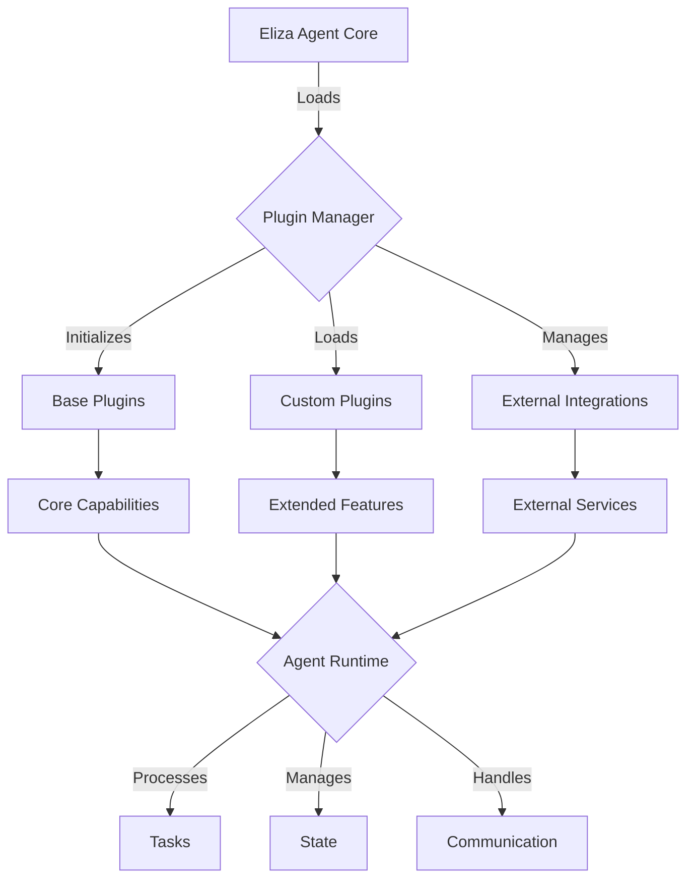

# 🤖 Eliza OS Framework Developer Guide

Welcome to the Eliza OS Framework Developer Guide! This repository contains comprehensive documentation for building and extending the Eliza OS Framework, a powerful system for creating intelligent AI agents.

## 🌟 Overview

Eliza OS is a flexible, plugin-based framework for creating and deploying intelligent agents that can perform a wide range of tasks. This guide provides detailed documentation, workflows, and best practices for developers working with the framework.

## 🏗️ Framework Architecture

### Agent System Workflow



### Core Components
- **Agent Core**: Central processing unit
- **Plugin System**: Extensible capability framework
- **Runtime Environment**: Task execution and state management
- **Integration Layer**: External system connectivity

## 📚 Documentation Structure

### 🔧 System Architecture
- Multi-agent system architecture
- Security implementation patterns
- Error handling strategies
- Performance optimization
- System monitoring

### 🔌 Integration Guides
- API integration patterns
- Database management
- Blockchain integration
- Deployment strategies
- API documentation

### 💻 Development Guides
- AI agent development
- Adapter patterns
- Bot automation
- Memory systems

### ⚙️ Infrastructure
- Testing infrastructure
- Logging system
- Workflow documentation
- Development standards

## 🛠️ Development Workflow

### Agent Development Process
1. Configure agent personality and behavior
2. Implement required plugins
3. Set up integrations
4. Deploy and monitor

### Plugin Development
```typescript
interface ElizaPlugin {
  name: string;
  version: string;
  capabilities: string[];
  initialize(): Promise<void>;
  execute(task: Task): Promise<Result>;
  cleanup(): Promise<void>;
}
```

## 📂 Framework Structure

```
eliza-os/
├── core/
│   ├── personality/
│   │   ├── base.json
│   │   └── templates/
│   ├── plugins/
│   │   ├── core/
│   │   └── custom/
│   └── runtime/
├── config/
│   ├── agent.json
│   └── plugins.json
└── integrations/
    ├── platforms/
    └── services/
```

## 🚀 Getting Started

1. **Installation**
   ```bash
   npm install @elizaos/core
   ```

2. **Basic Agent Setup**
   ```typescript
   import { ElizaAgent } from '@elizaos/core';
   
   const agent = new ElizaAgent({
     name: 'MyAgent',
     plugins: ['core-plugin'],
     personality: './config/personality.json'
   });
   ```

3. **Plugin Integration**
   ```typescript
   import { CustomPlugin } from './plugins/custom';
   
   agent.registerPlugin(new CustomPlugin());
   await agent.initialize();
   ```

## 📈 Maintenance and Updates

- Weekly documentation reviews
- Monthly content updates
- Quarterly architecture reviews
- Bi-annual major revisions

## 🤝 Contributing

We welcome contributions! Please see our [Contributing Guide](CONTRIBUTING.md) for details on:
- Code standards
- Documentation guidelines
- Pull request process
- Development workflow

## 📄 License

This project is licensed under the MIT License - see the [LICENSE](LICENSE) file for details.

---

*Last Updated: 2024-02-11* 