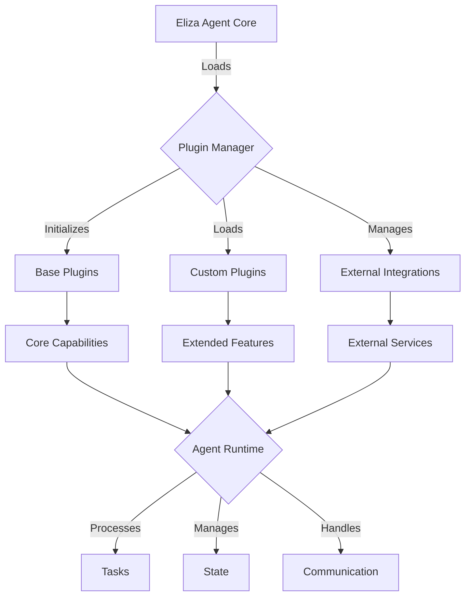

# 🤖 Eliza OS Framework Developer Guide

Welcome to the Eliza OS Framework Developer Guide! This repository contains comprehensive documentation for building and extending the Eliza OS Framework, a powerful system for creating intelligent AI agents.

## 🌟 Overview

Eliza OS is a flexible, plugin-based framework for creating and deploying intelligent agents that can perform a wide range of tasks. This guide provides detailed documentation, workflows, and best practices for developers working with the framework.

## 🏗️ Framework Architecture

### Agent System Workflow



### Core Components
- **Agent Core**: Central processing unit
- **Plugin System**: Extensible capability framework
- **Runtime Environment**: Task execution and state management
- **Integration Layer**: External system connectivity

## 📚 Documentation Structure

Our documentation is organized into the following key sections:

### 🔧 Architecture (`/architecture`)
- Multi-agent system architecture
- Security implementation patterns
- Error handling strategies
- Performance optimization
- System monitoring

### 🔌 Integration (`/integration`)
- API integration patterns
- Database management
- Blockchain integration
- Deployment strategies
- API documentation

### 💻 Development (`/development`)
- AI agent development
- Adapter patterns
- Bot automation
- Memory systems
- Character development
- Plugin development
- Client development
- Scripts development

### ⚙️ Infrastructure (`/infrastructure`)
- Testing infrastructure
- Logging system
- Workflow documentation
- Development standards
- File trees and documentation structure
- Task tracking and management
- Development templates

### 🤖 Auto-Bot (`/auto-bot`)
- Auto-bot chat development
- Chat formatting guidelines
- Development notes
- File structure
- Task management

### 🖥️ System (`/system`)
- Cursor system prompts
- Development prompts
- System configuration

## 🛠️ Development Workflow

### Agent Development Process
1. Configure agent personality and behavior
2. Implement required plugins
3. Set up integrations
4. Deploy and monitor

### Plugin Development
```typescript
interface ElizaPlugin {
  name: string;
  version: string;
  capabilities: string[];
  initialize(): Promise<void>;
  execute(task: Task): Promise<Result>;
  cleanup(): Promise<void>;
}
```

## 📂 Framework Structure

```
eliza-os/
├── core/
│   ├── personality/
│   │   ├── base.json
│   │   └── templates/
│   ├── plugins/
│   │   ├── core/
│   │   └── custom/
│   └── runtime/
├── config/
│   ├── agent.json
│   └── plugins.json
└── integrations/
    ├── platforms/
    └── services/
```

## 📈 Documentation Status

### 📊 Completion Status
- Core Architecture: 100% complete
- Integration Guides: 100% complete
- Development Guides: 100% complete
- Infrastructure Docs: 100% complete
- Auto-Bot Documentation: 100% complete
- System Configuration: 100% complete

### 🔄 Recent Updates
- Reorganized documentation into structured folders
- Added comprehensive auto-bot documentation
- Enhanced system configuration guides
- Updated development workflows
- Added detailed infrastructure setup guides

### 📝 File Metrics
- Total Guide Files: 35+
- Architecture Guides: 5 files
- Integration Guides: 5 files
- Development Guides: 8 files
- Infrastructure Docs: 7 files
- Auto-Bot Docs: 5 files
- System Guides: 2 files

## 🤝 Contributing

We welcome contributions! Please follow these guidelines:
- Review the appropriate guide in the `/development` section
- Follow the code standards in `/infrastructure/dev-templates.md`
- Test your changes using the infrastructure in `/infrastructure/testing-setup.md`
- Document changes following `/infrastructure/dev-notes.md`

## 📄 License

This project is licensed under the MIT License - see the [LICENSE](LICENSE) file for details.

---

*Last Updated: 2024-02-11* 