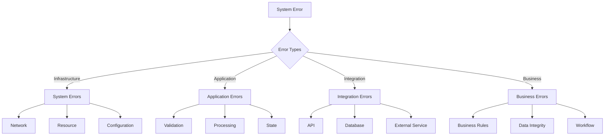
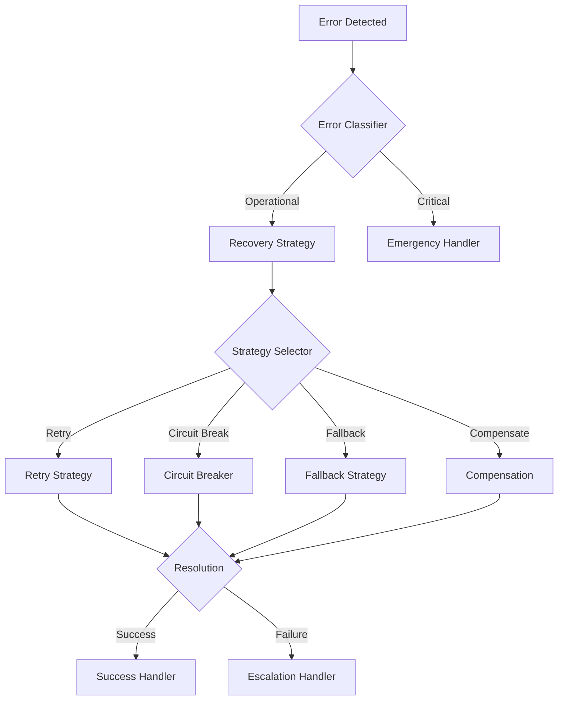
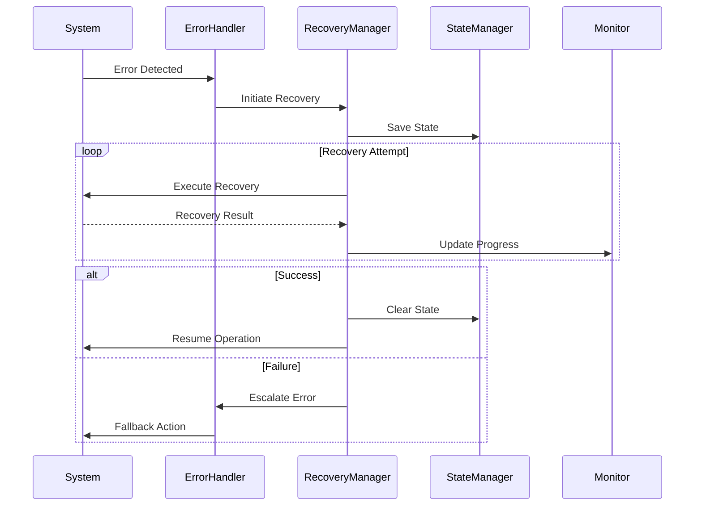

# ⚠️ Error Handling Guide

## 📚 Table of Contents
1. [Overview](#overview)
2. [Error Types](#error-types)
3. [Error Handling Strategies](#strategies)
4. [Error Recovery](#recovery)
5. [Error Logging](#logging)
6. [Implementation Examples](#examples)

## 🌟 Overview

The Error Handling system provides a comprehensive framework for managing and recovering from errors in the Eliza Market Scanner platform. Key features include:

- Advanced error classification
- Intelligent recovery strategies
- Comprehensive logging
- Retry mechanisms with backoff
- Circuit breakers for fault tolerance
- Error reporting and analytics
- Automated recovery workflows
- State management during recovery

## 🔍 Error Types

### Error Classification Hierarchy


### Error Classification
```typescript
interface BaseError extends Error {
  // Base error properties
  code: ErrorCode;
  timestamp: number;
  context: Record<string, unknown>;
  severity: ErrorSeverity;
  source: ErrorSource;
  
  // Error classification
  isOperational(): boolean;
  isProgrammatic(): boolean;
  isRetryable(): boolean;
  isRecoverable(): boolean;
  
  // Recovery hints
  getRecoveryStrategy(): RecoveryStrategy;
  getRetryPolicy(): RetryPolicy;
}

enum ErrorSeverity {
  CRITICAL = 'CRITICAL',   // System-wide impact
  HIGH = 'HIGH',          // Service-wide impact
  MEDIUM = 'MEDIUM',      // Feature-level impact
  LOW = 'LOW',           // Minor impact
  INFO = 'INFO'          // Informational
}

enum ErrorSource {
  SYSTEM = 'SYSTEM',
  APPLICATION = 'APPLICATION',
  INTEGRATION = 'INTEGRATION',
  USER = 'USER',
  EXTERNAL = 'EXTERNAL'
}
```

## 🛡️ Error Handling Strategies

### Recovery Strategy Flow


### Strategy Implementation
```typescript
interface RecoveryStrategy {
  // Strategy configuration
  config: {
    maxAttempts: number;
    timeout: number;
    backoff: BackoffConfig;
  };
  
  // Recovery methods
  canRecover(error: BaseError): boolean;
  recover(error: BaseError): Promise<void>;
  
  // State management
  saveState(): Promise<RecoveryState>;
  restoreState(state: RecoveryState): Promise<void>;
  
  // Monitoring
  trackProgress(progress: RecoveryProgress): void;
  getStatus(): RecoveryStatus;
}

interface RetryStrategy {
  // Retry configuration
  maxRetries: number;
  backoffFactor: number;
  initialDelay: number;
  maxDelay: number;
  
  // Retry methods
  shouldRetry(error: BaseError, attempt: number): boolean;
  getDelay(attempt: number): number;
  
  // Backoff implementation
  exponentialBackoff(attempt: number): number;
  linearBackoff(attempt: number): number;
  customBackoff(attempt: number): number;
}
```

## 🔄 Error Recovery

### Recovery Workflow


### Recovery Implementation
```typescript
class ErrorRecoveryManager {
  private strategies: Map<string, RecoveryStrategy> = new Map();
  private state: StateManager;
  private monitor: RecoveryMonitor;
  
  async handleError(error: BaseError): Promise<void> {
    // Save system state
    await this.state.saveState();
    
    try {
      // Select recovery strategy
      const strategy = this.selectStrategy(error);
      
      // Execute recovery
      await this.executeRecovery(strategy, error);
      
      // Verify recovery
      await this.verifyRecovery();
      
      // Restore state if needed
      await this.state.restoreState();
    } catch (recoveryError) {
      // Handle recovery failure
      await this.handleRecoveryFailure(error, recoveryError);
    }
  }
  
  private async executeRecovery(
    strategy: RecoveryStrategy,
    error: BaseError
  ): Promise<void> {
    let attempt = 0;
    let lastError: Error | null = null;
    
    while (attempt < strategy.config.maxAttempts) {
      try {
        await strategy.recover(error);
        return;
      } catch (retryError) {
        lastError = retryError;
        attempt++;
        
        // Calculate delay
        const delay = strategy.getDelay(attempt);
        await this.delay(delay);
      }
    }
    
    throw new RecoveryFailedError(lastError);
  }
}
```

## 📝 Error Logging

### Structured Logging
```typescript
interface ErrorLog {
  // Error details
  error: {
    name: string;
    message: string;
    stack: string;
    code: string;
  };
  
  // Context
  context: {
    timestamp: string;
    environment: string;
    component: string;
    operation: string;
  };
  
  // Recovery
  recovery: {
    strategy: string;
    attempts: number;
    duration: number;
    success: boolean;
  };
  
  // Metadata
  metadata: {
    severity: ErrorSeverity;
    tags: string[];
    correlationId: string;
  };
}

class ErrorLogger {
  async logError(error: BaseError, context: ErrorContext): Promise<void> {
    const logEntry = {
      error: this.formatError(error),
      context: this.enrichContext(context),
      recovery: await this.getRecoveryInfo(error),
      metadata: this.getMetadata(error)
    };
    
    await this.writeLog(logEntry);
    
    if (this.shouldAlert(error)) {
      await this.sendAlert(logEntry);
    }
  }
}
```

## 💡 Implementation Examples

### Circuit Breaker Pattern
```typescript
class CircuitBreaker {
  private state: CircuitState = CircuitState.CLOSED;
  private failures = 0;
  private lastStateChange = Date.now();
  private readonly monitor: CircuitMonitor;
  
  async execute<T>(operation: () => Promise<T>): Promise<T> {
    if (this.isOpen()) {
      if (this.shouldAttemptReset()) {
        this.halfOpen();
      } else {
        throw new CircuitOpenError();
      }
    }
    
    try {
      const result = await operation();
      this.recordSuccess();
      return result;
    } catch (error) {
      this.recordFailure(error);
      throw error;
    }
  }
  
  private recordFailure(error: Error): void {
    this.failures++;
    this.monitor.recordFailure(error);
    
    if (this.shouldOpen()) {
      this.open();
    }
  }
  
  private shouldOpen(): boolean {
    return (
      this.failures >= this.config.failureThreshold &&
      this.state === CircuitState.CLOSED
    );
  }
}
```

### Retry Pattern with Backoff
```typescript
class RetryWithBackoff {
  async execute<T>(
    operation: () => Promise<T>,
    options: RetryOptions
  ): Promise<T> {
    let attempt = 0;
    let lastError: Error | null = null;
    
    while (attempt < options.maxRetries) {
      try {
        return await operation();
      } catch (error) {
        lastError = error;
        
        if (!this.isRetryable(error)) {
          throw error;
        }
        
        attempt++;
        const delay = this.calculateDelay(attempt, options);
        await this.delay(delay);
      }
    }
    
    throw new MaxRetriesExceededError(lastError);
  }
  
  private calculateDelay(attempt: number, options: RetryOptions): number {
    const exponentialDelay = options.initialDelay * 
      Math.pow(options.backoffFactor, attempt - 1);
    
    return Math.min(
      exponentialDelay + this.jitter(options.jitterFactor),
      options.maxDelay
    );
  }
}
```

### State Recovery Pattern
```typescript
class StateRecoveryManager {
  private readonly stateStore: StateStore;
  private readonly monitor: RecoveryMonitor;
  
  async saveState(context: StateContext): Promise<void> {
    const snapshot = await this.createSnapshot(context);
    await this.stateStore.save(snapshot);
  }
  
  async restoreState(context: StateContext): Promise<void> {
    const snapshot = await this.stateStore.load(context.id);
    
    if (!snapshot) {
      throw new StateNotFoundError(context);
    }
    
    await this.validateSnapshot(snapshot);
    await this.applySnapshot(snapshot);
    await this.verifyState(context);
  }
  
  private async createSnapshot(context: StateContext): Promise<StateSnapshot> {
    return {
      id: context.id,
      timestamp: Date.now(),
      data: await this.captureState(context),
      metadata: this.getMetadata(context)
    };
  }
}
```

---

*This guide is continuously updated with new error handling patterns and best practices as they are developed.* 