# 🤖 Multi-Agent System Guide

## 📚 Table of Contents
1. [Overview](#overview)
2. [Architecture](#architecture)
3. [Agent Types](#agent-types)
4. [Communication](#communication)
5. [Coordination](#coordination)
6. [State Management](#state-management)
7. [Implementation Examples](#examples)
8. [Specialized Use Cases](#specialized)

## 🌟 Overview

The Eliza OS Multi-Agent System provides a flexible framework for creating and managing multiple collaborative AI agents. This guide will help you understand how to create any type of agent system using Eliza OS. Key features include:

- Agent Creation & Customization
  * Define agent personalities and behaviors
  * Configure agent capabilities and roles
  * Set up agent-specific knowledge bases
  * Implement custom actions and responses

- System Architecture
  * Inter-agent communication
  * Task coordination
  * State synchronization
  * Resource management
  * Conflict resolution
  * Performance monitoring

- Integration Capabilities
  * Platform connectors (Discord, Twitter, Telegram, etc.)
  * External API integration
  * Database and storage systems
  * Custom service integration

### Getting Started with Multi-Agent Systems

1. Basic Setup
```typescript
import { ElizaOS, AgentSystem, AgentConfig } from '@elizaos/core';

// Initialize the system
const system = new ElizaOS({
  systemId: 'my-agent-system',
  config: {
    maxAgents: 10,
    defaultModel: 'gpt-4',
    memoryType: 'persistent'
  }
});

// Create agent configurations
const agentConfigs: AgentConfig[] = [
  {
    id: 'agent-1',
    personality: {
      name: 'Helper',
      role: 'assistant',
      traits: ['helpful', 'friendly', 'knowledgeable']
    },
    capabilities: ['text-processing', 'task-management'],
    platforms: ['discord', 'telegram']
  },
  {
    id: 'agent-2',
    personality: {
      name: 'Researcher',
      role: 'analyst',
      traits: ['analytical', 'thorough', 'precise']
    },
    capabilities: ['research', 'data-analysis'],
    platforms: ['rest-api']
  }
];

// Initialize agents
await system.initializeAgents(agentConfigs);
```

2. Define Agent Behaviors
```typescript
interface AgentBehavior {
  // Core behavior definition
  name: string;
  description: string;
  triggers: TriggerCondition[];
  
  // Action handlers
  onMessage(message: Message): Promise<Response>;
  onTask(task: Task): Promise<Result>;
  onEvent(event: Event): Promise<void>;
  
  // State management
  updateState(state: State): Promise<void>;
  getState(): Promise<State>;
}

// Example behavior implementation
class CustomBehavior implements AgentBehavior {
  async onMessage(message: Message): Promise<Response> {
    // Custom message handling logic
    const intent = await this.analyzeIntent(message);
    const action = this.selectAction(intent);
    return this.executeAction(action);
  }
}
```

3. Configure Communication
```typescript
interface CommunicationConfig {
  // Channel configuration
  channels: {
    internal: InternalChannelConfig;
    external: ExternalChannelConfig[];
  };
  
  // Protocol settings
  protocols: {
    messageFormat: MessageFormat;
    encryption: EncryptionConfig;
    compression: CompressionConfig;
  };
  
  // Integration settings
  integrations: {
    platforms: PlatformConfig[];
    apis: APIConfig[];
    databases: DatabaseConfig[];
  };
}
```

## 🏗️ Architecture

### System Flow
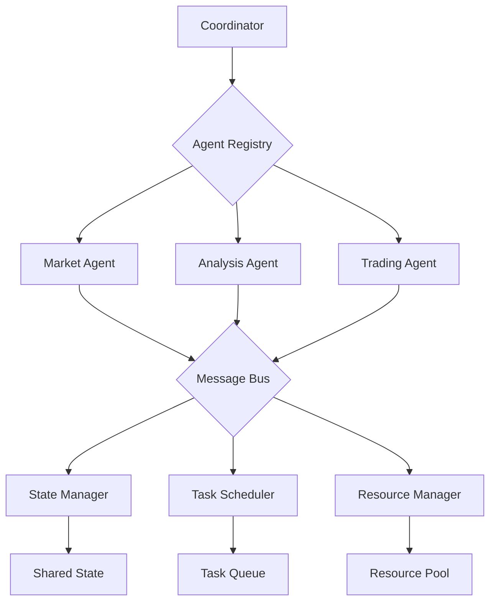
```mermaid
graph TB
    A[Coordinator] --> B{Agent Registry}
    B --> C[Market Agent]
    B --> D[Analysis Agent]
    B --> E[Trading Agent]
    
    C --> F{Message Bus}
    D --> F
    E --> F
    
    F --> G[State Manager]
    F --> H[Task Scheduler]
    F --> I[Resource Manager]
    
    G --> J[Shared State]
    H --> K[Task Queue]
    I --> L[Resource Pool]
```

### Core Components
```typescript
interface AgentSystem {
  // System components
  coordinator: AgentCoordinator;
  registry: AgentRegistry;
  messageBus: MessageBus;
  
  // Management
  stateManager: StateManager;
  taskScheduler: TaskScheduler;
  resourceManager: ResourceManager;
  
  // Monitoring
  monitor: SystemMonitor;
  logger: SystemLogger;
}

interface AgentCoordinator {
  // Agent lifecycle
  registerAgent(agent: Agent): void;
  deregisterAgent(agentId: string): void;
  
  // Coordination
  assignTask(task: Task): Promise<void>;
  resolveConflict(conflict: Conflict): Promise<Resolution>;
}
```

## 🤖 Agent Types

### Base Agent Types
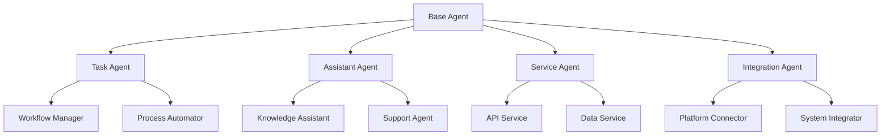
```mermaid
graph TB
    A[Base Agent] --> B[Task Agent]
    A --> C[Assistant Agent]
    A --> D[Service Agent]
    A --> E[Integration Agent]
    
    B --> F[Workflow Manager]
    B --> G[Process Automator]
    
    C --> H[Knowledge Assistant]
    C --> I[Support Agent]
    
    D --> J[API Service]
    D --> K[Data Service]
    
    E --> L[Platform Connector]
    E --> M[System Integrator]
```

### Common Agent Roles

1. Task Agents
   - Process automation
   - Workflow management
   - Task scheduling
   - Resource allocation

2. Assistant Agents
   - User support
   - Knowledge management
   - Content generation
   - Research assistance

3. Service Agents
   - API integration
   - Data processing
   - Analytics
   - Monitoring

4. Integration Agents
   - Platform connectivity
   - Protocol translation
   - Data transformation
   - System integration

### Agent Implementation Examples

1. Knowledge Assistant Agent
```typescript
class KnowledgeAssistant implements Agent {
  constructor(
    private readonly config: AgentConfig,
    private readonly knowledgeBase: KnowledgeBase,
    private readonly nlp: NLPProcessor
  ) {}
  
  async processQuery(query: Query): Promise<Response> {
    // Analyze query intent
    const intent = await this.nlp.analyzeIntent(query);
    
    // Search knowledge base
    const relevantInfo = await this.knowledgeBase.search(query, intent);
    
    // Generate response
    return this.generateResponse(relevantInfo, intent);
  }
  
  private async generateResponse(info: any, intent: Intent): Promise<Response> {
    const template = this.getResponseTemplate(intent);
    return template.format(info);
  }
}
```

2. Process Automator Agent
```typescript
class ProcessAutomator implements Agent {
  constructor(
    private readonly config: AgentConfig,
    private readonly workflowEngine: WorkflowEngine,
    private readonly taskManager: TaskManager
  ) {}
  
  async executeWorkflow(workflow: Workflow): Promise<WorkflowResult> {
    // Validate workflow
    await this.validateWorkflow(workflow);
    
    // Execute steps
    const tasks = workflow.generateTasks();
    const results = await this.taskManager.executeTasks(tasks);
    
    // Process results
    return this.processResults(results);
  }
}
```

### Specialized Agent Types

#### Market Analysis Agents
```typescript
class MarketAnalysisAgent implements Agent {
  constructor(
    private readonly marketData: MarketDataProvider,
    private readonly analyzer: TechnicalAnalyzer,
    private readonly messageBus: MessageBus
  ) {}

  async analyzeMarket(symbol: string): Promise<Analysis> {
    const data = await this.marketData.fetch(symbol);
    const analysis = await this.analyzer.analyze(data);
    
    await this.messageBus.publish('market.analysis', {
      symbol,
      analysis,
      timestamp: Date.now()
    });
    
    return analysis;
  }
}
```

#### Trading Strategy Agents
```typescript
class TradingStrategyAgent implements Agent {
  constructor(
    private readonly strategy: TradingStrategy,
    private readonly riskManager: RiskManager,
    private readonly orderManager: OrderManager
  ) {}

  async evaluatePosition(market: Market): Promise<Decision> {
    const signal = await this.strategy.evaluate(market);
    const risk = await this.riskManager.assess(signal);
    
    if (risk.acceptable) {
      return this.orderManager.createOrder(signal);
    }
    
    return { action: 'HOLD', reason: risk.reason };
  }
}
```

## 🎯 Common Use Cases

### 1. Customer Support System
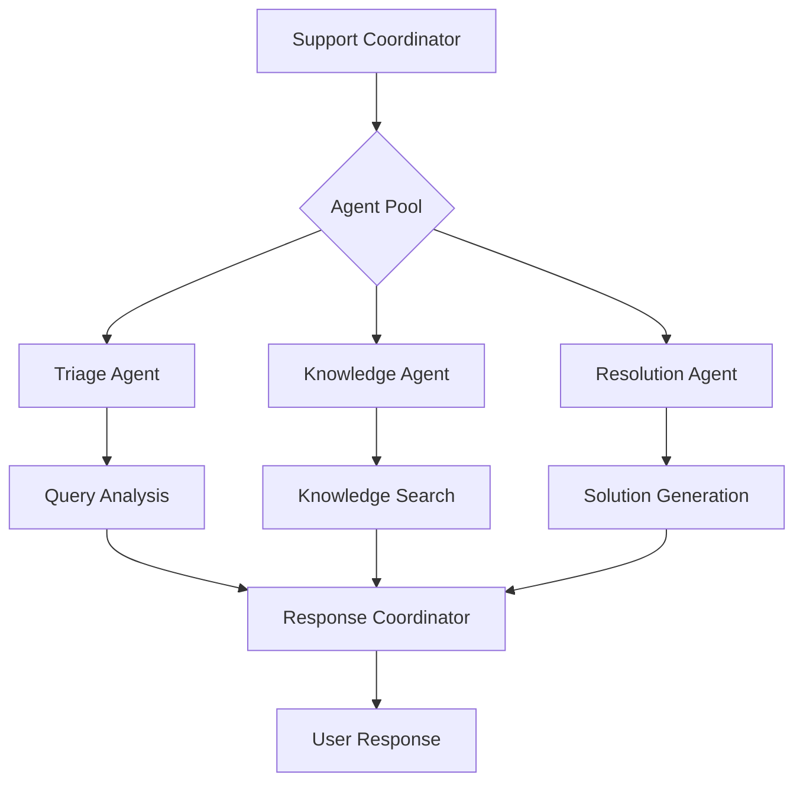
```mermaid
graph TB
    A[Support Coordinator] --> B{Agent Pool}
    B --> C[Triage Agent]
    B --> D[Knowledge Agent]
    B --> E[Resolution Agent]
    
    C --> F[Query Analysis]
    D --> G[Knowledge Search]
    E --> H[Solution Generation]
    
    F & G & H --> I[Response Coordinator]
    I --> J[User Response]
```

### 2. Content Management System
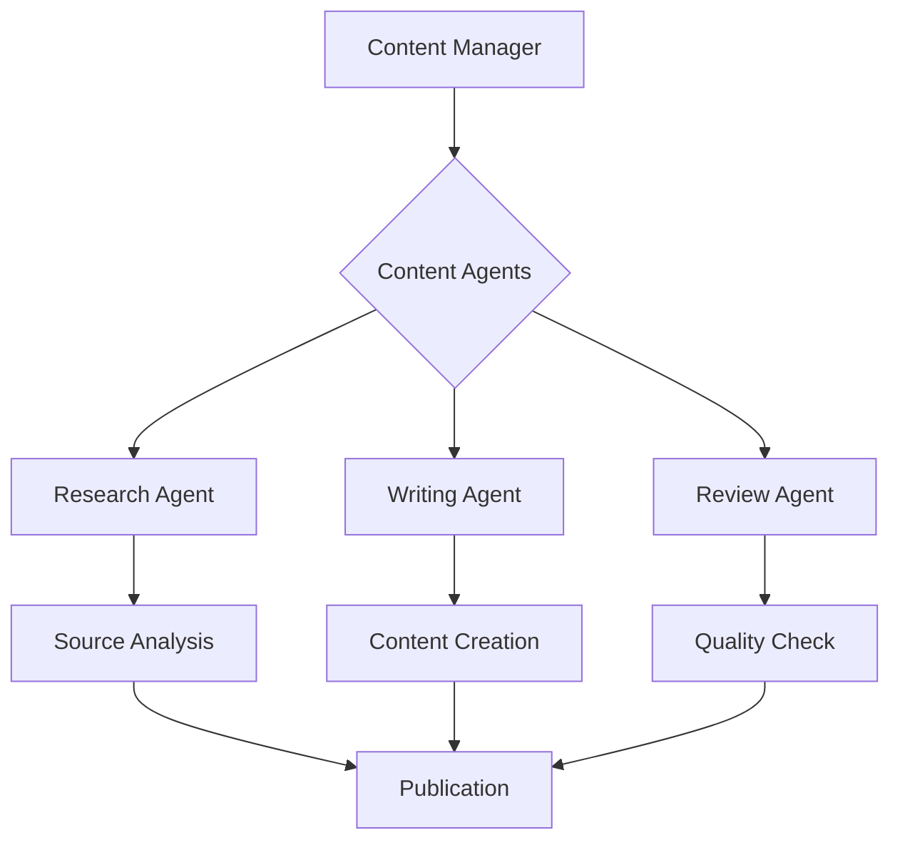
```mermaid
graph TB
    A[Content Manager] --> B{Content Agents}
    B --> C[Research Agent]
    B --> D[Writing Agent]
    B --> E[Review Agent]
    
    C --> F[Source Analysis]
    D --> G[Content Creation]
    E --> H[Quality Check]
    
    F & G & H --> I[Publication]
```

### 3. Data Processing Pipeline
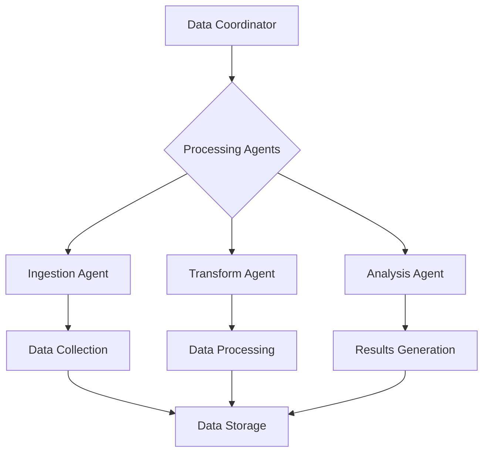
```mermaid
graph TB
    A[Data Coordinator] --> B{Processing Agents}
    B --> C[Ingestion Agent]
    B --> D[Transform Agent]
    B --> E[Analysis Agent]
    
    C --> F[Data Collection]
    D --> G[Data Processing]
    E --> H[Results Generation]
    
    F & G & H --> I[Data Storage]
```

## 🔧 Implementation Patterns

### 1. Agent Factory Pattern
```typescript
class AgentFactory {
  static createAgent(type: AgentType, config: AgentConfig): Agent {
    switch (type) {
      case 'assistant':
        return new AssistantAgent(config);
      case 'processor':
        return new ProcessorAgent(config);
      case 'integrator':
        return new IntegratorAgent(config);
      default:
        throw new Error(`Unknown agent type: ${type}`);
    }
  }
}
```

### 2. Agent Composition Pattern
```typescript
class CompositeAgent implements Agent {
  private subAgents: Agent[] = [];
  
  addAgent(agent: Agent): void {
    this.subAgents.push(agent);
  }
  
  async executeTask(task: VTask): Promise<Result> {
    // Distribute task to sub-agents
    const results = await Promise.all(
      this.subAgents.map(agent => agent.executeTask(task))
    );
    
    // Aggregate results
    return this.aggregateResults(results);
  }
}
```

### 3. Agent Observer Pattern
```typescript
class AgentMonitor implements Observer {
  observe(agent: Agent): void {
    agent.on('task:start', this.onTaskStart);
    agent.on('task:complete', this.onTaskComplete);
    agent.on('error', this.onError);
  }
  
  private onTaskStart(task: Task): void {
    // Monitor task start
  }
  
  private onTaskComplete(result: Result): void {
    // Monitor task completion
  }
}
```

## 🔬 Specialized Use Cases

### Trading & Market Analysis System
// ... existing trading-specific content ...

## 🔄 Advanced Agent Patterns

### Memory Management System
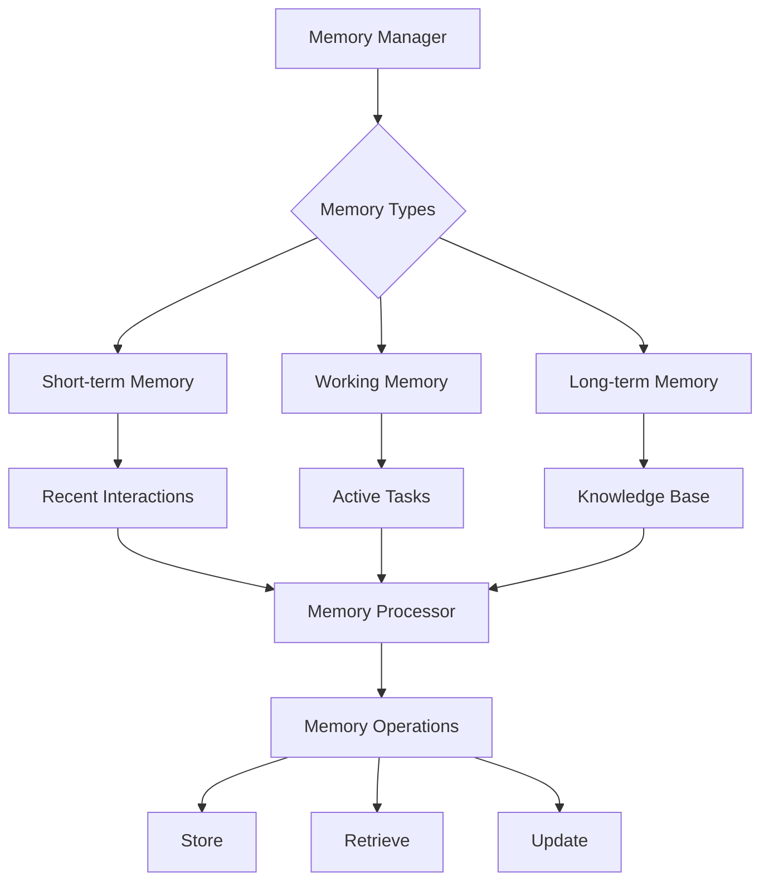
```mermaid
graph TB
    A[Memory Manager] --> B{Memory Types}
    B --> C[Short-term Memory]
    B --> D[Working Memory]
    B --> E[Long-term Memory]
    
    C --> F[Recent Interactions]
    D --> G[Active Tasks]
    E --> H[Knowledge Base]
    
    F --> I[Memory Processor]
    G --> I
    H --> I
    
    I --> J[Memory Operations]
    J --> K[Store]
    J --> L[Retrieve]
    J --> M[Update]
```

```typescript
interface MemorySystem {
  shortTerm: {
    capacity: number;
    items: MemoryItem[];
    ttl: number;
  };
  workingMemory: {
    tasks: ActiveTask[];
    context: ExecutionContext;
    resources: ResourceAllocation[];
  };
  longTerm: {
    storage: PersistentStorage;
    indexing: MemoryIndex;
    retrieval: MemoryRetrieval;
  };
}

interface MemoryOperations {
  store(item: MemoryItem, type: MemoryType): Promise<void>;
  retrieve(query: MemoryQuery): Promise<MemoryItem[]>;
  update(id: string, updates: Partial<MemoryItem>): Promise<void>;
  forget(id: string): Promise<void>;
}
```

### Learning System
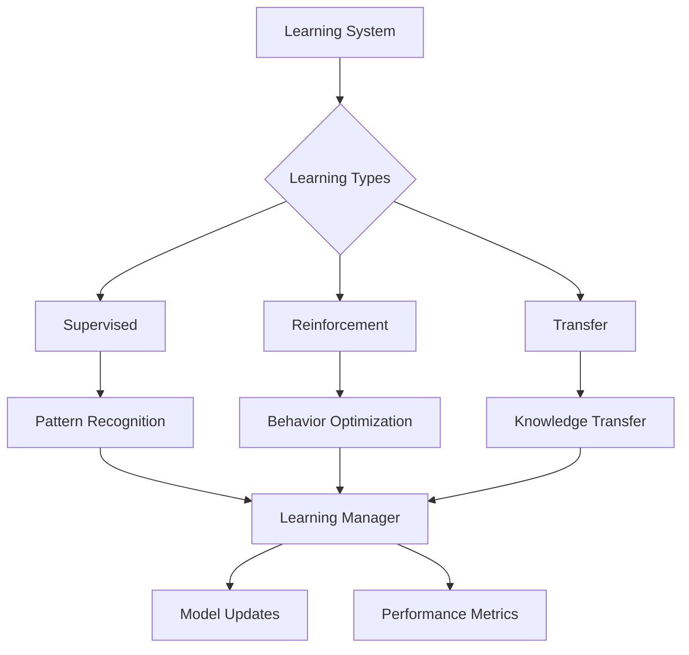
```mermaid
graph TB
    A[Learning System] --> B{Learning Types}
    B --> C[Supervised]
    B --> D[Reinforcement]
    B --> E[Transfer]
    
    C --> F[Pattern Recognition]
    D --> G[Behavior Optimization]
    E --> H[Knowledge Transfer]
    
    F --> I[Learning Manager]
    G --> I
    H --> I
    
    I --> J[Model Updates]
    I --> K[Performance Metrics]
```

```typescript
interface LearningSystem {
  models: {
    supervised: SupervisedModel[];
    reinforcement: ReinforcementModel[];
    transfer: TransferModel[];
  };
  training: {
    dataProcessor: DataProcessor;
    modelTrainer: ModelTrainer;
    evaluator: ModelEvaluator;
  };
  optimization: {
    hyperparams: HyperparamOptimizer;
    architecture: ArchitectureOptimizer;
  };
}
```

## 🔌 Extended Agent Capabilities

### Natural Language Processing
```typescript
interface NLPSystem {
  processors: {
    tokenizer: Tokenizer;
    parser: Parser;
    analyzer: Analyzer;
  };
  models: {
    intent: IntentClassifier;
    entity: EntityRecognizer;
    sentiment: SentimentAnalyzer;
  };
  generation: {
    templates: ResponseTemplate[];
    generator: TextGenerator;
    formatter: OutputFormatter;
  };
}
```

### Decision Making System
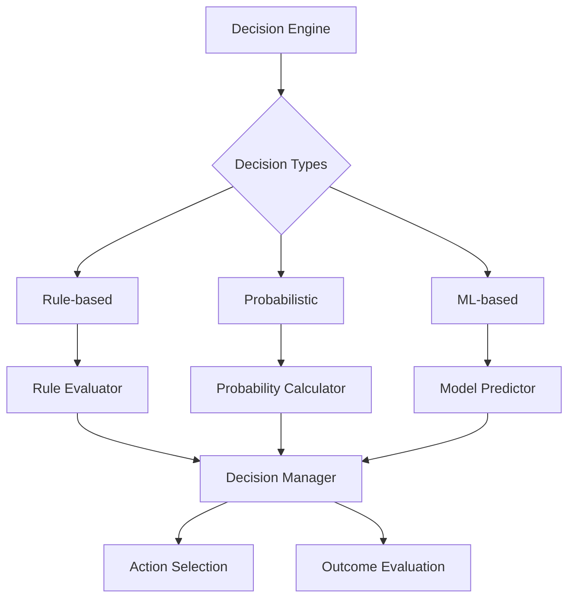
```mermaid
graph TB
    A[Decision Engine] --> B{Decision Types}
    B --> C[Rule-based]
    B --> D[Probabilistic]
    B --> E[ML-based]
    
    C --> F[Rule Evaluator]
    D --> G[Probability Calculator]
    E --> H[Model Predictor]
    
    F --> I[Decision Manager]
    G --> I
    H --> I
    
    I --> J[Action Selection]
    I --> K[Outcome Evaluation]
```

```typescript
interface DecisionSystem {
  engines: {
    ruleEngine: RuleEngine;
    probabilistic: ProbabilisticEngine;
    mlEngine: MLEngine;
  };
  evaluation: {
    contextAnalyzer: ContextAnalyzer;
    outcomePredictor: OutcomePredictor;
    riskAssessor: RiskAssessor;
  };
  selection: {
    actionSelector: ActionSelector;
    strategyOptimizer: StrategyOptimizer;
  };
}
```

## 🔗 Specialized Integrations

### API Integration System
```typescript
interface APIIntegration {
  connectors: {
    rest: RESTConnector;
    graphql: GraphQLConnector;
    grpc: GRPCConnector;
  };
  security: {
    auth: AuthManager;
    encryption: EncryptionManager;
  };
  management: {
    rateLimit: RateLimiter;
    caching: CacheManager;
    retry: RetryManager;
  };
}
```

### Database Integration
```typescript
interface DatabaseIntegration {
  connections: {
    sql: SQLConnection[];
    nosql: NoSQLConnection[];
    graph: GraphDBConnection[];
  };
  operations: {
    query: QueryBuilder;
    transaction: TransactionManager;
    migration: MigrationManager;
  };
  optimization: {
    indexing: IndexManager;
    caching: CacheStrategy;
    sharding: ShardManager;
  };
}
```

## 🔒 Security Implementation

### Access Control System
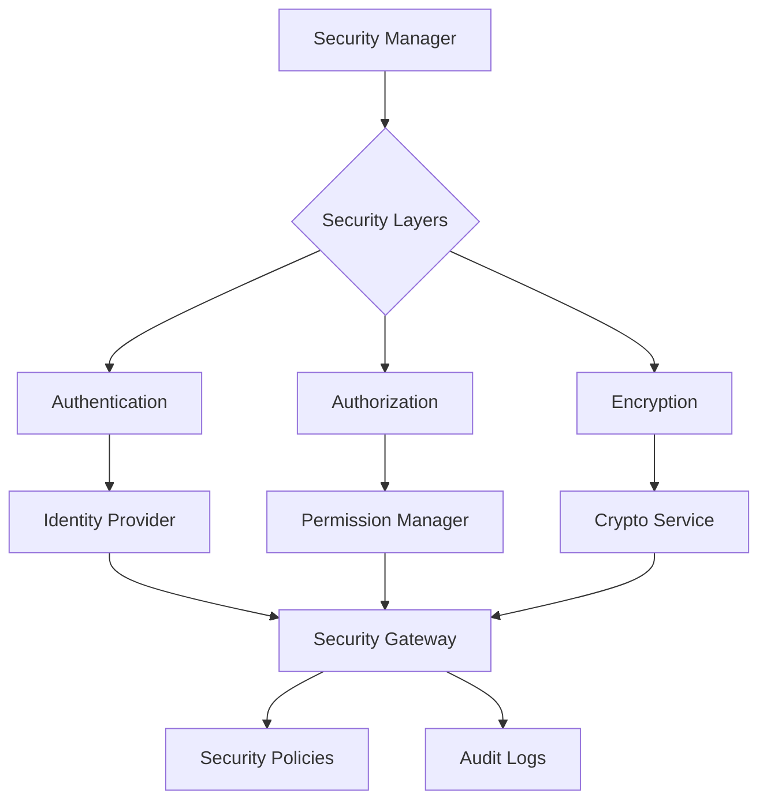
```mermaid
graph TB
    A[Security Manager] --> B{Security Layers}
    B --> C[Authentication]
    B --> D[Authorization]
    B --> E[Encryption]
    
    C --> F[Identity Provider]
    D --> G[Permission Manager]
    E --> H[Crypto Service]
    
    F --> I[Security Gateway]
    G --> I
    H --> I
    
    I --> J[Security Policies]
    I --> K[Audit Logs]
```

```typescript
interface SecuritySystem {
  authentication: {
    providers: AuthProvider[];
    validators: TokenValidator[];
    managers: SessionManager[];
  };
  authorization: {
    roles: Role[];
    permissions: Permission[];
    policies: Policy[];
  };
  encryption: {
    data: DataEncryption;
    communication: CommunicationEncryption;
    storage: StorageEncryption;
  };
}
```

## ⚡ Performance Optimization

### Resource Management
```typescript
interface ResourceManager {
  allocation: {
    cpu: CPUManager;
    memory: MemoryManager;
    storage: StorageManager;
  };
  monitoring: {
    metrics: MetricsCollector;
    alerts: AlertManager;
    logging: LogManager;
  };
  optimization: {
    scaling: AutoScaler;
    balancing: LoadBalancer;
    caching: CacheManager;
  };
}
```

### Load Balancing
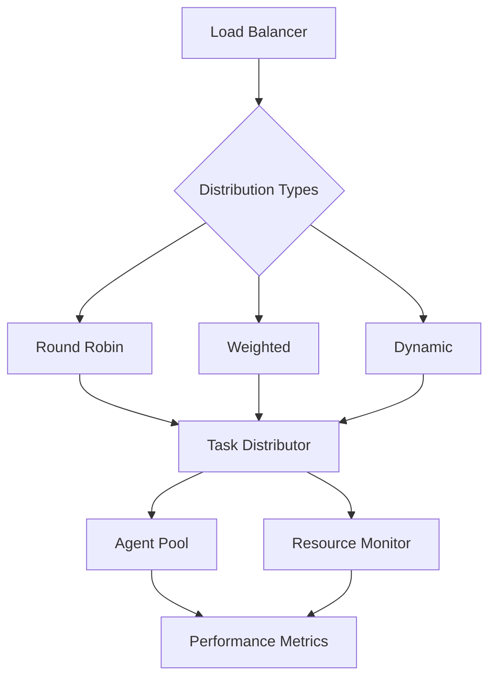
```mermaid
graph TB
    A[Load Balancer] --> B{Distribution Types}
    B --> C[Round Robin]
    B --> D[Weighted]
    B --> E[Dynamic]
    
    C --> F[Task Distributor]
    D --> F
    E --> F
    
    F --> G[Agent Pool]
    F --> H[Resource Monitor]
    
    G --> I[Performance Metrics]
    H --> I
```

## 📡 Communication Systems

### Message Bus Architecture
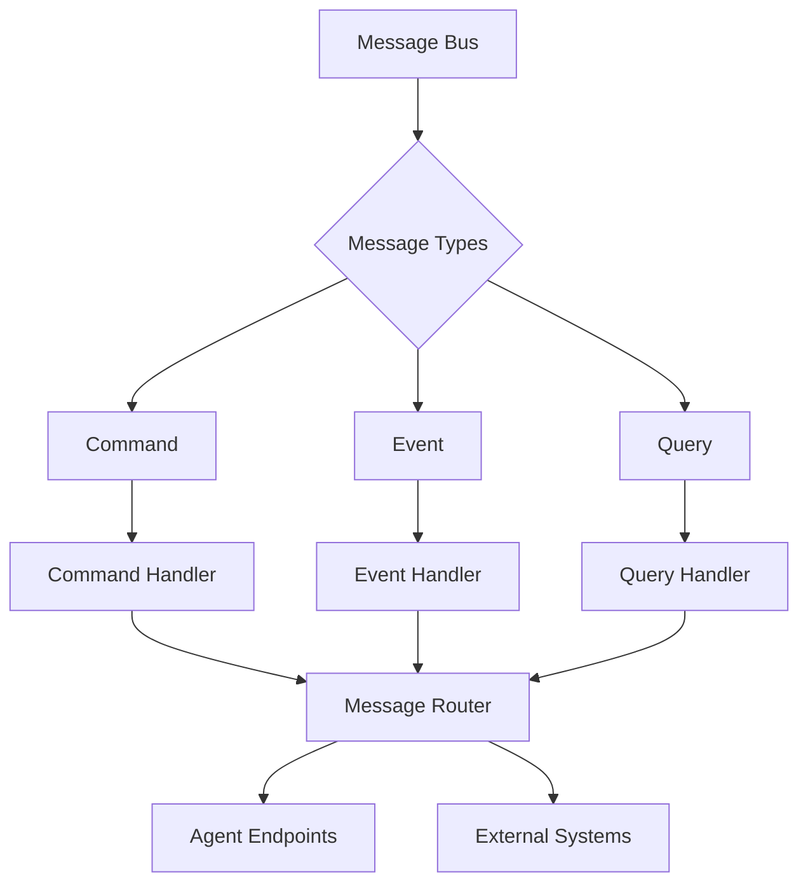
```mermaid
graph TB
    A[Message Bus] --> B{Message Types}
    B --> C[Command]
    B --> D[Event]
    B --> E[Query]
    
    C --> F[Command Handler]
    D --> G[Event Handler]
    E --> H[Query Handler]
    
    F --> I[Message Router]
    G --> I
    H --> I
    
    I --> J[Agent Endpoints]
    I --> K[External Systems]
```

### Communication Protocols
```typescript
interface CommunicationSystem {
  messageBus: {
    publishers: MessagePublisher[];
    subscribers: MessageSubscriber[];
    routers: MessageRouter[];
  };
  protocols: {
    internal: InternalProtocol;
    external: ExternalProtocol[];
    custom: CustomProtocol[];
  };
  handlers: {
    command: CommandHandler;
    event: EventHandler;
    query: QueryHandler;
  };
}

interface MessageProtocol {
  encoding: EncodingFormat;
  compression: CompressionMethod;
  encryption: EncryptionScheme;
  validation: ValidationRules;
}

interface MessageHandler {
  async handle(message: Message): Promise<void>;
  async validate(message: Message): Promise<boolean>;
  async transform(message: Message): Promise<TransformedMessage>;
  async route(message: Message): Promise<Destination>;
}
```

### Event System
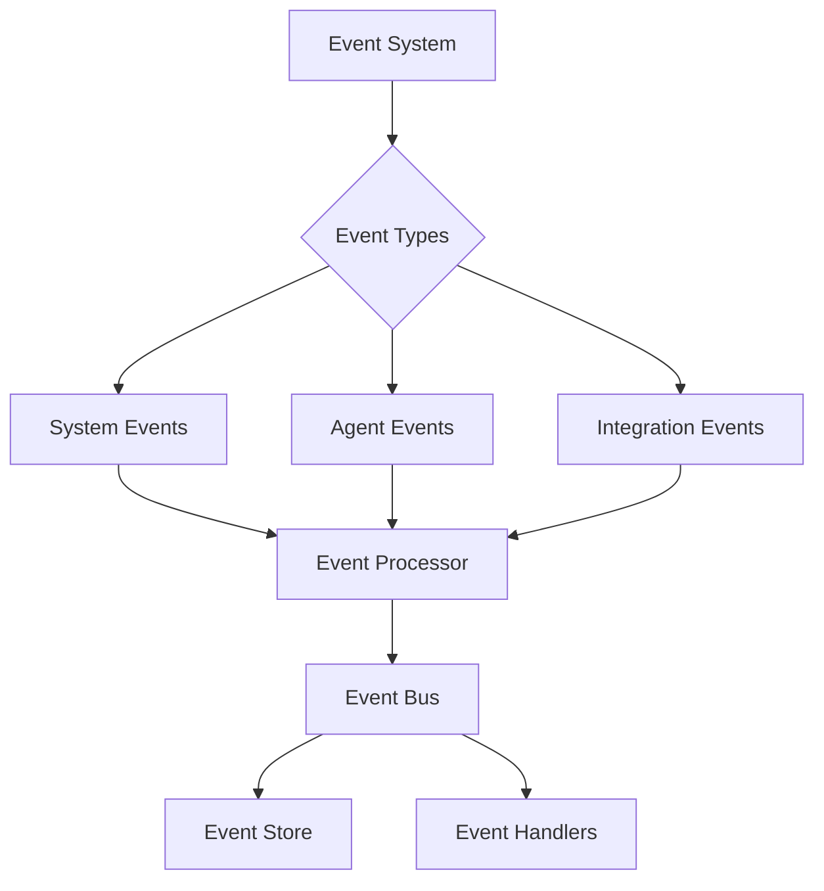
```mermaid
graph TB
    A[Event System] --> B{Event Types}
    B --> C[System Events]
    B --> D[Agent Events]
    B --> E[Integration Events]
    
    C --> F[Event Processor]
    D --> F
    E --> F
    
    F --> G[Event Bus]
    G --> H[Event Store]
    G --> I[Event Handlers]
```

```typescript
interface EventSystem {
  eventBus: {
    publishers: EventPublisher[];
    subscribers: EventSubscriber[];
    processors: EventProcessor[];
  };
  eventStore: {
    storage: EventStorage;
    indexing: EventIndex;
    retrieval: EventRetrieval;
  };
  handlers: {
    system: SystemEventHandler;
    agent: AgentEventHandler;
    integration: IntegrationEventHandler;
  };
}
```

## 🔄 Coordination System

### Task Orchestration
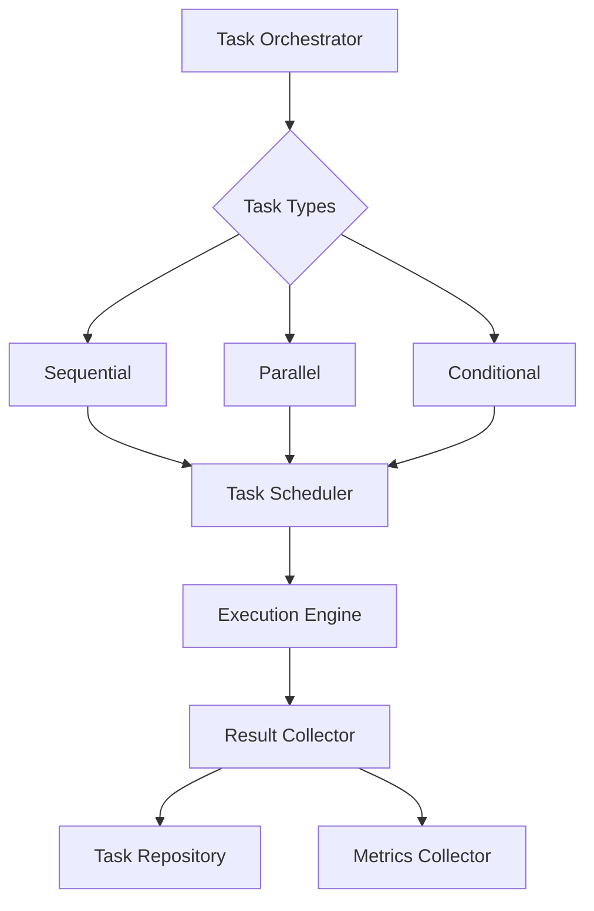
```mermaid
graph TB
    A[Task Orchestrator] --> B{Task Types}
    B --> C[Sequential]
    B --> D[Parallel]
    B --> E[Conditional]
    
    C --> F[Task Scheduler]
    D --> F
    E --> F
    
    F --> G[Execution Engine]
    G --> H[Result Collector]
    
    H --> I[Task Repository]
    H --> J[Metrics Collector]
```

```typescript
interface TaskOrchestration {
  scheduler: {
    planner: TaskPlanner;
    dispatcher: TaskDispatcher;
    monitor: TaskMonitor;
  };
  execution: {
    engine: ExecutionEngine;
    tracker: ExecutionTracker;
    optimizer: ExecutionOptimizer;
  };
  results: {
    collector: ResultCollector;
    analyzer: ResultAnalyzer;
    storage: ResultStorage;
  };
}
```

### State Coordination
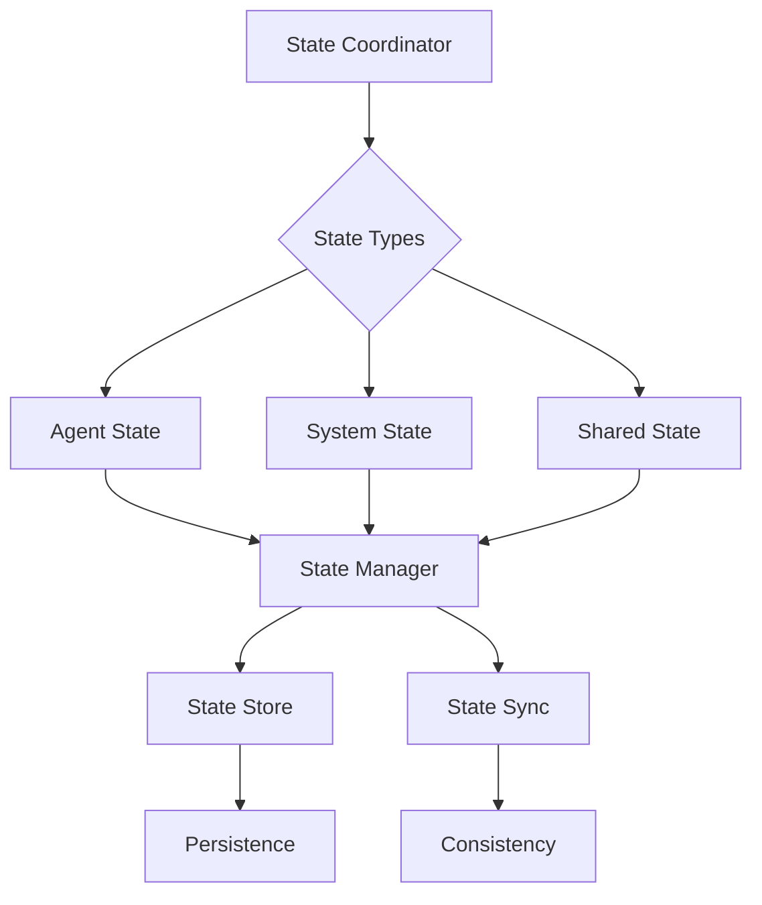
```mermaid
graph TB
    A[State Coordinator] --> B{State Types}
    B --> C[Agent State]
    B --> D[System State]
    B --> E[Shared State]
    
    C --> F[State Manager]
    D --> F
    E --> F
    
    F --> G[State Store]
    F --> H[State Sync]
    
    G --> I[Persistence]
    H --> J[Consistency]
```

```typescript
interface StateCoordination {
  manager: {
    tracker: StateTracker;
    validator: StateValidator;
    synchronizer: StateSynchronizer;
  };
  storage: {
    persistent: PersistentStore;
    cache: CacheStore;
    backup: BackupStore;
  };
  consistency: {
    checker: ConsistencyChecker;
    resolver: ConflictResolver;
    replicator: StateReplicator;
  };
}
```

### Resource Coordination
```typescript
interface ResourceCoordination {
  allocator: {
    scheduler: ResourceScheduler;
    optimizer: ResourceOptimizer;
    monitor: ResourceMonitor;
  };
  manager: {
    pool: ResourcePool;
    limiter: ResourceLimiter;
    scaler: ResourceScaler;
  };
  controller: {
    balancer: LoadBalancer;
    distributor: ResourceDistributor;
    failover: FailoverManager;
  };
}
```

## 🔍 Monitoring & Analytics

### System Monitoring
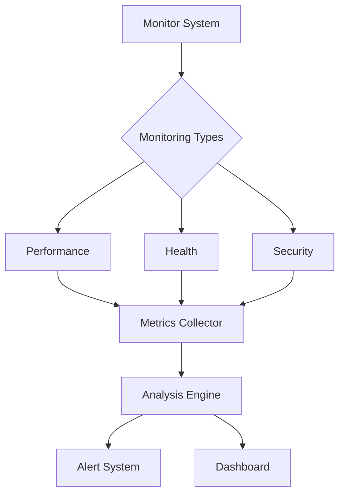
```mermaid
graph TB
    A[Monitor System] --> B{Monitoring Types}
    B --> C[Performance]
    B --> D[Health]
    B --> E[Security]
    
    C --> F[Metrics Collector]
    D --> F
    E --> F
    
    F --> G[Analysis Engine]
    G --> H[Alert System]
    G --> I[Dashboard]
```

```typescript
interface MonitoringSystem {
  collectors: {
    metrics: MetricsCollector;
    logs: LogCollector;
    traces: TraceCollector;
  };
  analysis: {
    engine: AnalysisEngine;
    predictor: PredictionEngine;
    correlator: CorrelationEngine;
  };
  reporting: {
    dashboard: Dashboard;
    alerts: AlertSystem;
    reports: ReportGenerator;
  };
}
```

### Analytics Engine
```typescript
interface AnalyticsEngine {
  processors: {
    data: DataProcessor;
    stream: StreamProcessor;
    batch: BatchProcessor;
  };
  analysis: {
    statistical: StatisticalAnalyzer;
    machine: MLAnalyzer;
    pattern: PatternAnalyzer;
  };
  visualization: {
    charts: ChartGenerator;
    graphs: GraphGenerator;
    tables: TableGenerator;
  };
}
```

## 🎯 Implementation Examples

### Complex Task Coordination Example
```typescript
class ComplexTaskCoordinator {
  constructor(
    private readonly orchestrator: TaskOrchestrator,
    private readonly stateManager: StateManager,
    private readonly resourceManager: ResourceManager
  ) {}

  async executeComplexTask(task: ComplexTask): Promise<TaskResult> {
    // Plan task execution
    const executionPlan = await this.orchestrator.createPlan(task);
    
    // Allocate resources
    const resources = await this.resourceManager.allocate(executionPlan);
    
    // Execute sub-tasks
    const results = await Promise.all(
      executionPlan.subTasks.map(async (subTask) => {
        // Track state
        await this.stateManager.trackExecution(subTask);
        
        // Execute
        const result = await this.orchestrator.execute(subTask, resources);
        
        // Update state
        await this.stateManager.updateState(subTask, result);
        
        return result;
      })
    );
    
    // Aggregate results
    return this.orchestrator.aggregateResults(results);
  }
}
```

### Advanced Communication Example
```typescript
class AdvancedCommunicationHandler {
  constructor(
    private readonly messageBus: MessageBus,
    private readonly eventSystem: EventSystem,
    private readonly securityManager: SecurityManager
  ) {}

  async handleComplexMessage(message: ComplexMessage): Promise<void> {
    // Validate and decrypt
    const validated = await this.securityManager.validateMessage(message);
    const decrypted = await this.securityManager.decryptMessage(validated);
    
    // Process message
    const events = await this.messageBus.processMessage(decrypted);
    
    // Emit events
    await Promise.all(
      events.map(async (event) => {
        // Secure event
        const secureEvent = await this.securityManager.secureEvent(event);
        
        // Publish
        await this.eventSystem.publish(secureEvent);
        
        // Track
        await this.eventSystem.track(secureEvent);
      })
    );
  }
}
```

## 🔄 Agent Lifecycle Management

### Lifecycle States
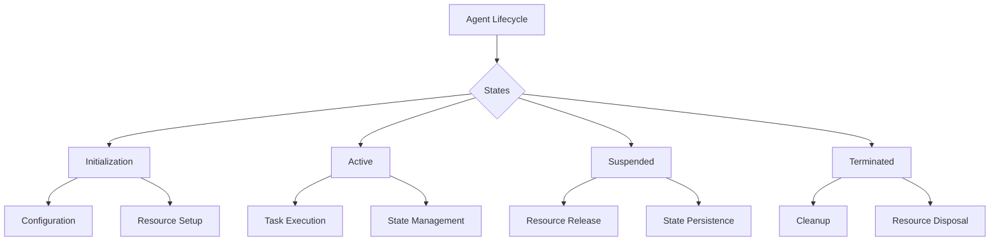
```mermaid
graph TB
    A[Agent Lifecycle] --> B{States}
    B --> C[Initialization]
    B --> D[Active]
    B --> E[Suspended]
    B --> F[Terminated]
    
    C --> G[Configuration]
    C --> H[Resource Setup]
    
    D --> I[Task Execution]
    D --> J[State Management]
    
    E --> K[Resource Release]
    E --> L[State Persistence]
    
    F --> M[Cleanup]
    F --> N[Resource Disposal]
```

### Lifecycle Manager
```typescript
interface LifecycleManager {
  initialization: {
    configLoader: ConfigLoader;
    resourceInitializer: ResourceInitializer;
    stateInitializer: StateInitializer;
  };
  runtime: {
    stateManager: StateManager;
    healthMonitor: HealthMonitor;
    performanceTracker: PerformanceTracker;
  };
  maintenance: {
    updater: SystemUpdater;
    backupManager: BackupManager;
    recoveryHandler: RecoveryHandler;
  };
}

interface AgentLifecycle {
  // Lifecycle hooks
  onInitialize(): Promise<void>;
  onActivate(): Promise<void>;
  onSuspend(): Promise<void>;
  onResume(): Promise<void>;
  onTerminate(): Promise<void>;
  
  // State management
  saveState(): Promise<void>;
  loadState(): Promise<void>;
  
  // Health checks
  checkHealth(): Promise<HealthStatus>;
  reportMetrics(): Promise<Metrics>;
}
```

## 🚀 Deployment Patterns

### Container Orchestration
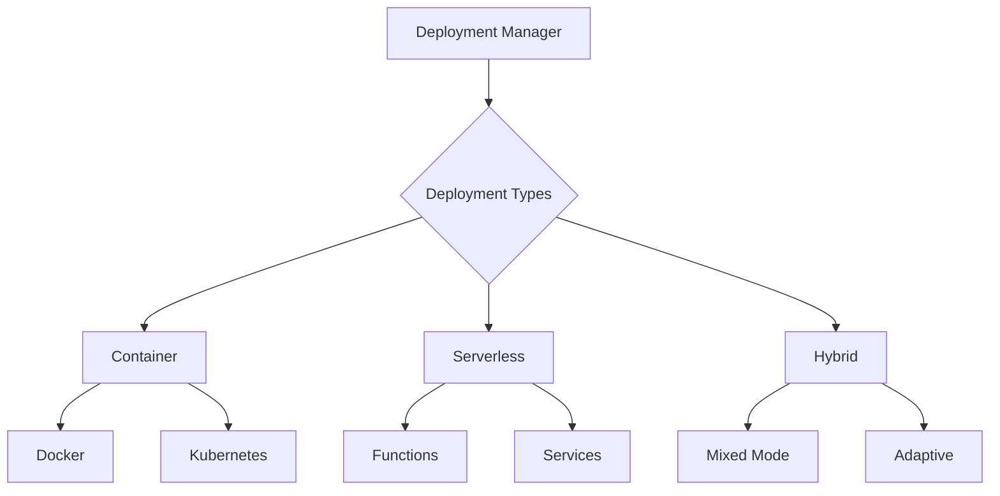
```mermaid
graph TB
    A[Deployment Manager] --> B{Deployment Types}
    B --> C[Container]
    B --> D[Serverless]
    B --> E[Hybrid]
    
    C --> F[Docker]
    C --> G[Kubernetes]
    
    D --> H[Functions]
    D --> I[Services]
    
    E --> J[Mixed Mode]
    E --> K[Adaptive]
```

### Deployment Configuration
```typescript
interface DeploymentConfig {
  container: {
    runtime: ContainerRuntime;
    orchestration: OrchestrationType;
    scaling: ScalingConfig;
  };
  resources: {
    compute: ComputeResources;
    memory: MemoryResources;
    storage: StorageResources;
  };
  networking: {
    topology: NetworkTopology;
    security: NetworkSecurity;
    routing: NetworkRouting;
  };
}

interface DeploymentManager {
  orchestrator: {
    scheduler: DeploymentScheduler;
    monitor: DeploymentMonitor;
    scaler: AutoScaler;
  };
  provisioner: {
    resources: ResourceProvisioner;
    services: ServiceProvisioner;
    network: NetworkProvisioner;
  };
  manager: {
    lifecycle: LifecycleManager;
    updates: UpdateManager;
    rollback: RollbackManager;
  };
}
```

### Scaling Patterns
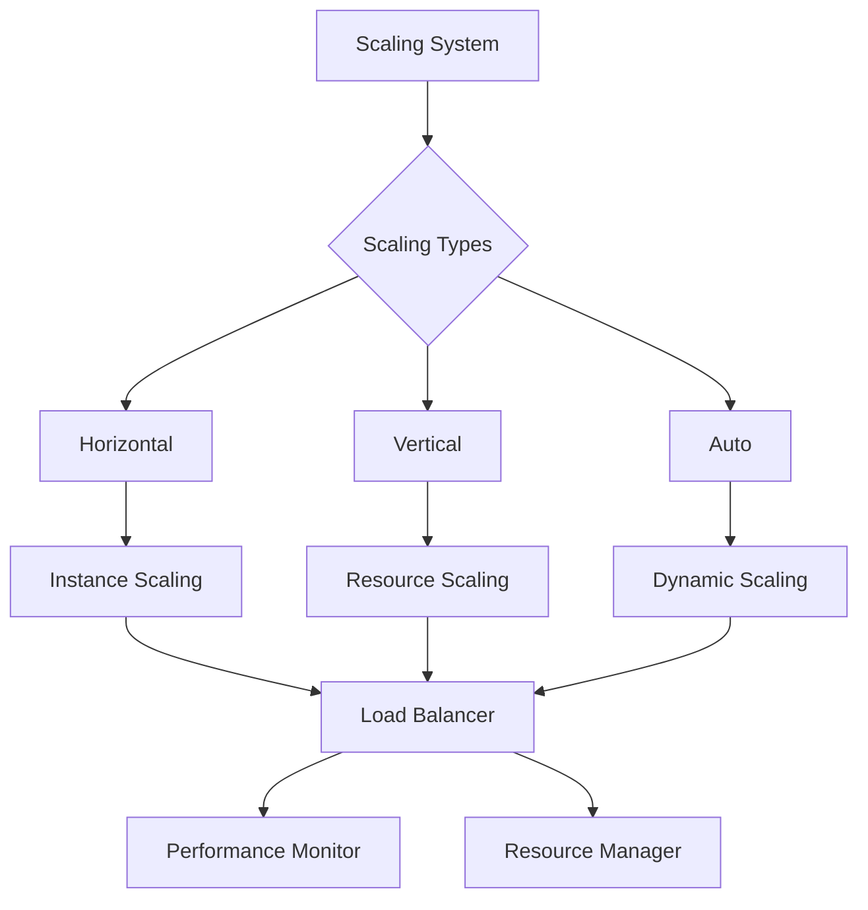
```mermaid
graph TB
    A[Scaling System] --> B{Scaling Types}
    B --> C[Horizontal]
    B --> D[Vertical]
    B --> E[Auto]
    
    C --> F[Instance Scaling]
    D --> G[Resource Scaling]
    E --> H[Dynamic Scaling]
    
    F --> I[Load Balancer]
    G --> I
    H --> I
    
    I --> J[Performance Monitor]
    I --> K[Resource Manager]
```

### High Availability
```typescript
interface HighAvailability {
  redundancy: {
    replication: ReplicationManager;
    failover: FailoverManager;
    recovery: RecoveryManager;
  };
  monitoring: {
    health: HealthMonitor;
    performance: PerformanceMonitor;
    alerts: AlertManager;
  };
  maintenance: {
    backup: BackupManager;
    restore: RestoreManager;
    updates: UpdateManager;
  };
}
```

## 🔧 Configuration Management

### Configuration System
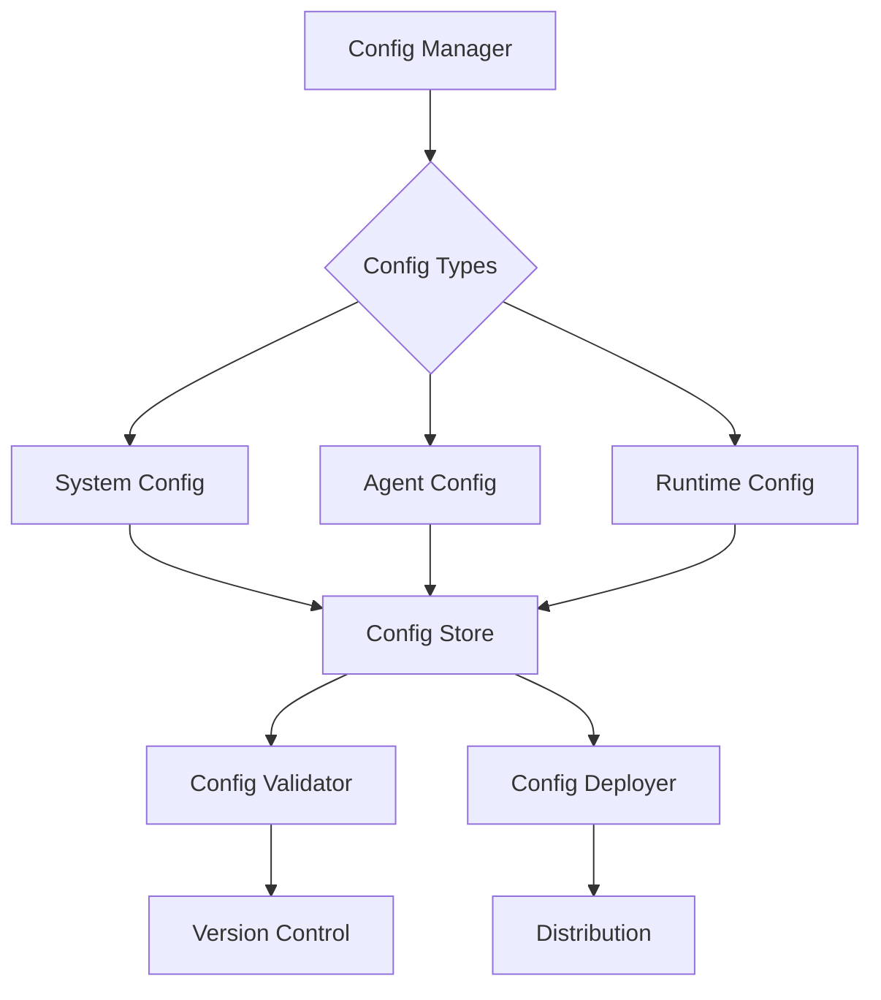
```mermaid
graph TB
    A[Config Manager] --> B{Config Types}
    B --> C[System Config]
    B --> D[Agent Config]
    B --> E[Runtime Config]
    
    C --> F[Config Store]
    D --> F
    E --> F
    
    F --> G[Config Validator]
    F --> H[Config Deployer]
    
    G --> I[Version Control]
    H --> J[Distribution]
```

### Configuration Interfaces
```typescript
interface ConfigurationSystem {
  manager: {
    loader: ConfigLoader;
    validator: ConfigValidator;
    deployer: ConfigDeployer;
  };
  storage: {
    store: ConfigStore;
    version: VersionControl;
    backup: ConfigBackup;
  };
  distribution: {
    publisher: ConfigPublisher;
    subscriber: ConfigSubscriber;
    monitor: ConfigMonitor;
  };
}

interface ConfigurationManager {
  // Configuration operations
  loadConfig(path: string): Promise<Config>;
  validateConfig(config: Config): Promise<ValidationResult>;
  deployConfig(config: Config): Promise<DeploymentResult>;
  
  // Version management
  getVersion(configId: string): Promise<Version>;
  updateVersion(configId: string, version: Version): Promise<void>;
  rollbackVersion(configId: string, version: Version): Promise<void>;
  
  // Distribution
  publishConfig(config: Config): Promise<void>;
  subscribeToUpdates(callback: UpdateCallback): Promise<Subscription>;
  monitorChanges(configId: string): Promise<ChangeStream>;
}
```

## 📈 Performance Optimization

### Performance Monitoring
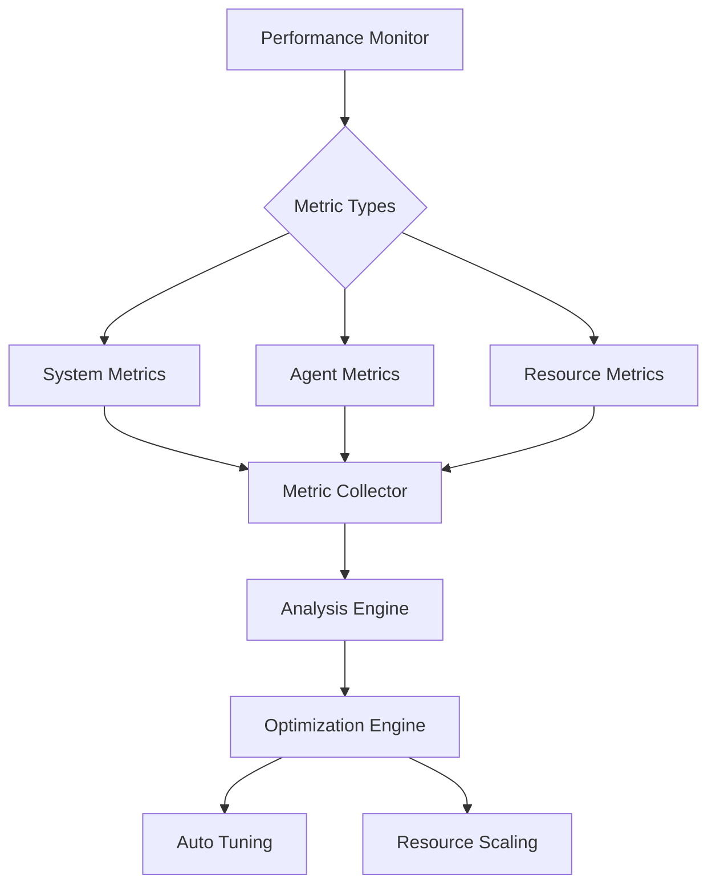
```mermaid
graph TB
    A[Performance Monitor] --> B{Metric Types}
    B --> C[System Metrics]
    B --> D[Agent Metrics]
    B --> E[Resource Metrics]
    
    C --> F[Metric Collector]
    D --> F
    E --> F
    
    F --> G[Analysis Engine]
    G --> H[Optimization Engine]
    
    H --> I[Auto Tuning]
    H --> J[Resource Scaling]
```

### Optimization System
```typescript
interface OptimizationSystem {
  monitoring: {
    collector: MetricCollector;
    analyzer: MetricAnalyzer;
    reporter: MetricReporter;
  };
  optimization: {
    tuner: AutoTuner;
    scaler: ResourceScaler;
    balancer: LoadBalancer;
  };
  management: {
    policies: PolicyManager;
    thresholds: ThresholdManager;
    actions: ActionManager;
  };
}

interface PerformanceOptimizer {
  // Monitoring
  collectMetrics(): Promise<Metrics>;
  analyzePerformance(): Promise<Analysis>;
  generateReport(): Promise<Report>;
  
  // Optimization
  optimizeResources(): Promise<OptimizationResult>;
  tuneParameters(): Promise<TuningResult>;
  balanceLoad(): Promise<BalancingResult>;
  
  // Management
  applyPolicy(policy: Policy): Promise<void>;
  updateThresholds(thresholds: Thresholds): Promise<void>;
  executeAction(action: OptimizationAction): Promise<void>;
}
```

---

*Note: This guide is continuously updated as multi-agent system patterns and best practices evolve.*