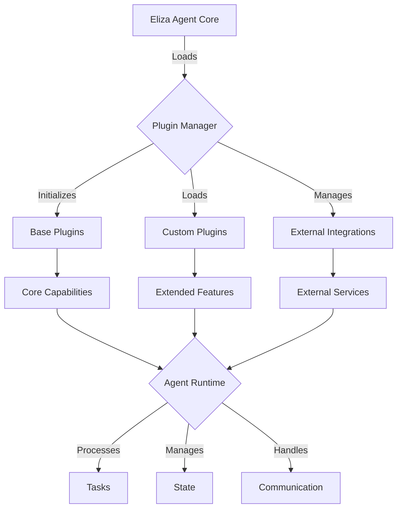
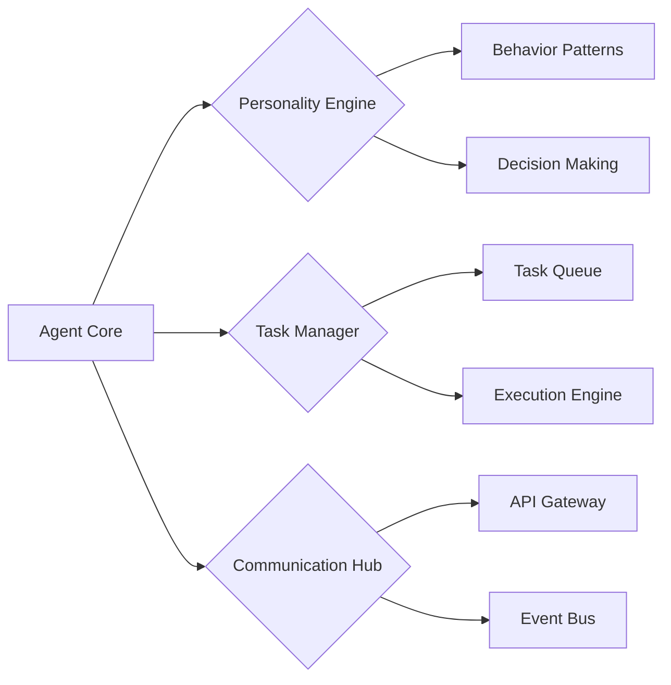
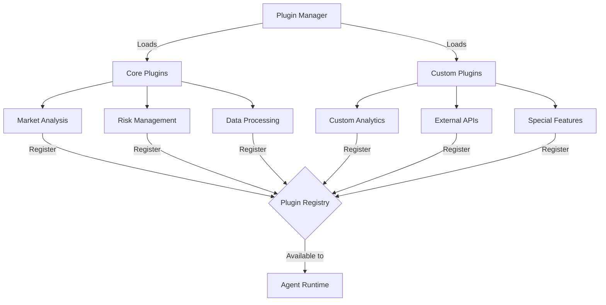
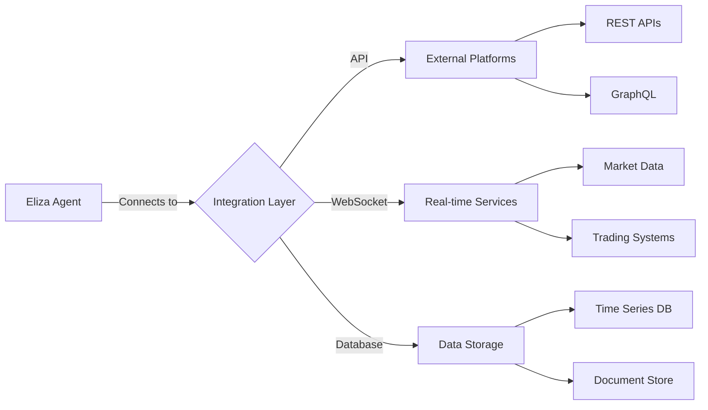
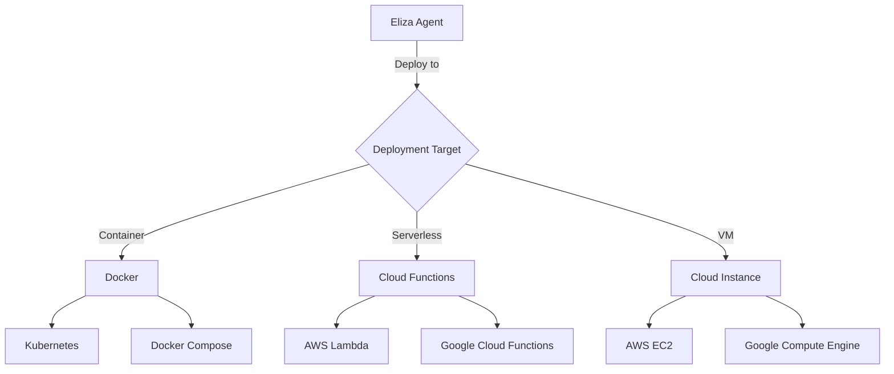
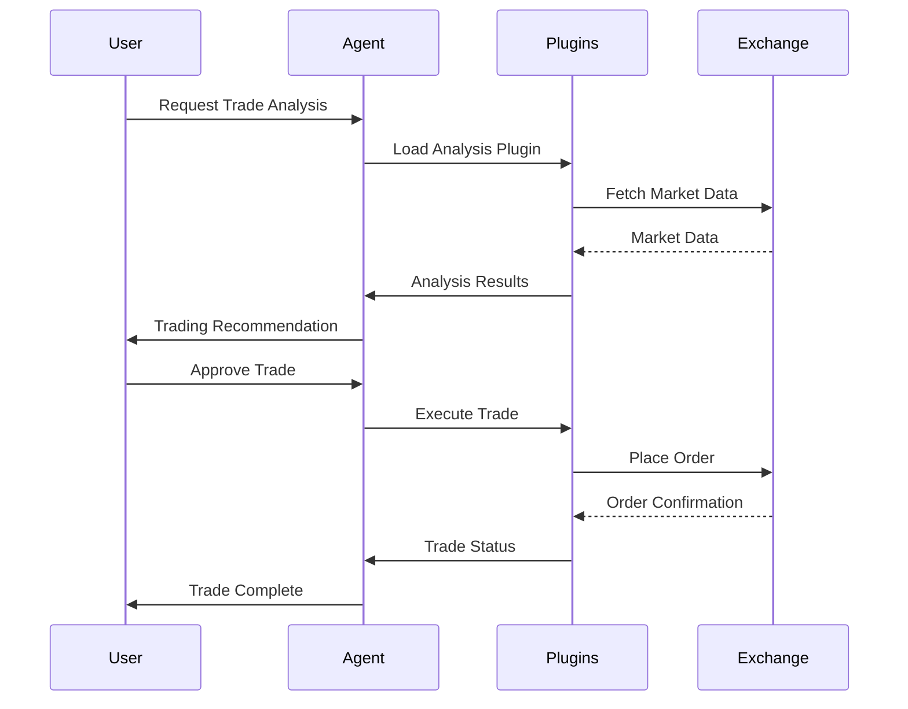
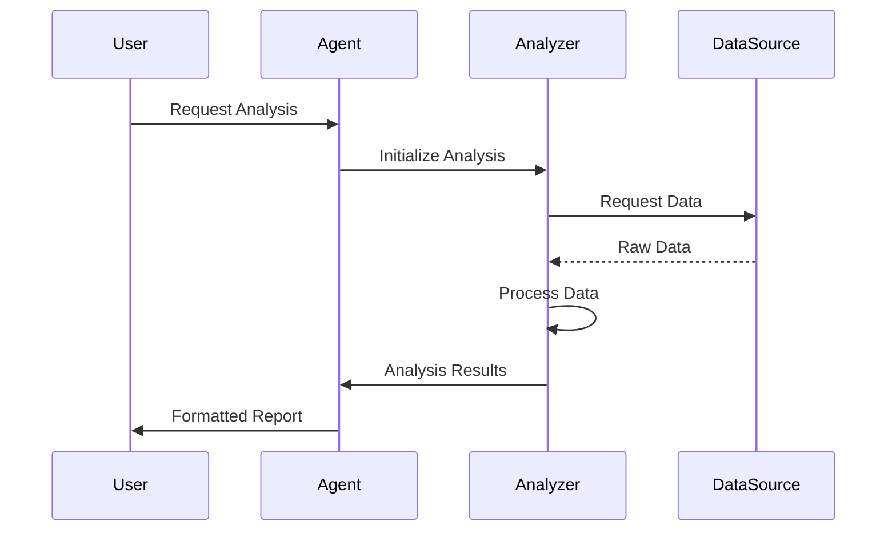
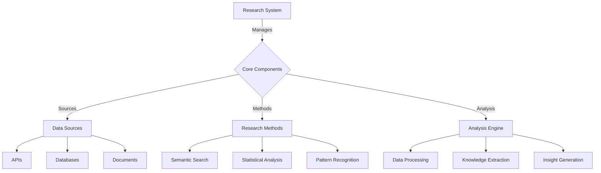

# 🤖 Eliza AI Agent Development Guide

## 📚 Table of Contents
1. [Overview](#overview)
2. [Architecture](#architecture)
3. [Agent System](#agent-system)
4. [Plugin System](#plugin-system)
5. [Configuration](#configuration)
6. [Integration](#integration)
7. [Deployment](#deployment)
8. [Examples](#examples)

## 🌟 Overview

Eliza's AI Agent system is a flexible, plugin-based framework for creating and deploying intelligent agents that can perform a wide range of tasks. Each agent is composed of:
- Core personality configuration
- Plugin-based capabilities
- Integration interfaces
- Communication protocols

### 🎯 Key Features
- Plugin-based architecture
- Multi-platform integration
- Extensible capabilities
- Real-time processing
- Secure communication

## 🏗️ Architecture



### 📂 File Structure
```
agent/
├── core/
│   ├── personality/
│   │   ├── base.json
│   │   └── templates/
│   ├── plugins/
│   │   ├── core/
│   │   └── custom/
│   └── runtime/
├── config/
│   ├── agent.json
│   └── plugins.json
└── integrations/
    ├── platforms/
    └── services/
```

## 🤖 Agent System

### 🧠 Core Components



### 🎭 Personality Configuration
```json
{
  "personality": {
    "name": "Trading Assistant",
    "type": "financial",
    "traits": {
      "analytical": 0.8,
      "cautious": 0.7,
      "responsive": 0.9
    },
    "behavior": {
      "risk_tolerance": "medium",
      "decision_style": "data-driven",
      "interaction_mode": "professional"
    }
  }
}
```

## 🔌 Plugin System

### 📊 Plugin Architecture



### 🛠️ Plugin Development
```typescript
interface ElizaPlugin {
  name: string;
  version: string;
  capabilities: string[];
  initialize(): Promise<void>;
  execute(task: Task): Promise<Result>;
  cleanup(): Promise<void>;
}

class CustomPlugin implements ElizaPlugin {
  // Plugin implementation
}
```

## ⚙️ Configuration

### 📝 Agent Configuration
```json
{
  "agent": {
    "id": "trading-assistant-01",
    "type": "financial",
    "plugins": ["market-analysis", "risk-management"],
    "capabilities": {
      "trading": true,
      "analysis": true,
      "reporting": true
    },
    "limits": {
      "max_tasks": 100,
      "max_connections": 10,
      "timeout": 30000
    }
  }
}
```

### 🔧 Plugin Configuration
```json
{
  "plugins": {
    "market-analysis": {
      "enabled": true,
      "config": {
        "data_sources": ["binance", "coinbase"],
        "update_interval": 5000,
        "indicators": ["RSI", "MACD", "BB"]
      }
    }
  }
}
```

## 🔗 Integration

### 🌐 Platform Integration



### 📡 Communication Protocols
1. REST API Integration
```typescript
interface APIConfig {
  endpoint: string;
  auth: {
    type: 'bearer' | 'apikey';
    token?: string;
    key?: string;
  };
  rateLimit: {
    max: number;
    window: number;
  };
}
```

2. WebSocket Integration
```typescript
interface WSConfig {
  url: string;
  protocols: string[];
  reconnect: {
    enabled: boolean;
    maxAttempts: number;
    delay: number;
  };
}
```

## 🚀 Deployment

### 📦 Deployment Options



### 🔧 Deployment Configuration
```yaml
version: '3'
services:
  eliza-agent:
    image: eliza/agent:latest
    environment:
      - NODE_ENV=production
      - AGENT_CONFIG=/config/agent.json
    volumes:
      - ./config:/config
    ports:
      - "3000:3000"
    restart: always
```

## 💡 Examples

### 🤖 Creating a Trading Agent

1. Basic Configuration
```json
{
  "agent": {
    "name": "TradingBot",
    "type": "trading",
    "plugins": [
      "binance-connector",
      "technical-analysis",
      "risk-manager"
    ]
  }
}
```

2. Plugin Setup
```typescript
// Trading plugin example
class TradingPlugin implements ElizaPlugin {
  async initialize() {
    // Setup trading connections
  }

  async execute(task: TradeTask) {
    // Execute trading logic
  }
}
```

3. Integration Code
```typescript
const agent = new ElizaAgent({
  config: tradingConfig,
  plugins: [
    new TradingPlugin(),
    new AnalysisPlugin(),
    new RiskPlugin()
  ]
});

await agent.start();
```

### 📊 Creating an Analysis Agent

1. Configuration
```json
{
  "agent": {
    "name": "MarketAnalyst",
    "type": "analysis",
    "plugins": [
      "market-data",
      "sentiment-analysis",
      "report-generator"
    ]
  }
}
```

2. Analysis Plugin
```typescript
class AnalysisPlugin implements ElizaPlugin {
  async analyze(data: MarketData) {
    // Perform market analysis
  }

  async generateReport() {
    // Create analysis report
  }
}
```

## 🔄 Workflow Examples

### 📈 Trading Workflow



### 🔍 Analysis Workflow



## 📚 Additional Resources

### 🔗 Useful Links
- [Plugin Development Guide](./plugin-dev-guide.md)
- [Agent Configuration Guide](./agent-config-guide.md)
- [Integration Examples](./integration-examples.md)
- [Deployment Guide](./deployment-guide.md)

### 📝 Best Practices
1. Always validate plugin configurations
2. Implement proper error handling
3. Use type-safe interfaces
4. Follow security guidelines
5. Maintain comprehensive logging

## 🔬 Research & Analysis

### 📚 Research System Architecture



### 🧠 Knowledge Management
```typescript
interface KnowledgeSystem {
  sources: {
    apis: APISource[];
    databases: DatabaseSource[];
    documents: DocumentSource[];
  };
  processors: {
    textProcessor: TextProcessor;
    dataProcessor: DataProcessor;
    mediaProcessor: MediaProcessor;
  };
  storage: {
    shortTerm: CacheStorage;
    longTerm: PersistentStorage;
    knowledge: KnowledgeBase;
  };
}

interface ResearchCapability {
  methods: ResearchMethod[];
  validators: DataValidator[];
  analyzers: DataAnalyzer[];
  synthesizers: DataSynthesizer[];
}
```

## 🌐 Platform Integration

### 📱 Social Platform Integration
```typescript
interface SocialPlatform {
  type: 'discord' | 'telegram' | 'slack' | 'twitter';
  config: {
    auth: AuthConfig;
    features: string[];
    permissions: string[];
  };
  handlers: {
    onMessage: MessageHandler;
    onEvent: EventHandler;
    onInteraction: InteractionHandler;
  };
}

interface MessageHandler {
  processMessage(message: Message): Promise<void>;
  formatResponse(response: Response): Promise<FormattedMessage>;
  handleReactions(reaction: Reaction): Promise<void>;
}
```

### 🤖 Bot Integration
```typescript
interface BotIntegration {
  platforms: SocialPlatform[];
  capabilities: {
    commands: Command[];
    interactions: Interaction[];
    automations: Automation[];
  };
  middleware: {
    rateLimit: RateLimiter;
    filter: ContentFilter;
    transformer: MessageTransformer;
  };
}

interface Command {
  name: string;
  description: string;
  permissions: string[];
  execute(context: CommandContext): Promise<void>;
}
```

## 🔄 Interaction System

### 🗣️ Natural Language Processing
```typescript
interface NLPSystem {
  processors: {
    tokenizer: Tokenizer;
    parser: Parser;
    analyzer: Analyzer;
  };
  models: {
    intent: IntentClassifier;
    entity: EntityRecognizer;
    sentiment: SentimentAnalyzer;
  };
  memory: {
    context: ContextManager;
    conversation: ConversationHistory;
  };
}

interface DialogueManager {
  current: DialogueState;
  history: DialogueHistory;
  strategies: DialogueStrategy[];
  handlers: {
    clarification: ClarificationHandler;
    confirmation: ConfirmationHandler;
    error: ErrorHandler;
  };
}
```

### 🎯 Task Management
```typescript
interface TaskSystem {
  scheduler: TaskScheduler;
  executor: TaskExecutor;
  monitor: TaskMonitor;
  handlers: {
    success: SuccessHandler;
    failure: FailureHandler;
    retry: RetryHandler;
  };
}

interface Task {
  id: string;
  type: TaskType;
  priority: Priority;
  dependencies: string[];
  execute(): Promise<TaskResult>;
}
```

## 📊 Analytics & Monitoring

### 📈 Performance Tracking
```typescript
interface AnalyticsSystem {
  metrics: {
    performance: PerformanceMetrics;
    usage: UsageMetrics;
    errors: ErrorMetrics;
  };
  tracking: {
    events: EventTracker;
    interactions: InteractionTracker;
    outcomes: OutcomeTracker;
  };
  reporting: {
    generator: ReportGenerator;
    scheduler: ReportScheduler;
    distributor: ReportDistributor;
  };
}

interface Monitoring {
  health: HealthCheck[];
  alerts: AlertSystem;
  logging: LogSystem;
  diagnostics: DiagnosticTools;
}
```

## 🔒 Security & Compliance

### 🛡️ Security System
```typescript
interface SecuritySystem {
  authentication: {
    providers: AuthProvider[];
    validators: TokenValidator[];
    managers: SessionManager[];
  };
  authorization: {
    roles: Role[];
    permissions: Permission[];
    policies: Policy[];
  };
  encryption: {
    data: DataEncryption;
    communication: CommunicationEncryption;
    storage: StorageEncryption;
  };
}

interface ComplianceSystem {
  policies: CompliancePolicy[];
  auditors: ComplianceAuditor[];
  reporters: ComplianceReporter[];
  validators: ComplianceValidator[];
}
```

## 💡 Implementation Examples

### 1. Research Agent Implementation
```typescript
const researchAgent = {
  knowledge: {
    sources: [
      {
        type: 'api',
        config: {
          endpoint: 'https://api.research.com',
          auth: { type: 'bearer', token: 'xxx' }
        }
      },
      {
        type: 'database',
        config: {
          type: 'postgresql',
          connection: dbConfig
        }
      }
    ],
    processors: {
      text: new TextProcessor({
        language: 'en',
        models: ['gpt-4', 'bert']
      }),
      data: new DataProcessor({
        formats: ['json', 'csv', 'xml']
      })
    }
  },
  integration: {
    platforms: [
      {
        type: 'discord',
        config: {
          token: 'xxx',
          features: ['commands', 'threads', 'reactions']
        }
      }
    ],
    commands: [
      {
        name: 'research',
        description: 'Conduct research on a topic',
        execute: async (context) => {
          // Research implementation
        }
      }
    ]
  }
};
```

### 2. Assistant Agent Implementation
```typescript
const assistantAgent = {
  nlp: {
    processors: {
      tokenizer: new Tokenizer({ language: 'en' }),
      parser: new Parser({ grammar: 'standard' }),
      analyzer: new Analyzer({ models: ['sentiment', 'intent'] })
    },
    dialogue: {
      strategies: [
        new ClarificationStrategy(),
        new ConfirmationStrategy(),
        new ErrorHandlingStrategy()
      ]
    }
  },
  tasks: {
    scheduler: new TaskScheduler({
      maxConcurrent: 5,
      priorityLevels: 3
    }),
    executor: new TaskExecutor({
      timeout: 30000,
      retries: 3
    })
  },
  security: {
    authentication: {
      providers: [
        new OAuth2Provider(),
        new APIKeyProvider()
      ]
    },
    encryption: {
      data: new AESEncryption(),
      communication: new TLSEncryption()
    }
  }
};
```

---

*This documentation is continuously updated as the Eliza AI Agent system evolves.* 