# 🤖 Auto-Bot Development Documentation

## 📋 Overview
Auto-Bot is an advanced cryptocurrency trading bot designed to trade effectively across all market cycles by dynamically adapting its strategy based on market conditions. The bot specializes in handling both trending and choppy markets through sophisticated position management, hedging strategies, and multi-timeframe analysis.

## 🔧 Technical Description
Auto-Bot employs a dynamic, multi-modal approach to trading that combines:
- 📊 Real-time market analysis across multiple timeframes
- 🎯 Pattern recognition using TA-Lib
- 💹 Dynamic position sizing and hedging
- 🔄 Automated mode switching based on market conditions
- ⚡ Advanced risk management and position scaling
- 🎯 Alignment-based entry and exit strategies

## 📝 Requirements List
| Category | Requirement | Priority |
|----------|-------------|-----------|
| 📈 Market Analysis | Multi-timeframe analysis capability | High |
| | Pattern recognition (TA-Lib integration) | High |
| | Volatility tracking | High |
| 💼 Position Management | Dynamic position sizing | High |
| | Hedging capability | High |
| | DCA functionality | High |
| 🛡️ Risk Management | Dynamic stop-loss adjustment | High |
| | Position scaling logic | High |
| | Emergency shutdown mechanism | High |
| ⚡ Performance | Real-time price tracking | High |
| | Fast order execution | High |
| | Efficient memory usage | Medium |
| 📱 Monitoring | Performance metrics tracking | Medium |
| | Telegram notifications | Medium |
| | Dashboard interface | Medium |

## 📂 File Tree
```
/bot
│── /core
│   ├── __init__.py
│   ├── bot.py                        # Main bot execution logic
│   ├── settings.py                    # Global settings & configurations
│   ├── alignment.py                    # Curve-fitting & backtesting for optimal mode selection
│   ├── mode_switching.py                # Handles switching between different bot modes
│
│── /strategies
│   ├── __init__.py
│   ├── trend_mode.py                    # Logic for trading in trend conditions
│   ├── chop_mode.py                     # Trading in ranging/choppy conditions
│   ├── breakout_mode.py                  # Breakout detection and execution
│   ├── reversal_mode.py                   # Identifies reversals & counter-trend setups
│   ├── volatility_based_hedging.py        # Adjusts positions dynamically based on volatility
│   ├── position_sizing.py                 # Calculates position size dynamically
│   ├── risk_control.py                     # Risk management & exposure settings
│   ├── market_structure.py                 # Identifies S/R levels, supply/demand zones
│
│── /execution
│   ├── __init__.py
│   ├── order_management.py                # Cancels, modifies, places orders dynamically
│   ├── rebalancing.py                      # Adjusts positions after each execution
│   ├── trade_execution.py                  # Sends orders to exchange
│   ├── hedging.py                           # Manages hedge trades dynamically
│   ├── entry_exit_logic.py                  # Defines when to enter/exit based on confirmation
│
│── /market_analysis
│   ├── __init__.py
│   ├── volatility_tracker.py              # Measures volatility dynamically
│   ├── trend_confirmation.py              # Confirms market trend status
│   ├── chop_detector.py                   # Identifies choppy vs trending markets
│   ├── pattern_detection.py               # Uses TA-Lib to detect candlestick patterns
│
│── /data
│   ├── __init__.py
│   ├── historical_data.py                 # Fetches past market data
│   ├── live_feed.py                        # Handles real-time data streaming
│   ├── sqlite_handler.py                   # Stores data for performance tracking
│   ├── postgres_handler.py                 # (Optional) Scalable data storage using PostgreSQL
│
│── /utils
│   ├── __init__.py
│   ├── logger.py                           # Logging system
│   ├── config_loader.py                    # Loads config settings
│   ├── api_handler.py                       # Manages API keys securely
│
│── /connections
│   ├── __init__.py
│   ├── buybit_websocket.py                 # WebSocket connection to exchange
│   ├── buybit_rest.py                      # REST API connection to exchange
│   ├── exchange_handler.py                  # Handles multi-exchange compatibility
│
│── /ui
│   ├── __init__.py
│   ├── dashboard.py                        # Streamlit-based UI for monitoring & settings
│   ├── pages/
│   │   ├── overview.py                     # High-level bot performance view
│   │   ├── strategies.py                   # Adjust bot strategies & settings
│   │   ├── execution.py                    # Monitor live trade execution
│   │   ├── risk_management.py              # Modify risk settings
│
│── run.py                                  # Main entry point to start bot
│── requirements.txt                        # Dependencies list
│── config.json                             # Configurations for API keys & strategy settings
│── README.md                               # Documentation
```

## 📁 File Descriptions

### 🎯 Core Files
- `bot.py`: Main bot logic orchestrating all components
- `settings.py`: Global configuration and settings management
- `alignment.py`: Implements alignment scoring system
- `mode_switching.py`: Handles transitions between trading modes

### 📈 Strategy Files
- `trend_mode.py`: Implements trend-following strategies
- `chop_mode.py`: Handles ranging market conditions
- `breakout_mode.py`: Manages breakout detection and execution
- `hedging.py`: Implements hedging strategies
- `position_sizing.py`: Calculates optimal position sizes
- `risk_control.py`: Manages risk parameters and limits

### 📊 Market Analysis Files
- `pattern_detection.py`: TA-Lib integration for pattern recognition
- `volatility_tracker.py`: Measures and tracks market volatility
- `trend_analyzer.py`: Analyzes trend strength and direction
- `timeframe_manager.py`: Coordinates multi-timeframe analysis

### ⚙️ Execution Files
- `order_manager.py`: Handles order execution and tracking
- `position_manager.py`: Manages active positions
- `hedge_manager.py`: Controls hedge positions

### 💾 Data Files
- `market_data.py`: Handles market data collection and processing
- `performance_tracker.py`: Tracks bot performance metrics
- `database.py`: Manages data storage and retrieval

### 🛠️ Utility Files
- `logger.py`: Logging functionality
- `notifier.py`: Telegram notification system
- `config_loader.py`: Configuration file management

## ✨ Full Feature List

### 💼 Position Modes
1. 📊 Static Mode
   - Fixed position sizing
   - No dynamic adjustments
   - Manual override capability

2. 📈 Percentage-Based Mode
   - Dynamic sizing based on available margin
   - Balanced long/short distribution
   - Adaptive risk factor

3. 🎯 DCA Mode
   - Gradual position building
   - Strategic entry points
   - Automated scaling

4. 🔲 Grid Mode
   - Multiple entry/exit levels
   - Auto-adjusting grid spacing
   - Profit taking at each level

### 📊 Trading Modes
1. 📈 Trend Mode
   - Trend following strategy
   - Momentum-based entries
   - Trailing stops

2. ↔️ Chop Mode
   - Range-bound trading
   - Hedged positions
   - Pennant tracking

3. 💥 Breakout Mode
   - Pattern recognition
   - Volume confirmation
   - Quick execution

4. 🔄 Reversal Mode
   - Pattern detection
   - Counter-trend trading
   - Risk-adjusted sizing

### 🛡️ Risk Management
1. 📊 Dynamic Position Sizing
   - Confidence-based scaling
   - Volatility-adjusted sizing
   - Maximum exposure limits

2. 🛑 Stop Loss Management
   - Dynamic stop placement
   - Multi-timeframe validation
   - Trailing stop logic

3. 💰 Take Profit Strategy
   - Multiple TP levels
   - Partial profit taking
   - Dynamic adjustment

### 💼 Asset Management
1. ⚖️ Portfolio Balance
   - Position limits
   - Margin allocation
   - Risk distribution

2. 🔄 Hedge Management
   - Dynamic hedge sizing
   - Correlation tracking
   - Automated rebalancing

### 🔔 Alerts and Notifications
1. 📱 Telegram Integration
   - Position updates
   - Performance metrics
   - Error alerts

2. 📊 Dashboard Monitoring
   - Real-time performance
   - Position tracking
   - Risk metrics

## 📈 Bot Behavior Per Market Condition

### 🚀 Bullish Trend
1. 📥 Entry Strategy
   - Momentum confirmation
   - Pattern recognition
   - Volume validation

2. 📊 Position Management
   - Progressive scaling
   - Trailing stops
   - Partial profit taking

### 🔻 Bearish Trend
1. 📉 Entry Strategy
   - Trend confirmation
   - Support/resistance levels
   - Volume analysis

2. 🛡️ Position Management
   - Controlled scaling
   - Strategic hedging
   - Risk reduction

### ↔️ Choppy/Sideways
1. 📊 Range Trading
   - Support/resistance trading
   - Hedged positions
   - Quick profit taking

2. Risk Management
   - Reduced position sizes
   - Tight stops
   - Balanced exposure

### Trending
1. Trend Following
   - Strong trend confirmation
   - Aggressive scaling
   - Momentum tracking

2. Risk Control
   - Progressive stop adjustment
   - Profit protection
   - Exposure management

## Multi-Timeframe Analysis

### Timeframe Hierarchy
1. Primary (1-minute)
   - Real-time execution
   - Pattern detection
   - Immediate volatility

2. Secondary (5-minute)
   - Trend confirmation
   - Support/resistance
   - Volume analysis

3. Higher Timeframes (15m, 1h, 4h)
   - Major trend direction
   - Key levels
   - Market structure

### Analysis Integration
1. Trend Alignment
   - Multi-timeframe confirmation
   - Weighted importance
   - Conflict resolution

2. Entry/Exit Validation
   - Multiple timeframe confirmation
   - Risk adjustment
   - Position sizing

## Bot Configuration Template
```json
{
  "trading": {
    "modes": {
      "trend": {
        "enabled": true,
        "min_confidence": 0.7,
        "scaling_factor": 1.5
      },
      "chop": {
        "enabled": true,
        "min_range_percent": 1.0,
        "hedge_ratio": 1.0
      }
    },
    "position_sizing": {
      "base_size": 100,
      "max_size": 1000,
      "scaling_factor": 1.2
    }
  },
  "risk_management": {
    "max_position_size": 5000,
    "max_open_positions": 3,
    "stop_loss_percent": 2.0
  },
  "timeframes": {
    "primary": "1m",
    "secondary": "5m",
    "higher": ["15m", "1h", "4h"]
  }
}
```

## Bot Decision Logic Matrix

### Market Condition → Bot Action
| Condition | Action | Mode |
|-----------|--------|------|
| Strong Trend + High Volume | Scale into position | Trend Mode |
| Choppy + Range-bound | Enter hedge positions | Chop Mode |
| Breakout + Volume surge | Quick entry | Breakout Mode |
| Trend weakening | Reduce exposure | Reversal Mode |

### Volatility → Position Size
| Volatility | Position Size | Stop Distance |
|------------|---------------|---------------|
| Low | Base size | Tight |
| Medium | 1.5x base | Moderate |
| High | 0.75x base | Wide |

## Indicators
1. Trend Indicators
   - Moving Averages
   - ADX
   - MACD

2. Volatility Indicators
   - ATR
   - Bollinger Bands
   - Standard Deviation

3. Volume Indicators
   - Volume
   - OBV
   - Volume Profile

## Indicator Modes

### 1. Default/Base Indicator Mode
1. Trend Indicators
   - Moving Averages (SMA, EMA, VWAP)
   - ADX (Average Directional Index)
   - MACD (Moving Average Convergence Divergence)

2. Volatility Indicators
   - ATR (Average True Range)
   - Bollinger Bands
   - Standard Deviation

3. Volume Indicators
   - Volume
   - OBV (On Balance Volume)
   - Volume Profile

### 2. Advanced Indicator Mode
1. Market Flow & Liquidity Indicators
   - CVD (Cumulative Volume Delta)
     * Smart money flow tracking
     * Volume imbalance detection
     * Trend confirmation
   - Open Interest
     * Market participation measurement
     * Trend strength validation
     * Divergence analysis
   - Funding Rate
     * Market sentiment gauge
     * Long/short ratio analysis
     * Mean reversion signals

2. Advanced Momentum & Trend Indicators
   - MFI (Money Flow Index)
     * Volume-weighted RSI
     * Stronger momentum signals
     * Divergence detection
   - Stochastic RSI
     * Second-derivative momentum
     * Faster signal generation
     * Extreme condition identification
   - Hull Moving Average
     * Reduced lag trend detection
     * Faster trend changes
     * Multiple timeframe analysis

3. Market Structure Indicators
   - Chop Index
     * Market condition classification
     * Trend vs chop identification
     * Trading mode selection
   - Liquidation Data
     * Forced closure tracking
     * Reversal point prediction
     * Risk management enhancement

### Indicator Mode Configuration
```json
{
  "indicator_mode": {
    "default": {
      "enabled": true,
      "trend": ["ma", "adx", "macd"],
      "volatility": ["atr", "bbands", "std_dev"],
      "volume": ["volume", "obv", "vol_profile"]
    },
    "advanced": {
      "enabled": false,
      "market_flow": ["cvd", "open_interest", "funding_rate"],
      "momentum": ["mfi", "stoch_rsi", "hull_ma"],
      "structure": ["chop_index", "liquidation_data"]
    }
  }
}
```

### Indicator Mode Workflows

#### 1. Mode Switching Logic
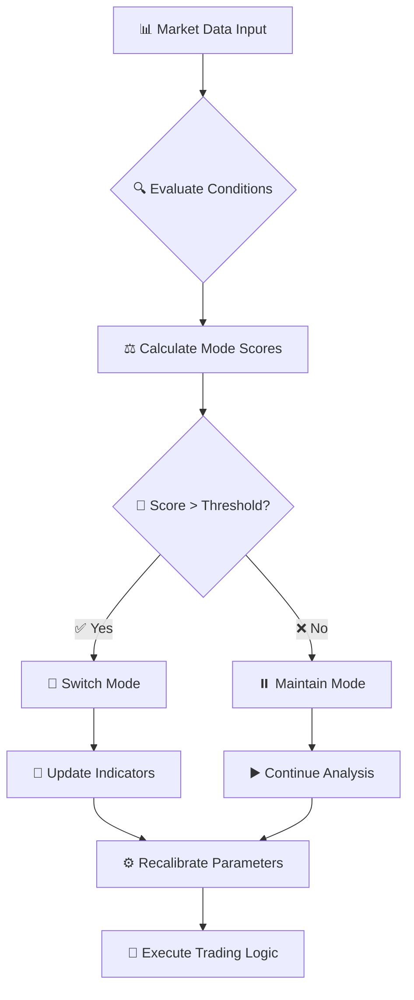
```mermaid
graph TD
    A[📊 Market Data Input] --> B{🔍 Evaluate Conditions}
    B --> C[⚖️ Calculate Mode Scores]
    C --> D{🎯 Score > Threshold?}
    D -->|✅ Yes| E[🔄 Switch Mode]
    D -->|❌ No| F[⏸️ Maintain Mode]
    
    E --> G[🔄 Update Indicators]
    F --> H[▶️ Continue Analysis]
    
    G --> I[⚙️ Recalibrate Parameters]
    H --> I
    
    I --> J[🚀 Execute Trading Logic]
```

#### 2. Mode Behavior Comparison
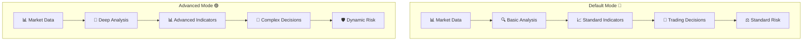
```mermaid
graph TB
    subgraph DefaultMode["Default Mode 🔵"]
        A1[📊 Market Data] --> B1[🔍 Basic Analysis]
        B1 --> C1[📈 Standard Indicators]
        C1 --> D1[🎯 Trading Decisions]
        D1 --> E1[⚖️ Standard Risk]
    end
    
    subgraph AdvancedMode["Advanced Mode 🟣"]
        A2[📊 Market Data] --> B2[🔬 Deep Analysis]
        B2 --> C2[📊 Advanced Indicators]
        C2 --> D2[🎯 Complex Decisions]
        D2 --> E2[🛡️ Dynamic Risk]
    end
```

#### 3. Advanced Mode Accuracy Matrix
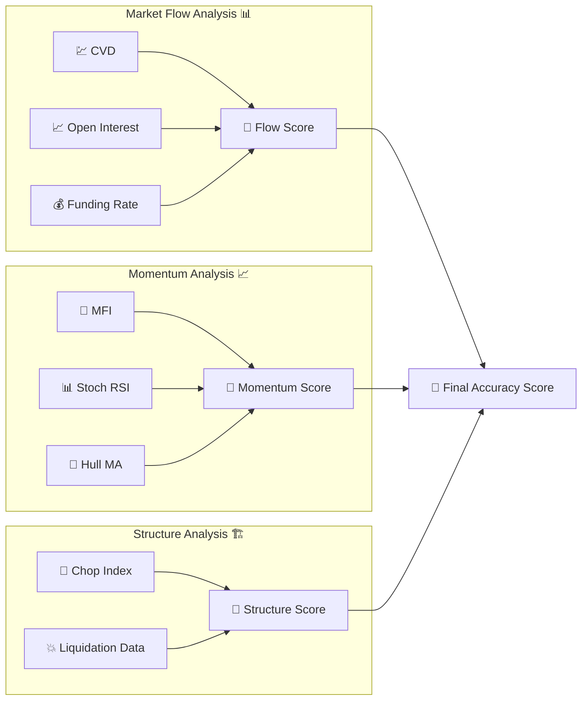
```mermaid
graph LR
    subgraph MarketFlow["Market Flow Analysis 📊"]
        MF1[💹 CVD] --> MFS[🌊 Flow Score]
        MF2[📈 Open Interest] --> MFS
        MF3[💰 Funding Rate] --> MFS
    end
    
    subgraph Momentum["Momentum Analysis 📈"]
        MA1[💫 MFI] --> MMS[🔄 Momentum Score]
        MA2[📊 Stoch RSI] --> MMS
        MA3[🌊 Hull MA] --> MMS
    end
    
    subgraph Structure["Structure Analysis 🏗️"]
        SA1[📏 Chop Index] --> STS[🎯 Structure Score]
        SA2[💥 Liquidation Data] --> STS
    end
    
    MFS --> FAS[🎯 Final Accuracy Score]
    MMS --> FAS
    STS --> FAS
```

#### 4. Confidence Matrix
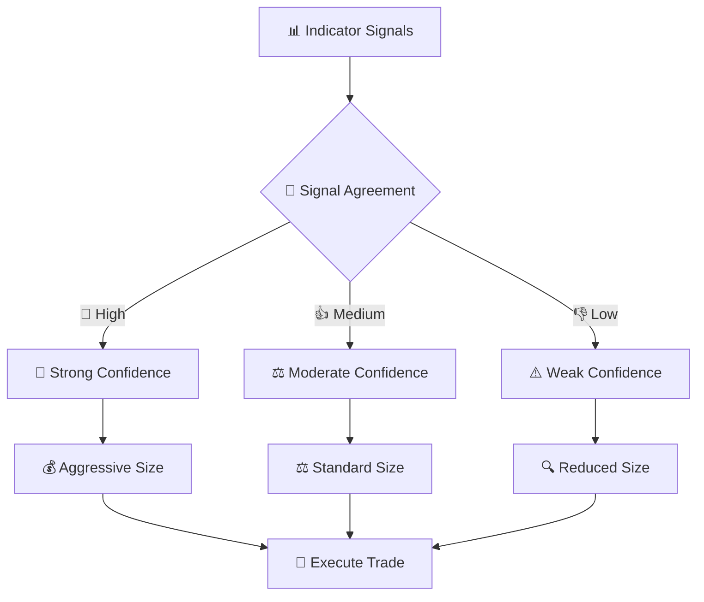
```mermaid
graph TD
    A[📊 Indicator Signals] --> B{🎯 Signal Agreement}
    B -->|💪 High| C[🚀 Strong Confidence]
    B -->|👍 Medium| D[⚖️ Moderate Confidence]
    B -->|👎 Low| E[⚠️ Weak Confidence]
    
    C --> F[💰 Aggressive Size]
    D --> G[⚖️ Standard Size]
    E --> H[🔍 Reduced Size]
    
    F --> I[🎯 Execute Trade]
    G --> I
    H --> I
```

#### 5. Trend Validation Flow
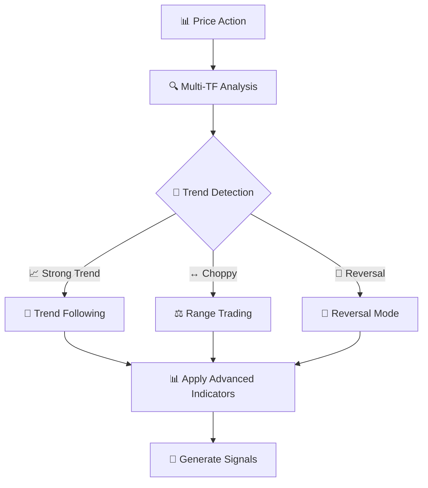
```mermaid
graph TD
    A[📊 Price Action] --> B[🔍 Multi-TF Analysis]
    B --> C{🎯 Trend Detection}
    
    C -->|📈 Strong Trend| D[🚀 Trend Following]
    C -->|↔️ Choppy| E[⚖️ Range Trading]
    C -->|🔄 Reversal| F[💫 Reversal Mode]
    
    D --> G[📊 Apply Advanced Indicators]
    E --> G
    F --> G
    
    G --> H[🎯 Generate Signals]
```

#### 6. Indicator Prediction Matrix
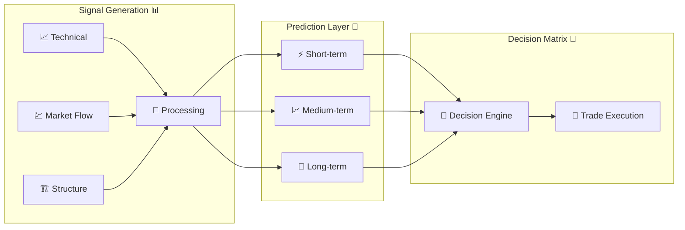
```mermaid
graph LR
    subgraph SignalGen["Signal Generation 📊"]
        S1[📈 Technical] --> SP[🔄 Processing]
        S2[💹 Market Flow] --> SP
        S3[🏗️ Structure] --> SP
    end
    
    subgraph Prediction["Prediction Layer 🔮"]
        SP --> P1[⚡ Short-term]
        SP --> P2[📈 Medium-term]
        SP --> P3[🌟 Long-term]
    end
    
    subgraph Decision["Decision Matrix 🎯"]
        P1 --> D[🧠 Decision Engine]
        P2 --> D
        P3 --> D
        D --> T[🚀 Trade Execution]
    end
```

### Mode-Specific Performance Metrics
| Mode | Computation Load | Signal Quality | Latency |
|------|-----------------|----------------|----------|
| Default | Low-Medium | Good | < 50ms |
| Advanced | Medium-High | Excellent | < 100ms |

## Bot Alignment Matrix

### Alignment Factors
1. Trend Strength (40%)
   - Direction
   - Momentum
   - Duration

2. Pattern Confidence (30%)
   - Formation quality
   - Historical accuracy
   - Volume confirmation

3. Volatility Score (20%)
   - Range measurement
   - ATR analysis
   - Price action

4. Volume Profile (10%)
   - Volume trend
   - Price correlation
   - Level significance

## Bot Modes

### Trend Mode
- Entry: Strong trend confirmation
- Scaling: Progressive with trend
- Exit: Trend weakness or reversal

### Chop Mode
- Entry: Range identification
- Hedging: Balanced positions
- Exit: Range break or compression

### Breakout Mode
- Entry: Pattern completion
- Scaling: Quick position building
- Exit: Target reached or failure

## Accuracy Equations

### Overall Accuracy
```python
accuracy = successful_trades / total_trades
weighted_accuracy = Σ(trade_profit * trade_weight) / total_trades
```

### Pattern Accuracy
```python
pattern_accuracy = correct_patterns / total_patterns
pattern_confidence = pattern_accuracy * pattern_strength
```

### Trend Accuracy
```python
trend_accuracy = correct_trend_calls / total_calls
trend_confidence = trend_accuracy * trend_strength
```

## Trend Analysis

### Trend Strength
```python
trend_strength = (current_price - price_n_bars_ago) / (atr * sqrt(n))
trend_quality = trend_strength * volume_confirmation
```

### Trend Direction
```python
trend_direction = sign(ema_short - ema_long)
trend_momentum = abs(ema_short - ema_long) / atr
```

## Pattern Detection

### Pattern Validation
```python
pattern_score = pattern_quality * volume_confirmation * trend_alignment
pattern_confidence = pattern_score * historical_accuracy
```

### Pattern Filtering
```python
valid_pattern = pattern_score > min_threshold and
                volume_confirms and
                trend_aligns
```

## Confidence Calculations

### Entry Confidence
```python
entry_confidence = (
    trend_strength * 0.4 +
    pattern_confidence * 0.3 +
    volume_score * 0.2 +
    timeframe_alignment * 0.1
)
```

### Position Sizing Confidence
```python
position_size = base_size * entry_confidence * volatility_adjustment
```

## Utilities

### Logging
- Performance metrics
- Trade history
- Error tracking
- System status

### Notifications
- Position updates
- Risk alerts
- System warnings
- Performance reports

### Configuration
- Settings management
- Parameter optimization
- Mode switching
- Risk controls

## Unit Testing

### Test Categories
1. Strategy Tests
   - Trend detection
   - Pattern recognition
   - Position sizing
   - Risk management

2. Integration Tests
   - Mode switching
   - Order execution
   - Position management
   - Data handling

3. Performance Tests
   - Latency
   - Memory usage
   - CPU utilization
   - Network efficiency

## Workflow Diagrams

### Main Bot Workflow
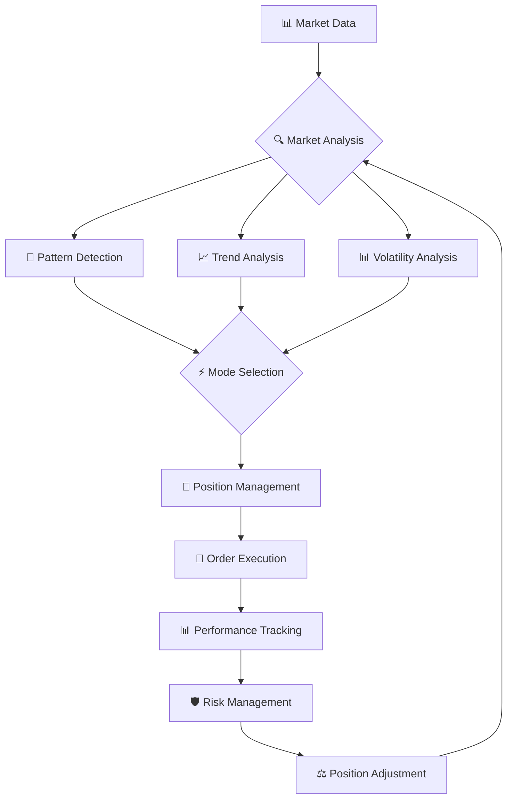
```mermaid
graph TD
    A[📊 Market Data] --> B{🔍 Market Analysis}
    B --> C[🎯 Pattern Detection]
    B --> D[📈 Trend Analysis]
    B --> E[📊 Volatility Analysis]
    C --> F{⚡ Mode Selection}
    D --> F
    E --> F
    F --> G[💼 Position Management]
    G --> H[📝 Order Execution]
    H --> I[📊 Performance Tracking]
    I --> J[🛡️ Risk Management]
    J --> K[⚖️ Position Adjustment]
    K --> B
```

### Mode Switching Workflow
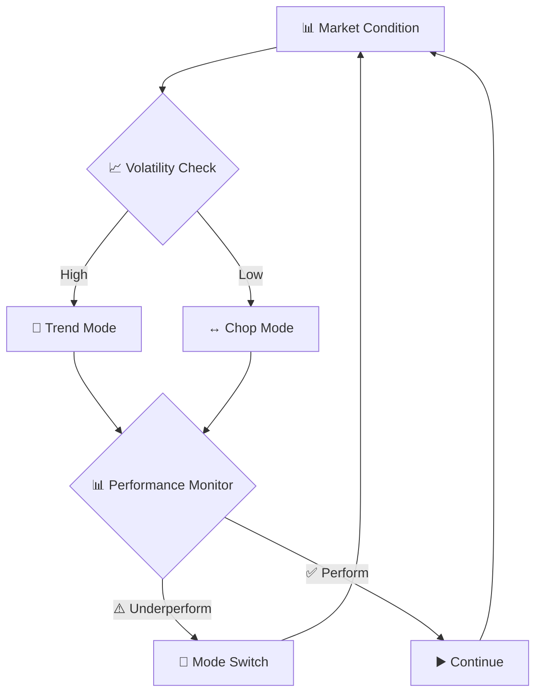
```mermaid
graph TD
    A[📊 Market Condition] --> B{📈 Volatility Check}
    B -->|High| C[🚀 Trend Mode]
    B -->|Low| D[↔️ Chop Mode]
    C --> E{📊 Performance Monitor}
    D --> E
    E -->|⚠️ Underperform| F[🔄 Mode Switch]
    E -->|✅ Perform| G[▶️ Continue]
    F --> A
    G --> A
```

### Position Management Workflow
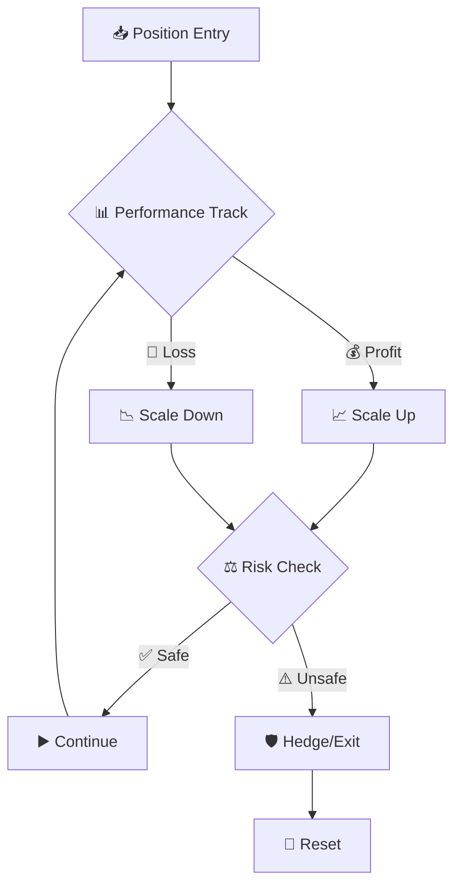
```mermaid
graph TD
    A[📥 Position Entry] --> B{📊 Performance Track}
    B -->|💰 Profit| C[📈 Scale Up]
    B -->|🔻 Loss| D[📉 Scale Down]
    C --> E{⚖️ Risk Check}
    D --> E
    E -->|✅ Safe| F[▶️ Continue]
    E -->|⚠️ Unsafe| G[🛡️ Hedge/Exit]
    F --> B
    G --> H[🔄 Reset]
```

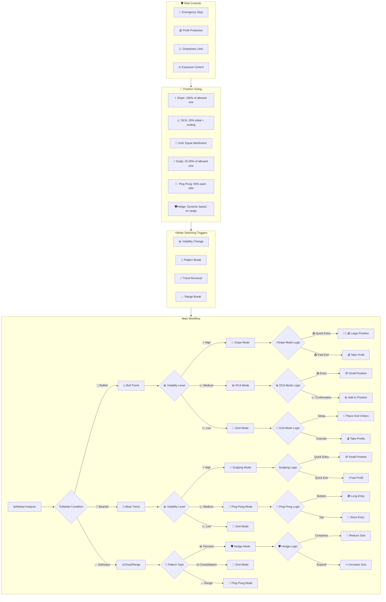
```mermaid
graph TD
    %% Define the four main sections and force vertical alignment

    %% Risk Controls Box (Top)
    subgraph RC["🛡️ Risk Controls"]
        TT[🛑 Emergency Stop]
        UU[💰 Profit Protection]
        VV[📉 Drawdown Limit]
        WW[⚖️ Exposure Control]
    end

    %% Position Sizing Box (Second)
    subgraph PS["💼 Position Sizing"]
        NN[⚡ Snipe: 100% of allowed size]
        OO[📈 DCA: 20% initial + scaling]
        PP[🔲 Grid: Equal distribution]
        QQ[⚡ Scalp: 25-50% of allowed size]
        RR[🏓  Ping Pong: 50% each side]
        SS[🛡️Hedge: Dynamic based on range]
    end

    %% Mode Switching Triggers (Third)
    subgraph MST["⚡Mode Switching Triggers"]
        JJ[📊 Volatility Change]
        KK[🎯 Pattern Break]
        LL[🔄 Trend Reversal]
        MM[↔️ Range Break]
    end

    %% Main Workflow (Bottom)
    subgraph MW["Main Workflow"]
        A[📊Market Analysis] --> B{🔍Market Condition}
        
        %% Market Conditions Branch
        B -->|🐂 Bullish| C[📈Bull Trend]
        B -->|🐻 Bearish| D[📉Bear Trend]
        B -->|↔️ Sideways| E[⚖️Chop/Range]
        


        %% Bull Trend Path
        C --> F{📊 Volatility Level}
        F -->|⚡ High| G[🎯 Snipe Mode]
        F -->|📈 Medium| H[📊 DCA Mode]
        F -->|📉 Low| I[🔲 Grid Mode]
        
        %% Bear Trend Path
        D --> J{📊 Volatility Level}
        J -->|⚡ High| K[⚡ Scalping Mode]
        J -->|📈 Medium| L[🏓 Ping Pong Mode]
        J -->|📉 Low| M[🔲 Grid Mode]
        

        %% Chop/Range Path
        E --> N{🎯 Pattern Type}
        N -->|📊 Pennant| O[🛡️ Hedge Mode]
        N -->|⚖️ Consolidation| P[🔲 Grid Mode]
        N -->|↔️  Range| Q[🏓 Ping Pong Mode]
        

        %% Mode Specific Behaviors
        G --> R{⚡Snipe Mode Logic}
        R -->|📥 Quick Entry| S[💸🤑💰 Large Position]
        R -->|📤 Fast Exit| T[💰 Take Profit]
        
        H --> U{📊 DCA Mode Logic}
        U -->|📥 Entry| V[🪙  Small Position]
        U -->|📈 Continuation| W[📊 Add to Position]
        
        I --> X{🔲 Grid Mode Logic}

        X -->|Setup| Y[🔲 Place Grid Orders]
        X -->|Execute| Z[💰 Take Profits]
        

        K --> AA{Scalping Logic}
        AA -->|Quick Entry| BB[🪙 Small Position]
        AA -->|Quick Exit| CC[⚡️Fast Profit]
        
        L --> DD{🏓 Ping Pong Logic}
        DD -->|Bottom| EE[🟢 Long Entry]
        DD -->|Top| FF[🔴 Short Entry]
        

        O --> GG{🛡️ Hedge Logic}
        GG -->|Compress| HH[-🪫Reduce Size]
        GG -->|Expand| II[+🔋Increase Size]
    end

    %% Force vertical stacking using directional arrows
    RC --> PS
    PS --> MST
    MST --> MW
```

### Mode Switching Rules Matrix

| Current Mode | Condition | Switch To | Trigger |
|-------------|-----------|-----------|----------|
| Any | Strong Trend + High Vol | Snipe | Momentum > 80% |
| Any | Strong Trend + Med Vol | DCA | Trend Conf > 70% |
| Any | Range + Low Vol | Grid | Range Width > 5% |
| Grid | Vol Increase | Ping Pong | Vol > 2x Avg |
| Ping Pong | Range Break | Scalping | Break > 3% |
| Scalping | Vol Drop | Grid | Vol < 0.5x Avg |
| DCA | Trend Weak | Hedge | Conf < 50% |
| Hedge | Range Compress | Exit/Switch | Width < 1% |

### Mode-Specific Parameters

1. Snipe Mode
   - Entry: Immediate on signal
   - Position Size: 100% of allowed size
   - Exit: Quick take profit or stop
   - Timeframe: 1m primarily

2. DCA Mode
   - Entry: Gradual building
   - Initial Size: 20% of total target
   - Scaling: +20% per confirmation
   - Timeframe: 5m, 15m

3. Grid Mode
   - Entry: Multiple levels
   - Grid Spacing: ATR-based
   - Size per Grid: Equal distribution
   - Timeframe: 15m, 1h

4. Ping Pong Mode
   - Entry: Range bounds
   - Size: 50% each direction
   - Profit: Per swing
   - Timeframe: 5m

5. Scalping Mode
   - Entry: Quick momentum
   - Size: 25-50% of allowed
   - Exit: Fast profit taking
   - Timeframe: 1m

6. Hedge Mode
   - Entry: Range confirmation
   - Size: Dynamic based on range
   - Adjustment: With range changes
   - Timeframe: Multi-TF

### Mode Transition Logic
```python
def determine_trading_mode(market_data, current_mode):
    # Market Condition Assessment
    trend = analyze_trend_strength(market_data)
    volatility = calculate_volatility(market_data)
    pattern = detect_pattern(market_data)
    
    # Primary Mode Selection
    if trend.strength > 0.8 and volatility > 2.0:
        return 'SNIPE'
    elif trend.strength > 0.6:
        return 'DCA'
    elif is_range_bound(market_data):
        if pattern == 'PENNANT':
            return 'HEDGE'
        elif volatility < 0.5:
            return 'GRID'
        else:
            return 'PING_PONG'
    elif volatility > 1.5 and trend.strength < 0.4:
        return 'SCALPING'
    
    # Maintain current mode if no clear switch needed
    return current_mode
```

### Order Types by Mode

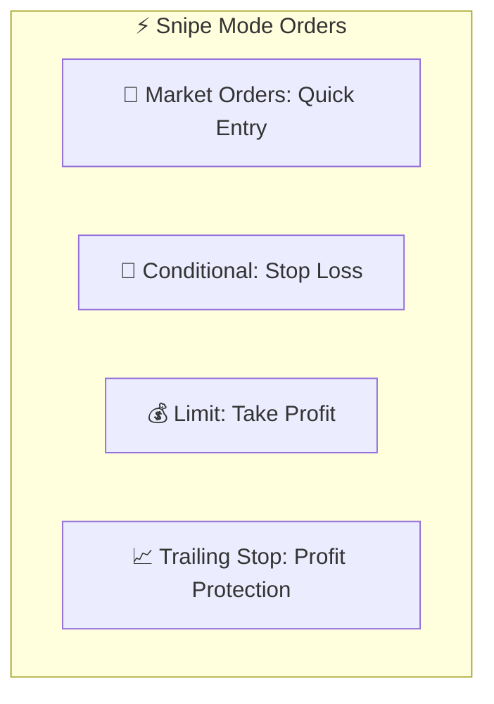
```mermaid
graph TD
    subgraph "⚡ Snipe Mode Orders"
        SN1[🚀 Market Orders: Quick Entry]
        SN2[🛑 Conditional: Stop Loss]
        SN3[💰 Limit: Take Profit]
        SN4[📈 Trailing Stop: Profit Protection]
    end
```    
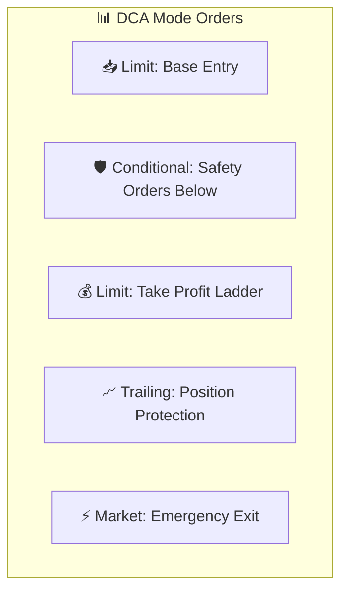
```mermaid
graph TD
    subgraph "📊 DCA Mode Orders"
        DC1[📥 Limit: Base Entry]
        DC2[🛡️ Conditional: Safety Orders Below]
        DC3[💰 Limit: Take Profit Ladder]
        DC4[📈 Trailing: Position Protection]
        DC5[⚡ Market: Emergency Exit]
    end
```    
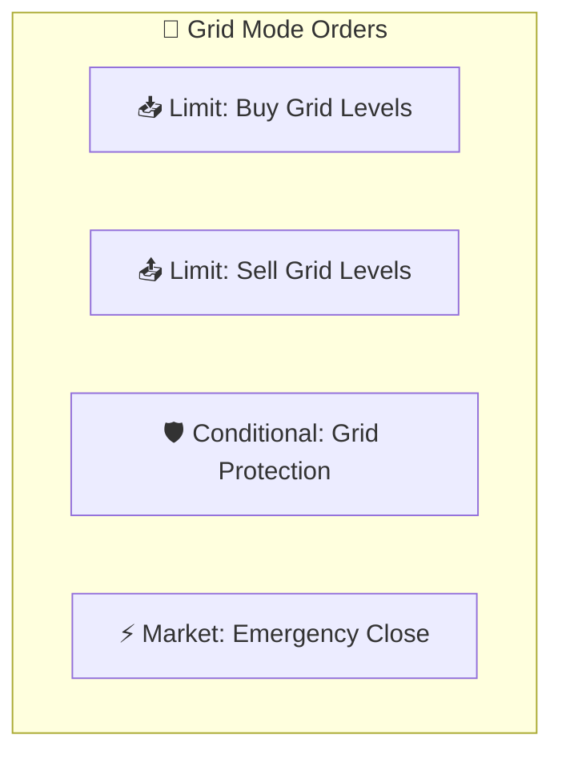
```mermaid
graph TD
    subgraph "🔲 Grid Mode Orders"
        GR1[📥 Limit: Buy Grid Levels]
        GR2[📤 Limit: Sell Grid Levels]
        GR3[🛡️ Conditional: Grid Protection]
        GR4[⚡ Market: Emergency Close]
    end
```    
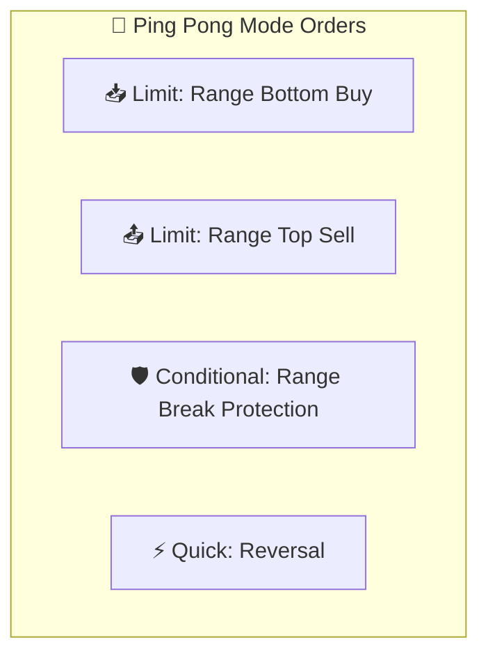
```mermaid
graph TD
    subgraph "🏓 Ping Pong Mode Orders"
        PP1[📥 Limit: Range Bottom Buy]
        PP2[📤 Limit: Range Top Sell]
        PP3[🛡️ Conditional: Range Break Protection]
        PP4[⚡ Quick: Reversal]
    end
```    
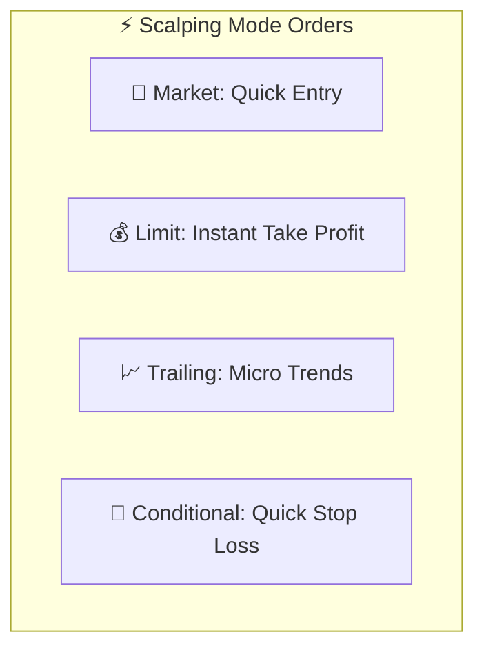
```mermaid
graph TD
    subgraph "⚡ Scalping Mode Orders"
        SC1[🚀 Market: Quick Entry]
        SC2[💰 Limit: Instant Take Profit]
        SC3[📈 Trailing: Micro Trends]
        SC4[🛑 Conditional: Quick Stop Loss]
    end
```    
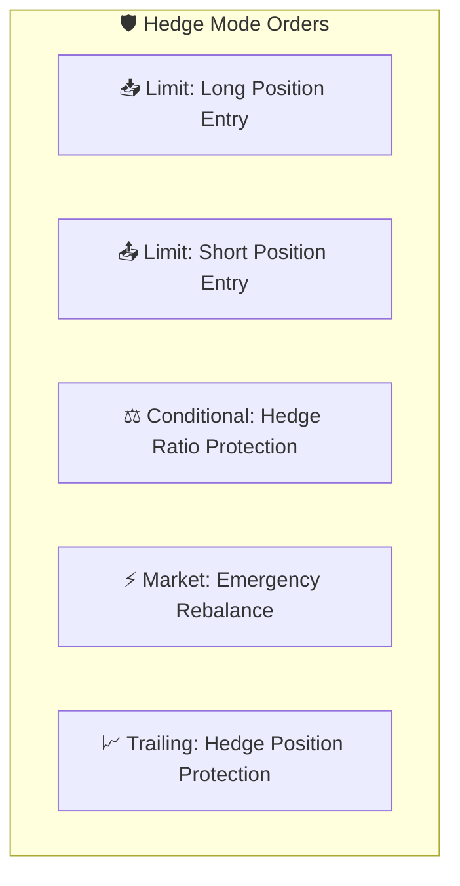
```mermaid
graph TD
    subgraph "🛡️ Hedge Mode Orders"
        HG1[📥 Limit: Long Position Entry]
        HG2[📤 Limit: Short Position Entry]
        HG3[⚖️ Conditional: Hedge Ratio Protection]
        HG4[⚡ Market: Emergency Rebalance]
        HG5[📈 Trailing: Hedge Position Protection]
    end
```

### Profit Protection Mechanisms

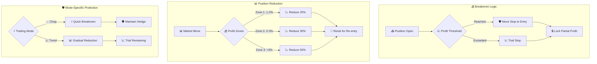
```mermaid
graph TD
    subgraph "💰 Breakeven Logic"
        BE1[📥 Position Open] --> BE2{💹 Profit Threshold}
        BE2 -->|Reached| BE3[🛡️ Move Stop to Entry]
        BE2 -->|Exceeded| BE4[📈 Trail Stop]
        BE3 --> BE5[🔒 Lock Partial Profit]
        BE4 --> BE5
    end

    subgraph "📊 Position Reduction"
        PR1[📊 Market Move] --> PR2{💰 Profit Zones}
        PR2 -->|Zone 1: 1-2%| PR3[📉 Reduce 20%]
        PR2 -->|Zone 2: 2-3%| PR4[📉 Reduce 30%]
        PR2 -->|Zone 3: >3%| PR5[📉 Reduce 50%]
        PR3 --> PR6[🔄 Reset for Re-entry]
        PR4 --> PR6
        PR5 --> PR6
    end

    subgraph "🛡️ Mode-Specific Protection"
        MS1{⚡ Trading Mode}
        MS1 -->|↔️ Chop| MS2[⚡ Quick Breakeven]
        MS1 -->|📈 Trend| MS3[📊 Gradual Reduction]
        MS2 --> MS4[🛡️ Maintain Hedge]
        MS3 --> MS5[📈 Trail Remaining]
    end
```

### Protection Workflow Integration
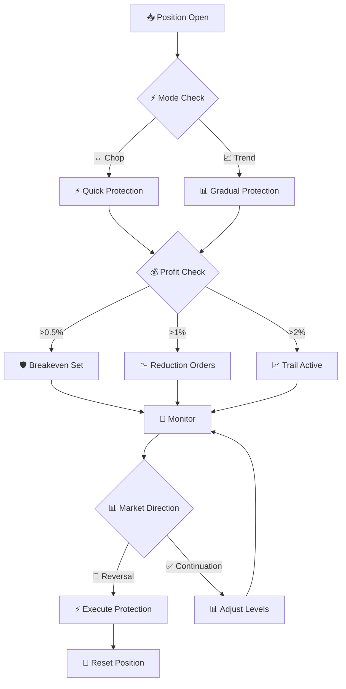
```mermaid
graph TD
    A[📥 Position Open] --> B{⚡ Mode Check}
    B -->|↔️ Chop| C[⚡ Quick Protection]
    B -->|📈 Trend| D[📊 Gradual Protection]
    
    C --> E{💰 Profit Check}
    D --> E
    
    E -->|>0.5%| F[🛡️ Breakeven Set]
    E -->|>1%| G[📉 Reduction Orders]
    E -->|>2%| H[📈 Trail Active]
    
    F --> I[👀 Monitor]
    G --> I
    H --> I
    
    I --> J{📊 Market Direction}
    J -->|🔄 Reversal| K[⚡ Execute Protection]
    J -->|✅ Continuation| L[📊 Adjust Levels]
    
    K --> M[🔄 Reset Position]
    L --> I
```

### Protection Parameters Matrix

| Mode | Breakeven Level | Initial Reduction | Trail Start | Reset Logic |
|------|----------------|-------------------|-------------|-------------|
| ↔️ Chop | 0.3-0.5% | 20% at 1% | 0.8% | ⚡ Quick Re-entry |
| 📈 Trend | 0.8-1.0% | 20% at 2% | 1.5% | 📊 Gradual Scale |
| 💥 Breakout | 0.5-0.7% | 30% at 1.5% | 1.2% | 🎯 Wait Pattern |
| ⚡ Scalp | 0.2-0.3% | 50% at 0.5% | 0.4% | 🚀 Fast Flip |
| 🛡️ Hedge | 0.4-0.6% | 25% at 1.2% | 1.0% | ⚖️ Balance Ratio |

### Alignment Process Workflow
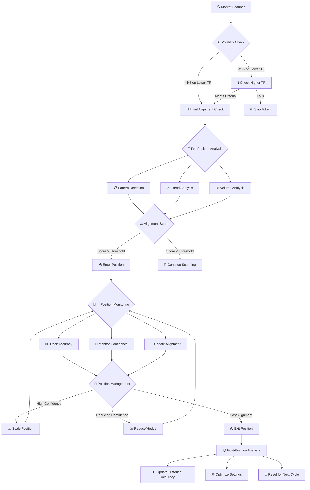
```mermaid
graph TD
    A[🔍 Market Scanner] --> B{📊 Volatility Check}
    B -->|>1% on Lower TF| C[🎯 Initial Alignment Check]
    B -->|<1% on Lower TF| D[⏫ Check Higher TF]
    D -->|Meets Criteria| C
    D -->|Fails| E[⏭️ Skip Token]
    
    C --> F{🔄 Pre-Position Analysis}
    F --> G[📋 Pattern Detection]
    F --> H[📈 Trend Analysis]
    F --> I[📊 Volume Analysis]
    
    G --> J{⚖️ Alignment Score}
    H --> J
    I --> J
    
    J -->|Score > Threshold| K[📥 Enter Position]
    J -->|Score < Threshold| L[🔄 Continue Scanning]
    
    K --> M{👀 In-Position Monitoring}
    M --> N[📊 Track Accuracy]
    M --> O[🎯 Monitor Confidence]
    M --> P[🔄 Update Alignment]
    
    N --> Q{💼 Position Management}
    O --> Q
    P --> Q
    
    Q -->|High Confidence| R[📈 Scale Position]
    Q -->|Reducing Confidence| S[📉 Reduce/Hedge]
    Q -->|Lost Alignment| T[📤 Exit Position]
    
    R --> M
    S --> M
    T --> U[📋 Post-Position Analysis]
    
    U --> V[📊 Update Historical Accuracy]
    U --> W[⚙️ Optimize Settings]
    U --> X[🔄 Reset for Next Cycle]
```

### Alignment Process Details

1. Pre-Position Phase
   - Market scanning for volatility > 1% on lower timeframes
   - Multi-timeframe analysis if lower timeframe volatility insufficient
   - Pattern recognition and trend confirmation
   - Initial alignment score calculation

2. Position Entry Phase
   - Confidence threshold validation
   - Market structure confirmation
   - Entry timing optimization
   - Initial position sizing

3. In-Position Monitoring
   - Real-time accuracy tracking
   - Confidence level updates
   - Dynamic alignment score adjustments
   - Position size management

4. Position Management
   - Scale up in high confidence scenarios
   - Reduce exposure when confidence decreases
   - Implement hedging based on market conditions
   - Exit when alignment is lost

5. Post-Position Analysis
   - Performance evaluation
   - Settings optimization
   - Historical accuracy updates
   - Preparation for next cycle

### Alignment Score Components
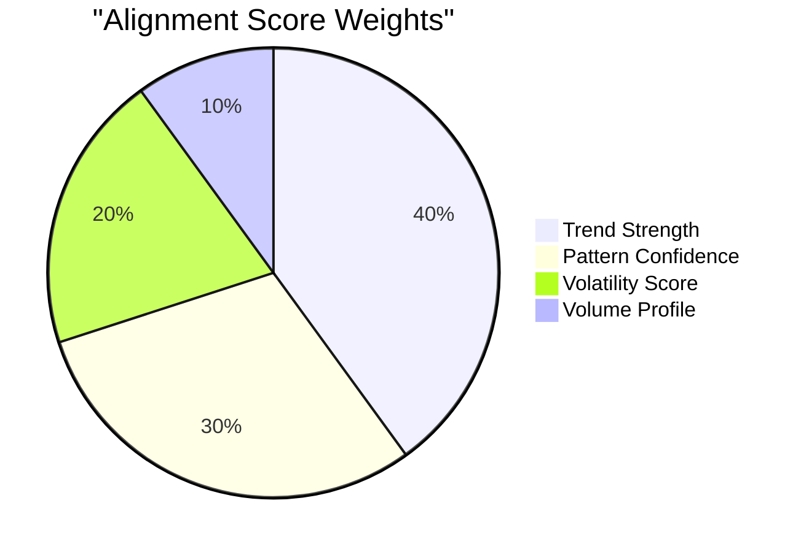
```mermaid
pie
    title "Alignment Score Weights"
    "Trend Strength" : 40
    "Pattern Confidence" : 30
    "Volatility Score" : 20
    "Volume Profile" : 10
```

### Time-Based Constraints
- Maximum alignment process time: 15 minutes
- Regular realignment checks: Every 5 minutes
- Emergency alignment checks: Every 1 minute on significant moves

### Confidence Thresholds
- Entry threshold: 0.7 (70% confidence)
- Maintenance threshold: 0.6 (60% confidence)
- Exit threshold: 0.5 (50% confidence)

### Symbol Selection Matrix
| Condition | Weight | Threshold |
|-----------|---------|-----------|
| Volatility | 40% | >1% per minute |
| Trend Strength | 30% | >0.7 score |
| Volume Profile | 20% | >2x average |
| Pattern Quality | 10% | >0.8 confidence |

### Alignment Code Example
```python
def check_symbol_alignment(symbol_data, timeframes):
    alignment_score = 0
    
    # Check each timeframe
    for tf in timeframes:
        # Get volatility score
        vol_score = calculate_volatility_score(symbol_data, tf)
        
        # Get trend strength
        trend_score = calculate_trend_strength(symbol_data, tf)
        
        # Get pattern confidence
        pattern_score = detect_patterns(symbol_data, tf)
        
        # Calculate timeframe score
        tf_score = (
            vol_score * 0.4 +
            trend_score * 0.3 +
            pattern_score * 0.3
        )
        
        # Weight higher timeframes more
        tf_weight = get_timeframe_weight(tf)
        alignment_score += tf_score * tf_weight
    
    return alignment_score > ALIGNMENT_THRESHOLD
```

## Additional Considerations

### Performance Optimization
- Efficient data structures
- Caching strategies
- Parallel processing
- Memory management

### Error Handling
- Connection issues
- Order failures
- Data inconsistencies
- System errors

### Monitoring
- System health
- Performance metrics
- Risk exposure
- Market conditions

### Documentation
- Setup guide
- Configuration
- Troubleshooting
- API reference


