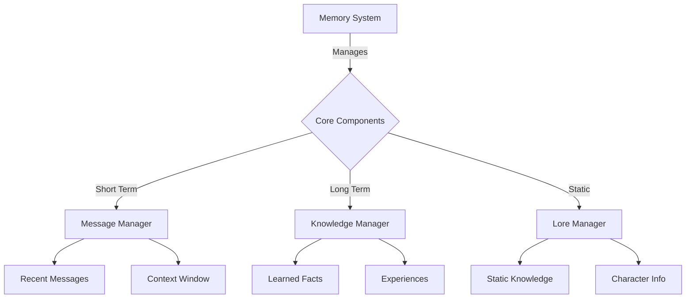

# 🧠 Eliza Memory Retrieval Guide

## 📚 Table of Contents
1. [Overview](#overview)
2. [Memory System Architecture](#architecture)
3. [Memory Types](#types)
4. [Memory Management](#management)
5. [Retrieval Systems](#retrieval)
6. [Integration & Usage](#integration)
7. [Best Practices](#best-practices)
8. [Examples](#examples)

## 🌟 Overview

Eliza's Memory System is a sophisticated framework that enables agents to maintain and retrieve different types of information across interactions. The system combines multiple specialized memory managers, each handling specific types of data, with advanced retrieval mechanisms including embedding-based semantic search.

### 🎯 Key Features
- Multiple memory types (short-term, long-term, knowledge base)
- Semantic search with embeddings
- Context-aware retrieval
- Efficient storage and indexing
- Cross-session persistence
- Memory deduplication
- Customizable retention policies

## 🏗️ Memory System Architecture



### 📂 Memory Structure
```typescript
interface Memory {
  id: UUID;
  content: {
    text: string;
    metadata?: any;
  };
  embedding?: number[];
  timestamp: Date;
  roomId: UUID;
  agentId: UUID;
}

interface MemoryManager {
  runtime: IAgentRuntime;
  tableName: string;
  
  createMemory(memory: Memory, unique?: boolean): Promise<void>;
  getMemories(opts: MemoryOptions): Promise<Memory[]>;
  searchMemoriesByEmbedding(embedding: number[], opts: SearchOptions): Promise<Memory[]>;
  removeMemory(memoryId: UUID): Promise<void>;
}
```

## 🧩 Memory Types

### 1. Message Memory
```typescript
// Stores recent conversation history
const messageManager = runtime.messageManager;

// Create a new message memory
await messageManager.createMemory({
  id: generateUUID(),
  content: {
    text: "User's message content",
    metadata: {
      type: "user_message",
      sentiment: "positive"
    }
  },
  timestamp: new Date(),
  roomId: conversationId,
  agentId: agentId
});
```

### 2. Knowledge Memory
```typescript
// Stores learned facts and experiences
const knowledgeManager = runtime.knowledgeManager;

// Store a learned fact
await knowledgeManager.createMemory({
  id: generateUUID(),
  content: {
    text: "User prefers technical explanations",
    metadata: {
      type: "learned_preference",
      confidence: 0.85
    }
  },
  timestamp: new Date(),
  roomId: userId,
  agentId: agentId
});
```

### 3. Lore Memory
```typescript
// Stores static character knowledge
const loreManager = runtime.loreManager;

// Add character background information
await loreManager.createMemory({
  id: generateUUID(),
  content: {
    text: "Character backstory and permanent traits",
    metadata: {
      type: "character_lore",
      category: "background"
    }
  },
  timestamp: new Date(),
  roomId: "global",
  agentId: agentId
});
```

## 🔄 Memory Management

### Memory Creation
```typescript
class MemoryManager implements IMemoryManager {
  async createMemory(memory: Memory, unique = false): Promise<void> {
    // Add embedding if not present
    if (!memory.embedding) {
      memory.embedding = await this.addEmbeddingToMemory(memory);
    }
    
    // Store in database with optional deduplication
    await this.runtime.databaseAdapter.createMemory(
      memory,
      this.tableName,
      unique
    );
  }
}
```

### Memory Retrieval
```typescript
class MemoryManager implements IMemoryManager {
  // Get memories by room ID
  async getMemories({
    roomId,
    count = 10,
    unique = true,
    start,
    end
  }: MemoryOptions): Promise<Memory[]> {
    return await this.runtime.databaseAdapter.getMemories({
      roomId,
      count,
      unique,
      tableName: this.tableName,
      agentId: this.runtime.agentId,
      start,
      end
    });
  }
  
  // Semantic search using embeddings
  async searchMemoriesByEmbedding(
    embedding: number[],
    opts: {
      match_threshold?: number;
      count?: number;
      roomId: UUID;
      unique?: boolean;
    }
  ): Promise<Memory[]> {
    return this.runtime.databaseAdapter.searchMemories({
      embedding,
      ...opts,
      tableName: this.tableName
    });
  }
}
```

## 🔍 Retrieval Systems

### 1. Direct Retrieval
```typescript
// Get recent messages
const recentMessages = await messageManager.getMemories({
  roomId: conversationId,
  count: 10,
  unique: true
});

// Get specific memory by ID
const specificMemory = await messageManager.getMemoryById(memoryId);
```

### 2. Semantic Search
```typescript
// Generate embedding for query
const queryEmbedding = await embed(runtime, queryText);

// Search memories by similarity
const similarMemories = await knowledgeManager.searchMemoriesByEmbedding(
  queryEmbedding,
  {
    match_threshold: 0.8,
    count: 5,
    roomId: userId
  }
);
```

### 3. Context Window Management
```typescript
class ContextManager {
  async getRelevantContext(query: string): Promise<Memory[]> {
    const queryEmbedding = await embed(this.runtime, query);
    
    // Combine recent and relevant memories
    const recentMessages = await this.messageManager.getMemories({
      roomId: this.currentRoom,
      count: 5
    });
    
    const relevantKnowledge = await this.knowledgeManager.searchMemoriesByEmbedding(
      queryEmbedding,
      {
        match_threshold: 0.7,
        count: 3,
        roomId: this.currentRoom
      }
    );
    
    return [...recentMessages, ...relevantKnowledge];
  }
}
```

## 🔌 Integration & Usage

### 1. Setting Up Memory Managers
```typescript
const runtime = new AgentRuntime({
  messageManager: new MemoryManager({
    tableName: "messages",
    runtime: this
  }),
  knowledgeManager: new MemoryManager({
    tableName: "knowledge",
    runtime: this
  }),
  loreManager: new MemoryManager({
    tableName: "lore",
    runtime: this
  })
});
```

### 2. Memory Integration in Agent Logic
```typescript
class Agent {
  async processMessage(message: string): Promise<void> {
    // Store incoming message
    await this.messageManager.createMemory({
      content: { text: message },
      roomId: this.currentRoom
    });
    
    // Get relevant context
    const context = await this.contextManager.getRelevantContext(message);
    
    // Generate response using context
    const response = await this.generateResponse(message, context);
    
    // Store response in memory
    await this.messageManager.createMemory({
      content: { text: response },
      roomId: this.currentRoom
    });
  }
}
```

## 📚 Best Practices

### 1. Memory Management
- Use appropriate memory types for different data
- Implement memory cleanup strategies
- Monitor memory usage and performance
- Handle memory conflicts and duplicates
- Validate memory content
- Implement error handling
- Use proper indexing

### 2. Retrieval Optimization
- Cache frequently accessed memories
- Use appropriate search thresholds
- Implement pagination for large results
- Balance recency vs relevance
- Monitor retrieval performance
- Implement fallback strategies
- Use efficient search patterns

### 3. Integration Guidelines
- Initialize memory managers early
- Handle memory persistence properly
- Implement proper error handling
- Monitor memory system health
- Maintain consistent memory structure
- Document memory patterns
- Test memory integrity

## 💡 Examples

### 1. Creating a Learning Agent
```typescript
class LearningAgent {
  constructor(runtime: IAgentRuntime) {
    this.messageManager = runtime.messageManager;
    this.knowledgeManager = runtime.knowledgeManager;
  }
  
  async learnFromInteraction(message: string): Promise<void> {
    // Extract learnable information
    const facts = await this.extractFacts(message);
    
    // Store learned facts
    for (const fact of facts) {
      await this.knowledgeManager.createMemory({
        content: {
          text: fact,
          metadata: {
            type: "learned_fact",
            confidence: fact.confidence
          }
        },
        roomId: this.currentRoom
      });
    }
  }
  
  async generateResponse(query: string): Promise<string> {
    // Get relevant memories
    const context = await this.contextManager.getRelevantContext(query);
    
    // Generate response using context
    return this.llm.generate(query, context);
  }
}
```

### 2. Implementing Memory-Based Personality
```typescript
class PersonalityAgent {
  async updatePersonality(interaction: string): Promise<void> {
    // Analyze interaction
    const traits = await this.analyzePersonalityTraits(interaction);
    
    // Update personality memory
    await this.knowledgeManager.createMemory({
      content: {
        text: JSON.stringify(traits),
        metadata: {
          type: "personality_update",
          timestamp: new Date()
        }
      },
      roomId: "personality"
    });
  }
  
  async getPersonalityContext(): Promise<Memory[]> {
    // Retrieve personality-related memories
    return this.knowledgeManager.getMemories({
      roomId: "personality",
      count: 10,
      unique: true
    });
  }
}
```

---

*This documentation is continuously updated as the Memory System evolves.* 