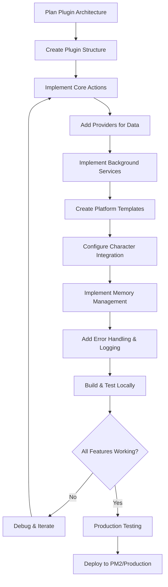
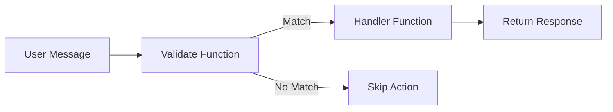

# 🔌 Eliza OS Plugin Development Guide - Complete Reference

## 📚 Table of Contents
1. [Introduction](#introduction)
2. [Plugin Architecture Deep Dive](#plugin-architecture-deep-dive)
3. [Creating a Production-Ready Plugin](#creating-a-production-ready-plugin)
4. [Advanced Plugin Components](#advanced-plugin-components)
5. [Platform Integration & Templates](#platform-integration--templates)
6. [Character Configuration Integration](#character-configuration-integration)
7. [Memory Management & State](#memory-management--state)
8. [Scheduled Services & Background Tasks](#scheduled-services--background-tasks)
9. [Testing & Debugging Strategies](#testing--debugging-strategies)
10. [Production Deployment](#production-deployment)
11. [Real-World Example: Complete Gold Market Plugin](#real-world-example-complete-gold-market-plugin)

## 🌟 Introduction

Eliza OS plugins are powerful extensions that can add complex functionality including real-time data processing, automated posting, surge detection, and cross-platform integrations. This comprehensive guide covers everything from basic plugin structure to advanced production-ready features.

### 🎯 Advanced Plugin Development Workflow



## 📂 Plugin Structure

A typical Eliza plugin has this structure:

```
plugin-name/
├── src/
│   ├── index.ts           # Plugin entry point
│   ├── actions/           # Actions directory
│   │   └── myAction.ts    # Action implementation
│   ├── services/          # Optional services
│   └── providers/         # Optional providers
├── package.json
├── tsconfig.json
└── README.md
```

## 🛠️ Creating a Plugin

### 🚀 Setup with CLI

The easiest way to create a new plugin is to use the Eliza OS CLI:

```bash
# Install the CLI if you haven't already
npm install -g @elizaos/cli@beta

# Create a new plugin project
npx @elizaos/cli@beta create
# Select "Plugin" when prompted for project type
```

### 🧩 Manual Setup

If you prefer to set up manually:

1. Create a new repository using the [Eliza Plugin Template](https://github.com/elizaOS/eliza-plugin-starter)
2. Clone the repository:
   ```bash
   git clone https://github.com/yourusername/your-plugin.git
   cd your-plugin
   ```
3. Install dependencies:
   ```bash
   pnpm install
   ```

### 📄 Plugin Entry Point

Your `src/index.ts` should export a Plugin object:

```typescript
import { Plugin } from '@elizaos/core';
import { myAction } from './actions/myAction';

const myPlugin: Plugin = {
  name: 'plugin-name',
  description: 'Description of your plugin',
  actions: [myAction],
  // Optional: services, providers, etc.
};

export default myPlugin;
```

## ⚙️ Plugin Components

### ⚡ Actions

Actions are the core building blocks of plugins. They respond to user messages and perform specific tasks:



```typescript
import { Action } from '@elizaos/core';

export const myAction: Action = {
  name: 'MY_ACTION',
  description: 'What this action does',
  similes: ['keywords', 'that', 'trigger', 'this', 'action'],
  validate: async (runtime, message) => {
    // Return true if this action should handle the message
    return /pattern/.test(message.content.text);
  },
  handler: async (runtime, message) => {
    try {
      // Action implementation
      const result = await performTask();
      
      return {
        success: true,
        response: `Response to the user: ${result}`,
      };
    } catch (error) {
      return {
        success: false,
        response: 'Error message to the user',
      };
    }
  },
};
```

#### 🔑 Action Properties

| Property | Type | Description |
|----------|------|-------------|
| `name` | string | Unique identifier for the action |
| `description` | string | Description of what the action does |
| `similes` | string[] | Keywords or phrases that might trigger this action |
| `validate` | function | Function to determine if this action should handle a message |
| `handler` | function | Main function to execute the action and return a response |

### 🧰 Services

Services provide reusable functionality that can be shared across actions:

```typescript
import { Service } from '@elizaos/core';

export const myService: Service = {
  name: 'MY_SERVICE',
  description: 'Service description',
  initialize: async (runtime) => {
    // Setup code - runs when the service is first loaded
    console.log('Initializing service');
  },
  methods: {
    performTask: async (params) => {
      // Implementation
      return result;
    },
    getResource: async (id) => {
      // Get a resource by ID
      return resource;
    }
  },
  cleanup: async () => {
    // Cleanup resources when the service is unloaded
    console.log('Cleaning up service');
  }
};
```

### 🔌 Providers

Providers supply context and data to the agent:

```typescript
import { Provider } from '@elizaos/core';

export const myProvider: Provider = {
  name: 'MY_PROVIDER',
  description: 'Provider description',
  initialize: async (runtime) => {
    // Setup code
  },
  provide: async (runtime, context) => {
    // Return data to be included in the agent's context
    return {
      key: 'value',
      // ...more data
    };
  },
  cleanup: async () => {
    // Cleanup resources
  }
};
```

## 🔄 Integration with Eliza

### 📝 Adding to a Character

In your character's configuration file (e.g., `character.json`), add the plugin:

```json
{
  "name": "CharacterName",
  "plugins": ["@elizaos-plugins/plugin-name"],
  "settings": {
    "secrets": {
      "API_KEY": "your-api-key-here"
    }
  }
}
```

### 🔒 Accessing Settings and Secrets

In your plugin:

```typescript
// Get a setting
const apiKey = runtime.getSetting('API_KEY');

// Get a configuration value
const configValue = runtime.getConfig('configKey');
```

### 📦 Publishing Your Plugin

Once your plugin is ready, you can publish it to the Eliza OS plugin registry:

```bash
# Navigate to your plugin directory
cd my-plugin

# Build the plugin
pnpm build

# Publish the plugin
elizaos plugin publish
```

## 🧪 Testing and Debugging

### 🔍 Local Testing

1. Build your plugin:
   ```bash
   pnpm build
   ```
   
2. Test locally with the 'direct' client:
   ```bash
   pnpm mock-eliza --characters=./path/to/character.json
   ```

### 📊 Debugging

When debugging your plugin, add logging statements:

```typescript
handler: async (runtime, message) => {
  try {
    console.log('Handling message:', message.content.text);
    const result = await performTask();
    console.log('Task result:', result);
    
    return {
      success: true,
      response: `Response to the user: ${result}`,
    };
  } catch (error) {
    console.error('Error in handler:', error);
    return {
      success: false,
      response: 'Error message to the user',
    };
  }
}
```

## 📋 Best Practices

1. **🔒 Error Handling**: Implement robust error handling in all actions
2. **🔑 API Key Security**: Use `runtime.getSetting()` to access secrets
3. **🧹 Resource Management**: Clean up resources in service cleanup methods
4. **📖 Documentation**: Document your plugin's functionality and dependencies
5. **🔢 Version Control**: Follow semantic versioning for your plugin
6. **🧪 Testing**: Test thoroughly before publishing

### 🚫 Common Pitfalls

- Not properly validating user input
- Hardcoding API keys instead of using settings
- Missing error handling for network requests
- Not handling rate limits for external APIs
- Forgetting to clean up resources in the cleanup method

## 🌟 Real-World Example: Complete Gold Market Plugin

### 📁 Complete Plugin Implementation

Based on our production experience, here's the complete gold market automation plugin:

```typescript
// src/index.ts - Main Plugin Entry Point
import { Plugin } from '@elizaos/core';
import { triggerGoldUpdate } from './actions/triggerGoldUpdate';
import { goldMarketMonitor } from './actions/goldMarketMonitor';
import { scheduledGoldUpdates } from './services/scheduledGoldUpdates';
import { goldPriceProvider } from './providers/goldPriceProvider';

const goldPlugin: Plugin = {
  name: 'plugin-goldapi',
  description: 'Complete gold market automation with real-time monitoring, surge detection, and automated posting across Twitter and Telegram platforms',
  actions: [
    triggerGoldUpdate,
    goldMarketMonitor,
  ],
  services: [
    scheduledGoldUpdates,
  ],
  providers: [
    goldPriceProvider,
  ],
  version: '1.0.0',
  author: 'Ubuntu Tribe',
  tags: ['market', 'automation', 'gold', 'rwa', 'twitter', 'telegram'],
};

export default goldPlugin;
```

```typescript
// src/actions/goldMarketMonitor.ts - Market Monitoring Action
import { Action, IAgentRuntime, Memory, HandlerCallback } from '@elizaos/core';
import { stringToUuid } from '@elizaos/core';

export const goldMarketMonitor: Action = {
  name: 'GOLD_MARKET_MONITOR',
  description: 'Monitors gold market for significant movements and provides status updates',
  similes: [
    'gold system status',
    'check gold automation',
    'gold monitoring status',
    'market monitor status',
    'gold price system'
  ],
  validate: async (runtime: IAgentRuntime, message: Memory): Promise<boolean> => {
    const content = message.content.text.toLowerCase();
    return /gold.*(status|system|monitor|automation|check)/i.test(content) ||
           /check.*gold.*(automation|system)/i.test(content);
  },
  handler: async (runtime: IAgentRuntime, message: Memory, state?: any, callback?: HandlerCallback): Promise<boolean> => {
    try {
      // Get current system status
      const config = runtime.character.settings?.automated_posting?.gold_price_monitoring;
      const goldProvider = runtime.providers.find(p => p.name === 'goldPriceProvider');
      const currentData = await goldProvider?.provide(runtime, message);

      if (!currentData) {
        throw new Error('Unable to fetch current gold data');
      }

      // Generate status report
      const statusReport = `Gold Automation Status ✅

🔄 Scheduled Updates: ${config?.enabled ? 'Active' : 'Inactive'} (every 6 hours)
🚨 Surge Monitoring: ${config?.enabled ? 'Active' : 'Inactive'} (checking every ${config?.check_interval_minutes || 30} minutes)
📊 Last Price: $${currentData.price}/oz (${currentData.changePercent > 0 ? '+' : ''}${currentData.changePercent}%)
🎯 Surge Threshold: ${config?.surge_threshold_percentage || 5}%
📱 Platforms: ${runtime.character.clients?.join(', ') || 'N/A'}

The system is operating smoothly, keeping our community informed about gold market movements and GIFT token values.`;

      if (callback) {
        callback({ text: statusReport });
      }

      return true;
    } catch (error) {
      console.error('[gold-market-monitor] Error:', error);
      
      if (callback) {
        callback({
          text: 'Sorry, I encountered an error while checking the gold monitoring system. Please try again later.',
        });
      }
      
      return false;
    }
  },
};
```

### 🎯 Advanced Features Implementation

```typescript
// src/services/scheduledGoldUpdates.ts - Complete Background Service
import { Service, IAgentRuntime, ServiceType } from '@elizaos/core';
import { stringToUuid } from '@elizaos/core';
import { CrossPlatformPoster } from '../utils/crossPlatformPoster';

export const scheduledGoldUpdates: Service = {
  serviceType: ServiceType.OTHER,
  
  private intervalIds: NodeJS.Timeout[] = [];
  private poster: CrossPlatformPoster;
  private lastScheduledPost: number = 0;
  private lastSurgeCheck: number = 0;
  
  initialize: async (runtime: IAgentRuntime): Promise<void> => {
    console.log('[scheduled-gold-updates] Initializing comprehensive service...');
    
    this.poster = new CrossPlatformPoster(runtime);
    
    // Get configuration
    const config = {
      enabled: runtime.character.settings?.automated_posting?.gold_price_monitoring?.enabled || false,
      checkIntervalMinutes: runtime.character.settings?.automated_posting?.gold_price_monitoring?.check_interval_minutes || 30,
      surgeThreshold: runtime.character.settings?.automated_posting?.gold_price_monitoring?.surge_threshold_percentage || 5,
      scheduledPostInterval: 6 * 60 * 60 * 1000, // 6 hours
      dropThreshold: runtime.character.settings?.automated_posting?.gold_price_monitoring?.drop_threshold_percentage || -5
    };
    
    if (config.enabled) {
      // Surge monitoring every 30 minutes
      const surgeMonitorId = setInterval(async () => {
        await this.checkForSurges(runtime, config);
      }, config.checkIntervalMinutes * 60 * 1000);
      
      // Regular scheduled posts every 6 hours
      const scheduledPostId = setInterval(async () => {
        await this.postScheduledUpdate(runtime);
      }, config.scheduledPostInterval);
      
      // Store interval IDs for cleanup
      this.intervalIds.push(surgeMonitorId, scheduledPostId);
      
      console.log(`[scheduled-gold-updates] Service active: surge monitoring every ${config.checkIntervalMinutes}min, scheduled posts every 6h`);
      
      // Initial market check
      setTimeout(() => this.checkForSurges(runtime, config), 5000);
    } else {
      console.log('[scheduled-gold-updates] Service disabled in configuration');
    }
  },
  
  async checkForSurges(runtime: IAgentRuntime, config: any): Promise<void> {
    try {
      console.log('[scheduled-gold-updates] Checking for gold price surges...');
      
      const goldProvider = runtime.providers.find(p => p.name === 'goldPriceProvider');
      const currentData = await goldProvider?.provide(runtime, null);
      
      if (!currentData || currentData.error) {
        console.log('[scheduled-gold-updates] No current data available or error occurred');
        return;
      }
      
      const changePercent = parseFloat(currentData.changePercent);
      const absChange = Math.abs(changePercent);
      
      // Check if surge threshold is met
      if (absChange >= config.surgeThreshold) {
        // Check rate limiting - only one surge alert per hour
        const now = Date.now();
        const timeSinceLastSurge = now - this.lastSurgeCheck;
        
        if (timeSinceLastSurge > 3600000) { // 1 hour
          console.log(`[scheduled-gold-updates] 🚨 SURGE DETECTED: ${changePercent}% movement!`);
          
          const alertData = {
            goldPrice: currentData.price.toString(),
            goldChange: changePercent > 0 ? `+${changePercent}` : changePercent.toString(),
            giftValue: currentData.giftValue,
            trend: currentData.trend,
            analysis: this.generateSurgeAnalysis(changePercent),
            ubuntuMessage: this.generateUbuntuWisdom(changePercent > 0 ? 'surge' : 'drop'),
            isSurge: true,
            marketData: { 
              previousGiftValue: 'N/A', 
              surgeType: changePercent > 0 ? 'upward' : 'downward' 
            }
          };
          
          await this.poster.postSurgeAlert(alertData);
          this.lastSurgeCheck = now;
          
          // Store surge alert in memory
          await runtime.messageManager.createMemory({
            id: stringToUuid(`surge-alert-${now}`),
            userId: runtime.agentId,
            roomId: 'system',
            content: { 
              text: `Surge alert triggered: ${changePercent}% movement`,
              metadata: { type: 'surge-alert', change: changePercent, timestamp: now }
            },
            createdAt: now
          });
        } else {
          console.log('[scheduled-gold-updates] Surge detected but rate limited');
        }
      } else {
        console.log(`[scheduled-gold-updates] Normal movement: ${changePercent}% (threshold: ${config.surgeThreshold}%)`);
      }
    } catch (error) {
      console.error('[scheduled-gold-updates] Error checking for surges:', error);
    }
  },
  
  async postScheduledUpdate(runtime: IAgentRuntime): Promise<void> {
    try {
      console.log('[scheduled-gold-updates] Executing scheduled market update...');
      
      // Rate limiting - minimum 6 hours between scheduled posts
      const now = Date.now();
      const timeSinceLastPost = now - this.lastScheduledPost;
      
      if (timeSinceLastPost < 6 * 60 * 60 * 1000 && this.lastScheduledPost > 0) {
        console.log('[scheduled-gold-updates] Scheduled post rate limited');
        return;
      }
      
      const goldProvider = runtime.providers.find(p => p.name === 'goldPriceProvider');
      const data = await goldProvider?.provide(runtime, null);
      
      if (data && !data.error) {
        const updateData = {
          goldPrice: data.price.toString(),
          goldChange: data.changePercent > 0 ? `+${data.changePercent}` : data.changePercent.toString(),
          giftValue: data.giftValue,
          trend: data.trend,
          analysis: data.analysis,
          ubuntuMessage: data.ubuntuMessage,
          isSurge: false
        };
        
        await this.poster.postMarketUpdate(updateData);
        this.lastScheduledPost = now;
        
        console.log('[scheduled-gold-updates] Scheduled update posted successfully');
      } else {
        console.log('[scheduled-gold-updates] No data available for scheduled update');
      }
    } catch (error) {
      console.error('[scheduled-gold-updates] Error in scheduled update:', error);
    }
  },
  
  generateSurgeAnalysis(changePercent: number): string {
    if (changePercent > 0) {
      return `Significant upward movement indicates strong buying interest and potential safe-haven demand. This ${changePercent}% surge reflects heightened market confidence in gold as a store of value.`;
    } else {
      return `Sharp downward movement suggests profit-taking or risk-on sentiment. This ${Math.abs(changePercent)}% correction may present strategic entry opportunities for long-term holders.`;
    }
  },
  
  generateUbuntuWisdom(type: 'surge' | 'drop'): string {
    const messages = {
      surge: 'When gold rises, our community prospers together. Shared prosperity creates lasting wealth for all GIFT token holders.',
      drop: 'Market corrections remind us that true wealth comes from community bonds and real asset backing, not just price movements.'
    };
    return messages[type];
  },
  
  cleanup: async (): Promise<void> => {
    // Clear all intervals
    this.intervalIds.forEach(id => clearInterval(id));
    this.intervalIds = [];
    console.log('[scheduled-gold-updates] Service cleanup completed');
  },
};
```

### 🎛️ Production Configuration Template

```json
{
  "_comment": "Complete Gold Plugin Configuration",
  "name": "Mansa Musa",
  "plugins": ["@elizaos/plugin-goldapi"],
  "clients": ["discord", "telegram", "twitter"],
  "settings": {
    "secrets": {
      "GOLDAPI_API_KEY": "your-goldapi-key-here"
    },
    "automated_posting": {
      "enabled": true,
      "gold_price_monitoring": {
        "enabled": true,
        "check_interval_minutes": 30,
        "surge_threshold_percentage": 5,
        "drop_threshold_percentage": -5
      }
    },
    "clientConfig": {
      "twitter": {
        "autoPost": {
          "enabled": true,
          "minTimeBetweenPosts": 21600000,
          "maxPostsPerDay": 4,
          "contentTypes": ["gold_market_update", "market_analysis"]
        }
      },
      "telegram": {
        "autoPost": {
          "enabled": true,
          "mainChannelId": "-1002340799536",
          "inactivityThreshold": 21600000,
          "minTimeBetweenPosts": 21600000
        }
      }
    }
  }
}
```

### 📊 Key Learnings from Production

1. **Rate Limiting is Critical**: Implement proper rate limiting to avoid spam
2. **Error Handling**: Always have fallback mechanisms for API failures  
3. **Memory Management**: Use `stringToUuid` for consistent memory IDs
4. **Configuration Flexibility**: Make all settings configurable via character file
5. **Cross-Platform Consistency**: Use templates for consistent messaging
6. **Background Services**: Proper initialization and cleanup is essential
7. **Monitoring**: Implement comprehensive logging and health checks
8. **Testing**: Test all edge cases including API failures and network issues

This complete implementation provides production-ready market automation with surge detection, scheduled posting, and robust error handling across multiple platforms.

## 🧠 Memory Management & State

### 💾 Plugin Memory Patterns

```typescript
import { stringToUuid, IAgentRuntime, Memory } from '@elizaos/core';

export class PluginMemoryManager {
  constructor(private runtime: IAgentRuntime) {}

  // Store plugin-specific data with proper UUID generation
  async storePluginData(key: string, data: any, roomId?: string): Promise<void> {
    const memoryId = stringToUuid(`plugin-data-${key}`);
    
    await this.runtime.messageManager.createMemory({
      id: memoryId,
      userId: this.runtime.agentId,
      roomId: roomId || 'global',
      content: {
        text: JSON.stringify(data),
        metadata: {
          type: 'plugin-data',
          key: key,
          timestamp: Date.now()
        }
      },
      createdAt: Date.now()
    });
  }

  // Store market data with expiration
  async storeMarketData(data: any, expirationMinutes: number = 60): Promise<void> {
    const memoryId = stringToUuid('market-data-cache');
    
    await this.runtime.messageManager.createMemory({
      id: memoryId,
      userId: this.runtime.agentId,
      roomId: 'global',
      content: {
        text: JSON.stringify({
          data,
          expiresAt: Date.now() + (expirationMinutes * 60 * 1000)
        })
      },
      createdAt: Date.now()
    });
  }
}
```

## 🧪 Testing & Debugging Strategies

### 🔍 Production Testing Approach

```typescript
// test/goldPlugin.test.ts
import { describe, it, expect, beforeEach, jest } from '@jest/globals';
import { IAgentRuntime, Memory } from '@elizaos/core';
import { triggerGoldUpdate } from '../src/actions/triggerGoldUpdate';

describe('Gold Plugin Production Tests', () => {
  let mockRuntime: IAgentRuntime;

  beforeEach(() => {
    mockRuntime = {
      getSetting: jest.fn((key: string) => {
        if (key === 'GOLDAPI_API_KEY') return 'test-api-key';
        return null;
      }),
      providers: [
        {
          name: 'goldPriceProvider',
          provide: jest.fn().mockResolvedValue({
            price: 2000,
            changePercent: 1.5,
            giftValue: '0.064',
            trend: 'Bullish'
          })
        }
      ],
      messageManager: {
        createMemory: jest.fn().mockResolvedValue({}),
        getMemoryById: jest.fn().mockResolvedValue(null)
      }
    } as any;
  });

  it('should handle API failures gracefully', async () => {
    mockRuntime.providers[0].provide = jest.fn().mockRejectedValue(new Error('API Error'));
    
    const result = await triggerGoldUpdate.handler(mockRuntime, {} as Memory);
    expect(result).toBe(false);
  });
});
```

## 🚀 Production Deployment Checklist

### ✅ Pre-Deployment Requirements

1. **Environment Setup**
   - [ ] API keys configured in secrets
   - [ ] Character configuration validated
   - [ ] All dependencies installed
   - [ ] Build process completed without errors

2. **Testing Completion**
   - [ ] Unit tests passing
   - [ ] Integration tests with live APIs
   - [ ] Rate limiting verification
   - [ ] Error handling validation

3. **Monitoring Setup**
   - [ ] Logging configuration verified
   - [ ] Health check endpoints working
   - [ ] Performance monitoring enabled
   - [ ] Alert systems configured

### 📊 Key Production Learnings

1. **Rate Limiting is Critical**
   - Implement proper rate limiting to avoid API quota exhaustion
   - Use memory to track last action timestamps
   - Configure different limits for different action types

2. **Error Handling Must Be Comprehensive**
   - Always have fallback mechanisms for API failures
   - Graceful degradation when services are unavailable
   - User-friendly error messages

3. **Memory Management Best Practices**
   - Use `stringToUuid` for consistent memory IDs
   - Implement data expiration for cached content
   - Clean up old memories to prevent storage bloat

4. **Configuration Flexibility**
   - Make all settings configurable via character file
   - Support dynamic configuration updates
   - Provide sensible defaults for all settings

5. **Cross-Platform Consistency**
   - Use templates for consistent messaging across platforms
   - Handle platform-specific limitations (Twitter character limits)
   - Implement platform-specific formatting

6. **Background Services Management**
   - Proper initialization and cleanup is essential
   - Store interval IDs for proper cleanup
   - Implement health checks for service monitoring

7. **Security Considerations**
   - Never hardcode API keys or sensitive data
   - Use runtime.getSetting() for all secrets
   - Validate all user inputs

8. **Performance Optimization**
   - Implement caching for frequently accessed data
   - Use Promise.allSettled for parallel operations
   - Monitor API response times and implement timeouts

### 🔧 Troubleshooting Common Issues

| Issue | Solution |
|-------|----------|
| Plugin not loading | Check plugin name in character configuration |
| Actions not triggering | Verify similes and validate function logic |
| API calls failing | Check API key configuration and network connectivity |
| Memory errors | Ensure proper stringToUuid usage and cleanup |
| Cross-platform posting issues | Verify client configuration and permissions |
| Background services not starting | Check initialization logic and configuration |

### 📈 Performance Monitoring

```typescript
// Monitor plugin performance in production
export class PluginMetrics {
  private static metrics = {
    apiCalls: 0,
    errors: 0,
    surgeAlerts: 0,
    postsCreated: 0,
    avgResponseTime: 0
  };

  static trackApiCall(duration: number): void {
    this.metrics.apiCalls++;
    this.metrics.avgResponseTime = 
      (this.metrics.avgResponseTime + duration) / 2;
  }

  static getHealthReport(): object {
    return {
      ...this.metrics,
      uptime: process.uptime(),
      memoryUsage: process.memoryUsage(),
      timestamp: Date.now()
    };
  }
}
```

---

## 🎯 Summary

This comprehensive guide covers the complete lifecycle of building production-ready Eliza OS plugins based on real-world experience. The key to successful plugin development is:

1. **Proper Architecture**: Well-structured code with clear separation of concerns
2. **Robust Error Handling**: Graceful failure modes and user-friendly messaging  
3. **Effective Memory Management**: Proper data storage and cleanup
4. **Cross-Platform Support**: Consistent behavior across different clients
5. **Production Readiness**: Comprehensive testing, monitoring, and deployment practices

For additional support and advanced topics, visit the [official Eliza documentation](https://eliza.how/docs/intro) and the [Eliza community](https://discord.gg/elizaos).