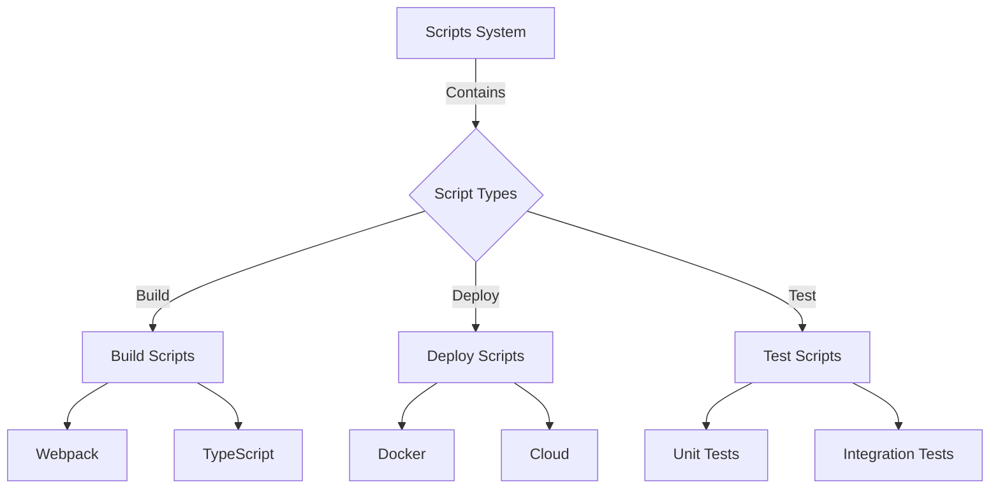
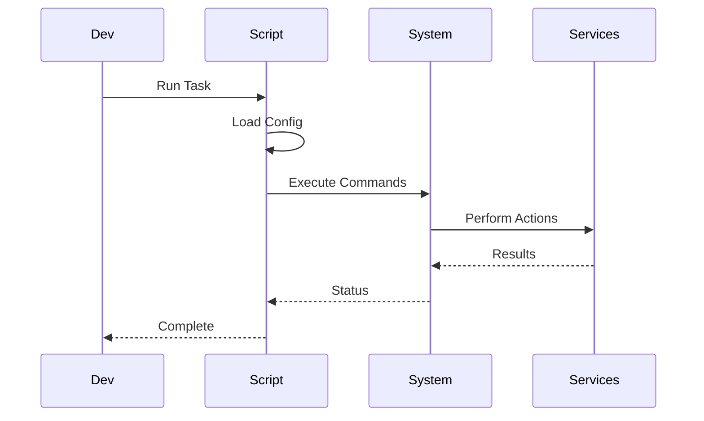
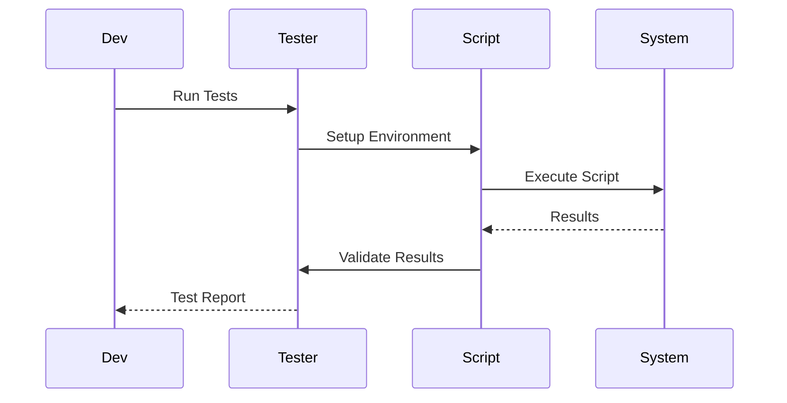

# 📜 Eliza Scripts Development Guide

## 📚 Table of Contents
1. [Overview](#overview)
2. [Script Types](#types)
3. [Development](#development)
4. [Automation](#automation)
5. [Testing](#testing)
6. [Examples](#examples)

## 🌟 Overview

Eliza's Scripts System provides a collection of automation tools and utilities for development, deployment, testing, and maintenance tasks. These scripts help streamline workflows and ensure consistency across the platform.

### 🎯 Key Features
- Task automation
- Build processes
- Deployment scripts
- Testing utilities
- Maintenance tools

## 🏗️ Script Architecture



### 📂 Scripts Structure
```
scripts/
├── build/
│   ├── webpack.config.js
│   ├── tsconfig.json
│   └── build.sh
├── deploy/
│   ├── docker-compose.yml
│   ├── kubernetes/
│   └── deploy.sh
├── test/
│   ├── setup.ts
│   ├── teardown.ts
│   └── run-tests.sh
├── utils/
│   ├── logger.ts
│   ├── config.ts
│   └── helpers.ts
└── maintenance/
    ├── backup.sh
    ├── cleanup.sh
    └── monitor.sh
```

## 🧩 Script Types

### 🛠️ Build Scripts

1. Webpack Configuration
```javascript
// webpack.config.js
module.exports = {
  entry: './src/index.ts',
  output: {
    path: path.resolve(__dirname, 'dist'),
    filename: 'bundle.js'
  },
  module: {
    rules: [
      {
        test: /\.tsx?$/,
        use: 'ts-loader',
        exclude: /node_modules/
      }
    ]
  },
  resolve: {
    extensions: ['.tsx', '.ts', '.js']
  }
};
```

2. TypeScript Configuration
```json
{
  "compilerOptions": {
    "target": "es2020",
    "module": "commonjs",
    "strict": true,
    "esModuleInterop": true,
    "skipLibCheck": true,
    "forceConsistentCasingInFileNames": true,
    "outDir": "./dist"
  },
  "include": ["src/**/*"],
  "exclude": ["node_modules", "**/*.test.ts"]
}
```

### 📦 Deployment Scripts

1. Docker Compose
```yaml
version: '3.8'
services:
  app:
    build: .
    ports:
      - "3000:3000"
    environment:
      NODE_ENV: production
    volumes:
      - ./data:/app/data
    depends_on:
      - db
      - redis
  
  db:
    image: postgres:latest
    environment:
      POSTGRES_PASSWORD: ${DB_PASSWORD}
    volumes:
      - pgdata:/var/lib/postgresql/data
  
  redis:
    image: redis:latest
    volumes:
      - redisdata:/data

volumes:
  pgdata:
  redisdata:
```

2. Kubernetes Deployment
```yaml
apiVersion: apps/v1
kind: Deployment
metadata:
  name: eliza-app
spec:
  replicas: 3
  selector:
    matchLabels:
      app: eliza
  template:
    metadata:
      labels:
        app: eliza
    spec:
      containers:
      - name: eliza
        image: eliza:latest
        ports:
        - containerPort: 3000
        env:
        - name: NODE_ENV
          value: production
```

## 🛠️ Development

### 🔧 Script Development Kit
```typescript
// Script development utilities
class ScriptUtils {
  static async executeCommand(command: string): Promise<void> {
    // Command execution logic
  }
  
  static async validateConfig(config: any): Promise<boolean> {
    // Configuration validation
  }
  
  static log(message: string, level: LogLevel): void {
    // Logging logic
  }
}
```

### 📝 Script Configuration
```typescript
interface ScriptConfig {
  name: string;
  description: string;
  environment: 'development' | 'staging' | 'production';
  variables: {
    [key: string]: string;
  };
  commands: {
    [key: string]: string;
  };
}
```

## 🤖 Automation

### 🎯 Task Automation



### 📡 CI/CD Integration
```yaml
# GitHub Actions workflow
name: CI/CD Pipeline

on:
  push:
    branches: [ main ]
  pull_request:
    branches: [ main ]

jobs:
  build:
    runs-on: ubuntu-latest
    steps:
    - uses: actions/checkout@v2
    - name: Setup Node.js
      uses: actions/setup-node@v2
      with:
        node-version: '18'
    - name: Install Dependencies
      run: pnpm install
    - name: Run Tests
      run: pnpm test
    - name: Build
      run: pnpm build
```

## 🧪 Testing

### 📊 Script Testing Framework
```typescript
interface ScriptTest {
  name: string;
  setup(): Promise<void>;
  execute(): Promise<void>;
  validate(): Promise<boolean>;
  teardown(): Promise<void>;
}

class ScriptTester {
  constructor(config: ScriptTest) {
    // Initialize tester
  }
  
  async runTest() {
    // Test execution logic
  }
}
```

### 🔍 Validation Process



## 💡 Examples

### 1. Build Script

```bash
#!/bin/bash
# build.sh

# Set environment variables
export NODE_ENV=production

# Clean dist directory
rm -rf dist/

# Run TypeScript compilation
echo "Compiling TypeScript..."
pnpm tsc

# Run Webpack build
echo "Running Webpack build..."
pnpm webpack --config webpack.config.js

# Run post-build tasks
echo "Running post-build tasks..."
node scripts/post-build.js

echo "Build complete!"
```

### 2. Deployment Script

```typescript
// deploy.ts
async function deploy() {
  try {
    // Build application
    await executeCommand('pnpm build');
    
    // Run tests
    await executeCommand('pnpm test');
    
    // Deploy to Docker
    await executeCommand('docker-compose up -d');
    
    // Verify deployment
    await verifyDeployment();
    
    console.log('Deployment successful!');
  } catch (error) {
    console.error('Deployment failed:', error);
    process.exit(1);
  }
}
```

## 📚 Best Practices

### 1. Script Development
- Use proper error handling
- Implement logging
- Add progress indicators
- Include cleanup logic
- Document requirements

### 2. Automation
- Modularize tasks
- Use configuration files
- Implement retries
- Add validation
- Monitor execution

### 3. Maintenance
- Regular updates
- Version control
- Documentation
- Error tracking
- Performance monitoring

## 🔍 Monitoring

### 📊 Script Metrics
1. Execution Stats
   - Run time
   - Success rate
   - Error frequency
   - Resource usage
   
2. Performance Metrics
   - Task completion time
   - Resource efficiency
   - Bottlenecks
   - Optimization opportunities
   
3. Usage Statistics
   - Frequency of use
   - Common failures
   - User patterns
   - Resource consumption

## 🛠️ Troubleshooting

### Common Issues
1. Execution Problems
   - Permission errors
   - Environment issues
   - Dependency conflicts
   
2. Performance Issues
   - Slow execution
   - Resource constraints
   - Bottlenecks
   
3. Integration Problems
   - API failures
   - Service connectivity
   - Configuration errors

## 🔒 Security

### Security Guidelines
1. Script Security
   - Input validation
   - Environment isolation
   - Access control
   
2. Data Protection
   - Secure storage
   - Encryption
   - Access logging
   
3. Compliance
   - Audit logging
   - Policy enforcement
   - Regular reviews

---

*This documentation is continuously updated as the Scripts System evolves.* 