# 🔄 Workflow Diagrams

## 📊 System Architecture Overview

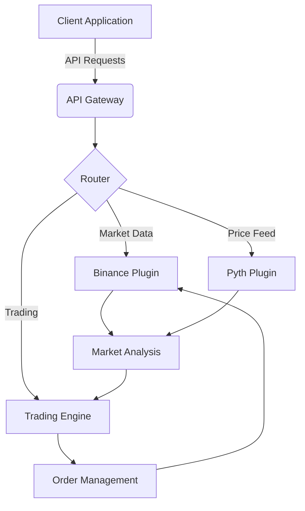

## 🔄 Trading Workflow

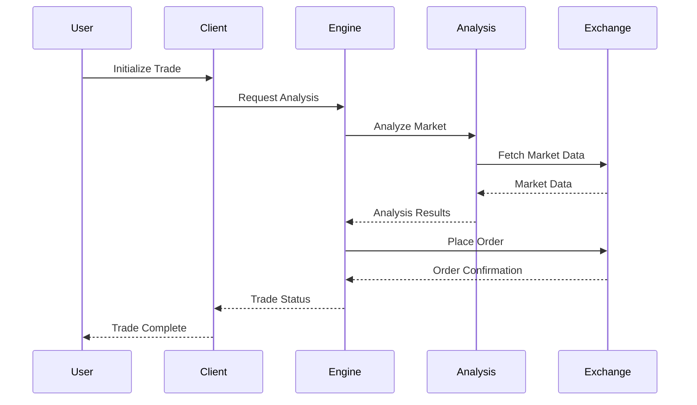

## 📈 Market Analysis Process

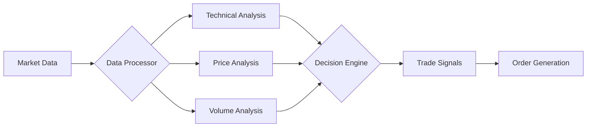

## 🔐 Authentication Flow

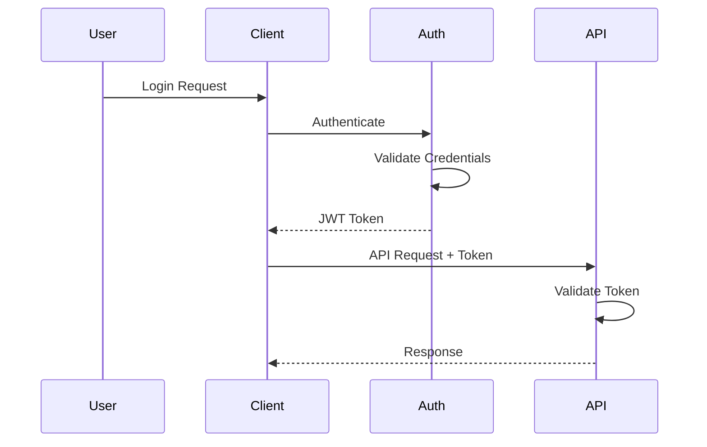

## 📊 Data Flow Architecture

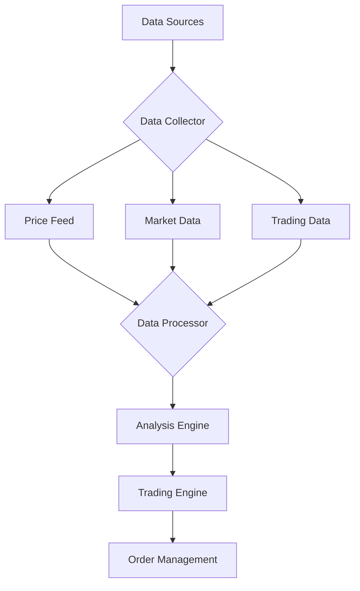

## 🔄 Plugin System Architecture

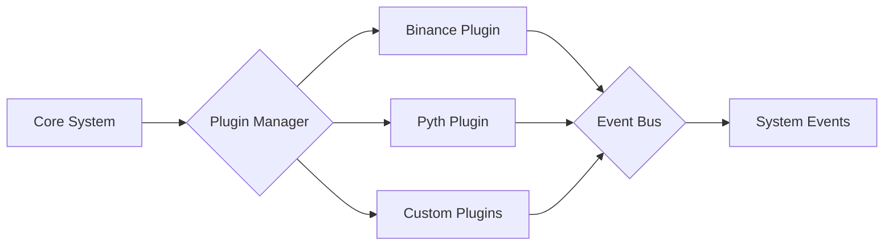

## 📈 Order Execution Flow

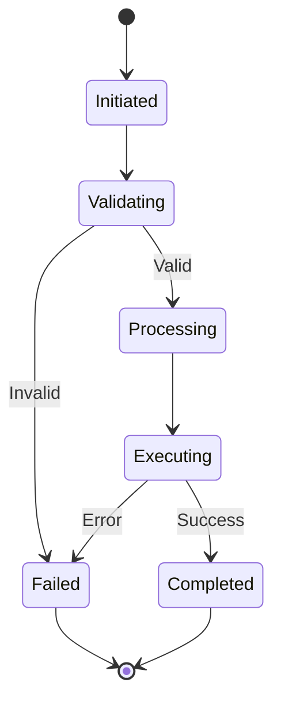

## 🔄 Character System Workflow

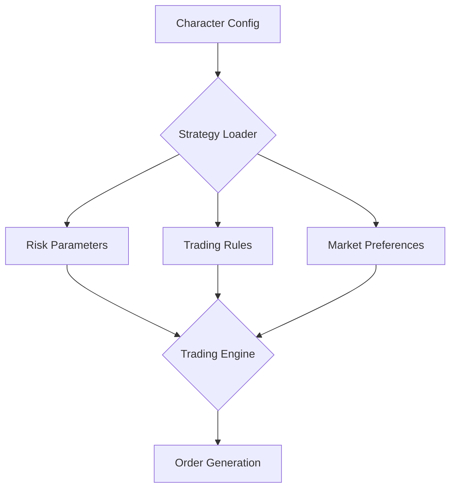

## 📊 Monitoring System

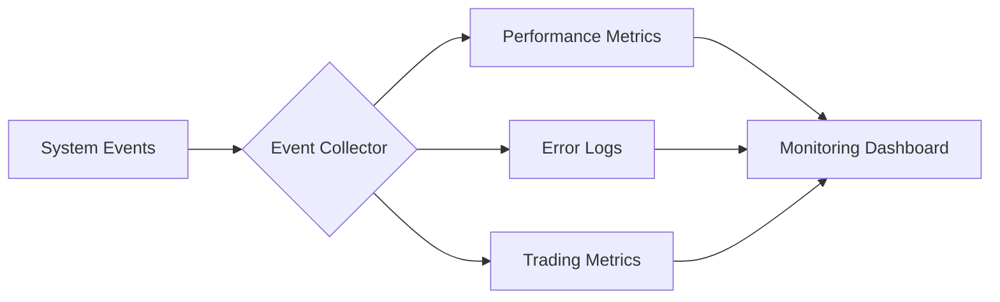

## 🔄 Deployment Pipeline

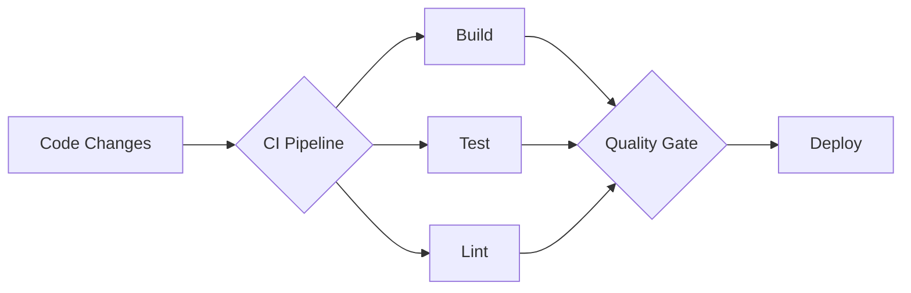

## 📈 Error Handling Flow

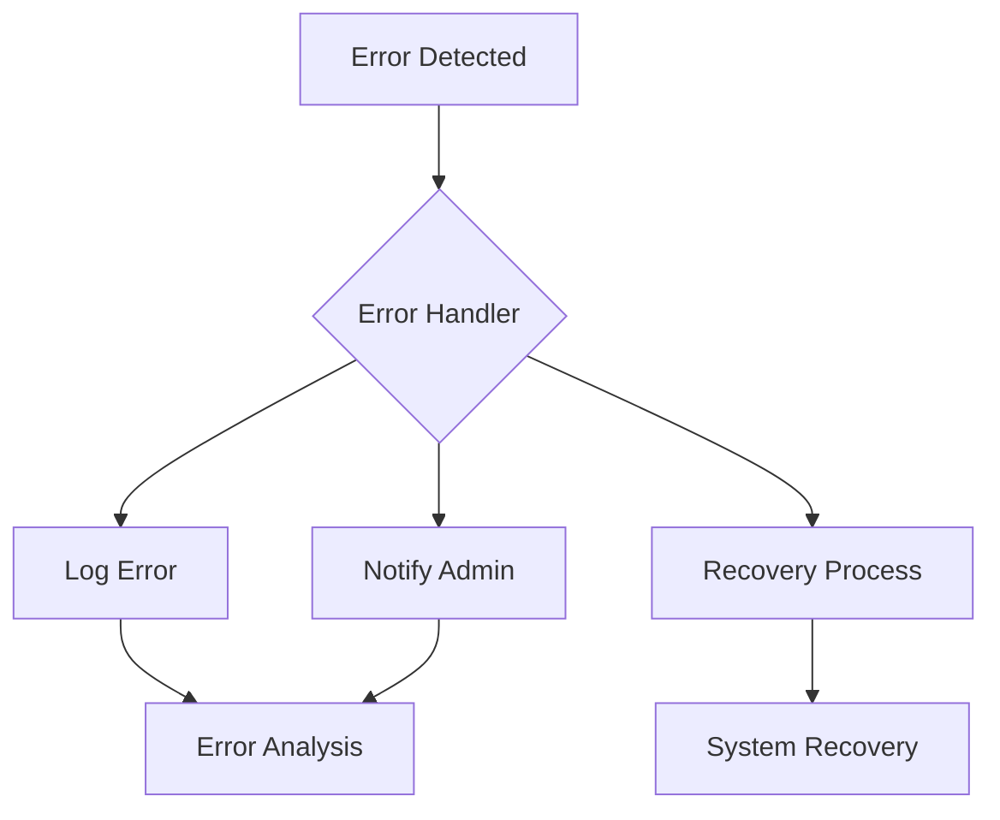

## 🔌 Plugin Lifecycle Management

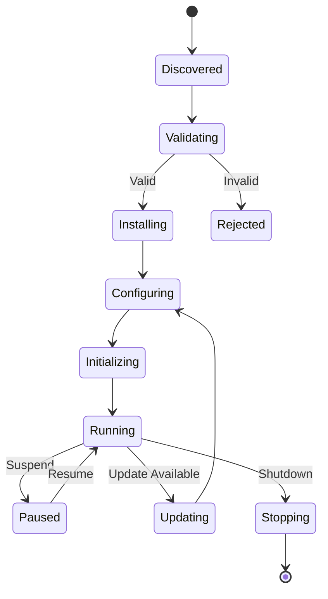

## 🔄 Data Synchronization Flow

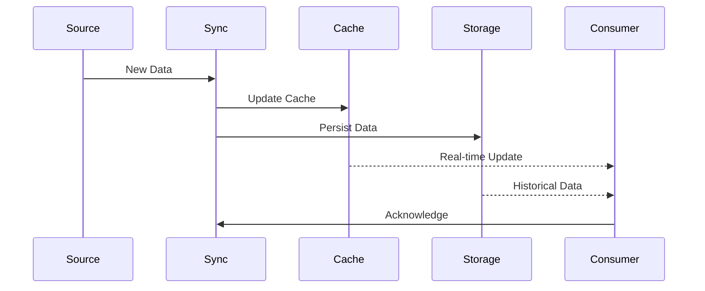

## 🌐 Integration Patterns

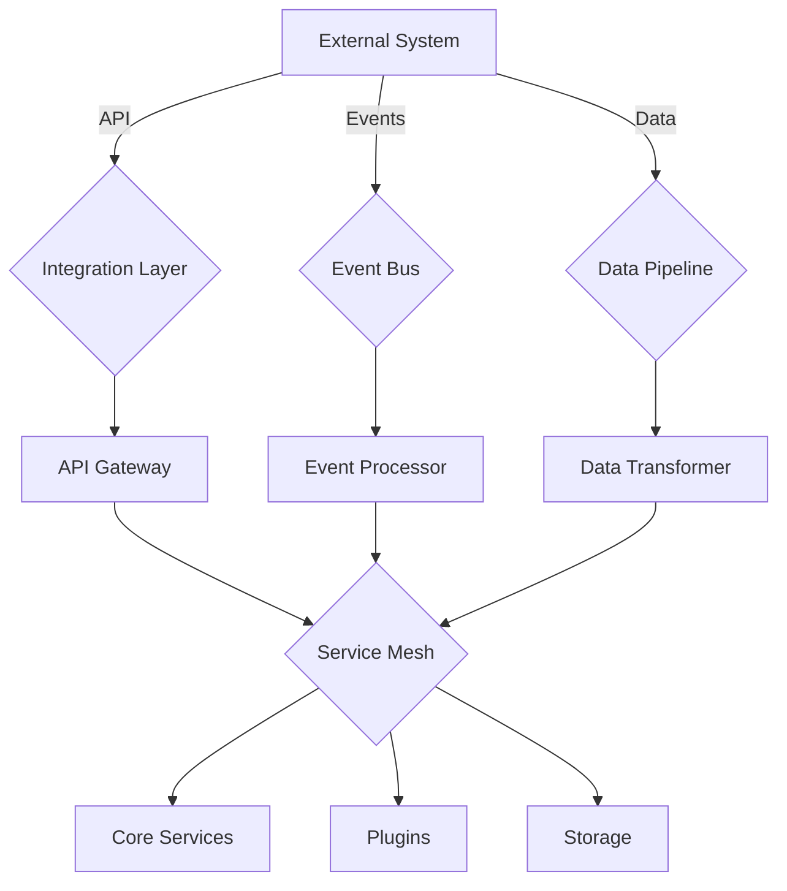

## 🔍 Search and Analysis Flow

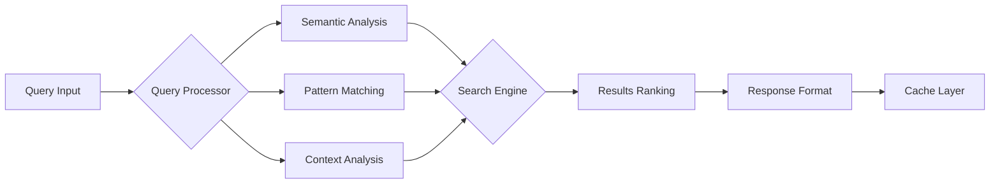

## 🤖 AI Processing Pipeline

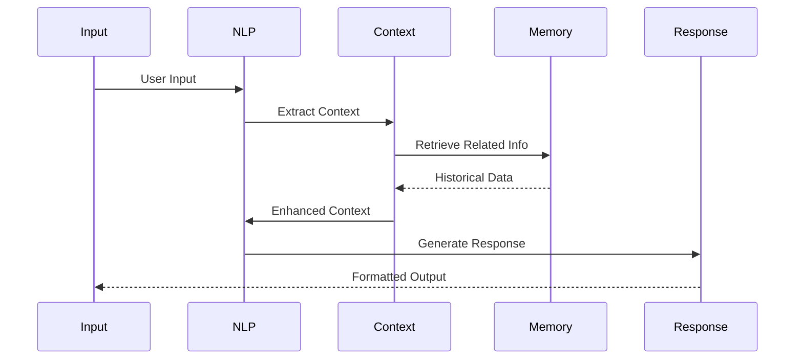

## 🔐 Security and Access Control

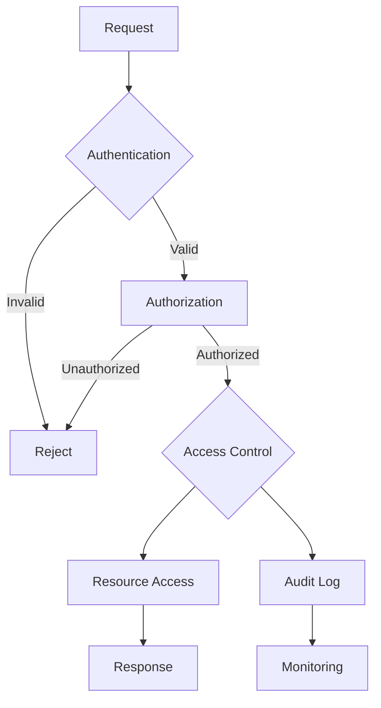

## 📊 Real-time Analytics Pipeline

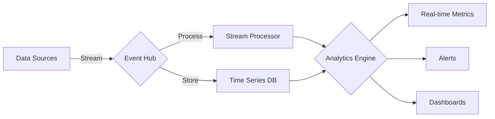

## 🔄 State Management Flow

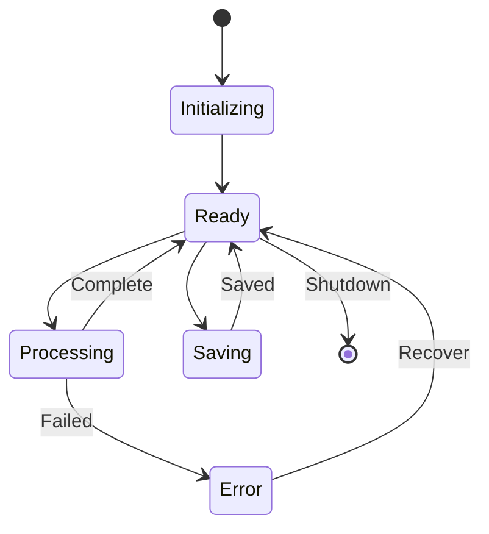

## 🗄️ Database Integration Workflow

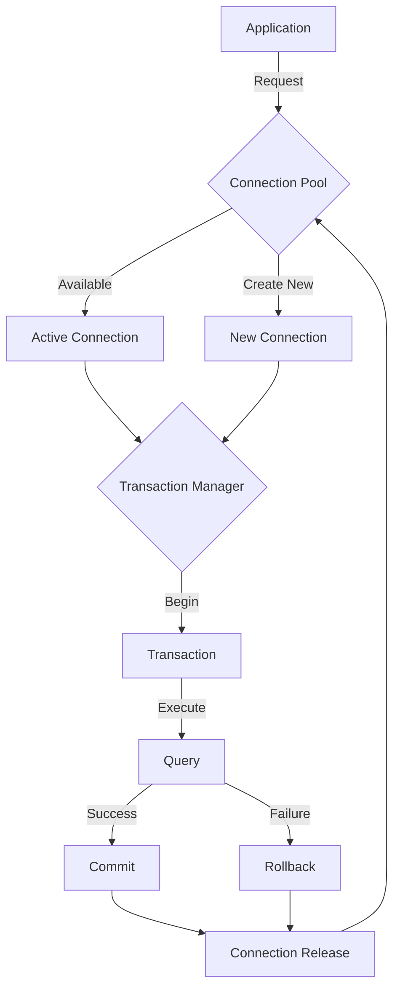

## 🔐 Security Implementation Flow

```mermaid
sequenceDiagram
    participant Client
    participant Gateway
    participant Auth
    participant RBAC
    participant Service
    participant Audit

    Client->>Gateway: Request
    Gateway->>Auth: Validate Token
    Auth->>RBAC: Check Permissions
    
    alt Authorized
        RBAC->>Service: Process Request
        Service->>Audit: Log Action
        Service-->>Client: Response
    else Unauthorized
        RBAC-->>Gateway: Deny Access
        Gateway-->>Client: 403 Forbidden
    end
    
    Audit->>Audit: Store Log
```

## 🌐 API Integration Flow

```mermaid
graph TB
    A[Client Request] --> B{API Gateway}
    B --> C[Rate Limiter]
    C --> D{Authentication}
    D -->|Valid| E[Route Handler]
    D -->|Invalid| F[Error Handler]
    
    E --> G{Service Router}
    G --> H[Service A]
    G --> I[Service B]
    G --> J[Service C]
    
    H --> K{Response Handler}
    I --> K
    J --> K
    
    K --> L[Cache Layer]
    L --> M[Response Formatter]
    M --> N[Client Response]
```

## ⛓️ Chain Integration Flow

```mermaid
graph TB
    A[Transaction Request] --> B{Chain Provider}
    B --> C[Transaction Builder]
    C --> D{Gas Estimator}
    D --> E[Nonce Manager]
    
    E --> F{Transaction Sender}
    F -->|Success| G[Transaction Monitor]
    F -->|Failure| H[Retry Handler]
    
    G --> I[Event Listener]
    I --> J[Event Processor]
    
    H --> K[Backoff Strategy]
    K --> F
    
    J --> L[State Update]
    L --> M[Callback Handler]
```

## ⚠️ Error Handling Flow

```mermaid
graph TB
    A[Error Detected] --> B{Error Classifier}
    B -->|Operational| C[Error Logger]
    B -->|Critical| D[Alert System]
    
    C --> E{Recovery Strategy}
    D --> F[Emergency Handler]
    
    E -->|Retry| G[Retry Handler]
    E -->|Circuit Break| H[Circuit Breaker]
    E -->|Fallback| I[Fallback System]
    
    G --> J{Resolution Check}
    H --> J
    I --> J
    
    J -->|Resolved| K[Success Handler]
    J -->|Failed| L[Failure Handler]
```

## 🚀 Performance Optimization Flow

```mermaid
graph LR
    A[System Event] --> B{Performance Monitor}
    B --> C[CPU Profiler]
    B --> D[Memory Profiler]
    B --> E[Network Profiler]
    
    C --> F{Analysis Engine}
    D --> F
    E --> F
    
    F --> G[Optimization Selector]
    G --> H[CPU Optimization]
    G --> I[Memory Optimization]
    G --> J[Network Optimization]
    
    H --> K{Performance Validator}
    I --> K
    J --> K
    
    K --> L[Metrics Reporter]
```

## 🧪 Testing Infrastructure Flow

```mermaid
graph TB
    A[Test Suite] --> B{Test Runner}
    B --> C[Unit Tests]
    B --> D[Integration Tests]
    B --> E[E2E Tests]
    
    C --> F{Test Reporter}
    D --> F
    E --> F
    
    F --> G[Coverage Analysis]
    F --> H[Performance Analysis]
    
    G --> I[Report Generator]
    H --> I
    
    I --> J[CI/CD Pipeline]
    J --> K[Deployment Decision]
```

## 📊 Database Replication Flow

```mermaid
graph TB
    A[Write Request] -->|Primary| B[Master DB]
    B -->|Sync| C[Replica 1]
    B -->|Sync| D[Replica 2]
    B -->|Async| E[Replica 3]
    
    F[Read Request] -->|Load Balancer| G{Router}
    G -->|Read| C
    G -->|Read| D
    G -->|Read| E
    
    H[Health Check] --> B
    H --> C
    H --> D
    H --> E
```

## 🛡️ Security Monitoring Flow

```mermaid
graph LR
    A[Security Events] -->|Collect| B{Event Processor}
    B -->|Analyze| C[Threat Detection]
    B -->|Monitor| D[Performance]
    B -->|Track| E[Compliance]
    
    C -->|Alert| F[Security Team]
    D -->|Report| G[Dashboard]
    E -->|Generate| H[Audit Reports]
    
    F -->|Action| I[Response Team]
    G -->|Review| J[System Admin]
    H -->|Verify| K[Compliance Team]
```

---

*Note: These diagrams are generated using mermaid.js and can be viewed in compatible markdown viewers.* 