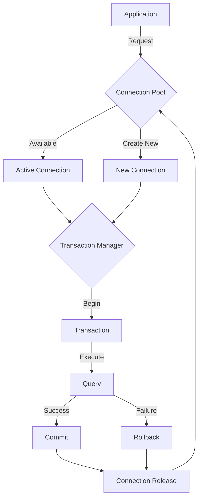
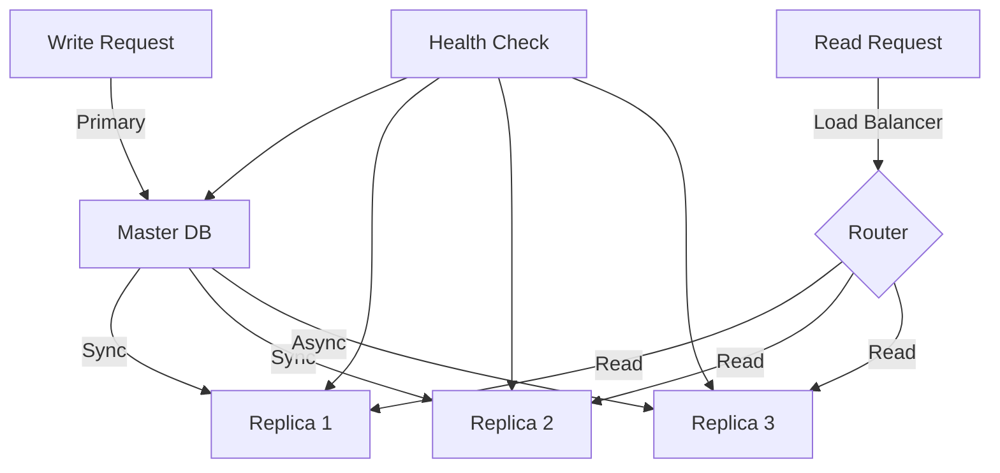

# 🗄️ Database Integration Guide

## 📚 Table of Contents
1. [Overview](#overview)
2. [Architecture](#architecture)
3. [Connection Management](#connection-management)
4. [Transaction Handling](#transaction-handling)
5. [Replication Strategy](#replication-strategy)
6. [Error Handling](#error-handling)
7. [Performance Optimization](#performance-optimization)
8. [Monitoring](#monitoring)
9. [Implementation Examples](#implementation-examples)

## 🌟 Overview

The Database Integration system provides a robust, scalable, and efficient way to manage database operations across the Eliza Market Scanner platform. It includes:

- Connection pooling
- Transaction management
- Replication support
- Error handling
- Performance optimization
- Monitoring and logging

## 🏗️ Architecture

### Database Integration Workflow


## 🔌 Connection Management

### Connection Pool Configuration
```typescript
interface ConnectionPoolConfig {
  maxSize: number;
  minSize: number;
  idleTimeout: number;
  acquireTimeout: number;
  healthCheck: {
    enabled: boolean;
    interval: number;
    timeout: number;
  };
}
```

### Connection Manager Implementation
```typescript
class ConnectionManager {
  private pool: ConnectionPool;
  private metrics: ConnectionMetrics;
  
  async getConnection(): Promise<Connection> {
    // Connection acquisition logic
  }
  
  async releaseConnection(conn: Connection): Promise<void> {
    // Connection release logic
  }
  
  async healthCheck(): Promise<HealthStatus> {
    // Health check implementation
  }
}
```

## 📊 Transaction Handling

### Transaction Manager
```typescript
interface TransactionConfig {
  isolation: IsolationLevel;
  timeout: number;
  retryPolicy: RetryPolicy;
}

class TransactionManager {
  async beginTransaction(config: TransactionConfig): Promise<Transaction> {
    // Transaction start logic
  }
  
  async commit(transaction: Transaction): Promise<void> {
    // Commit logic
  }
  
  async rollback(transaction: Transaction): Promise<void> {
    // Rollback logic
  }
}
```

## 🔄 Replication Strategy

### Replication Flow


### Replication Configuration
```typescript
interface ReplicationConfig {
  master: DatabaseConfig;
  replicas: DatabaseConfig[];
  syncMode: 'sync' | 'async';
  readPreference: 'primary' | 'secondary' | 'nearest';
}
```

## ⚠️ Error Handling

### Error Types
```typescript
enum DatabaseErrorType {
  CONNECTION_ERROR = 'CONNECTION_ERROR',
  QUERY_ERROR = 'QUERY_ERROR',
  TRANSACTION_ERROR = 'TRANSACTION_ERROR',
  REPLICATION_ERROR = 'REPLICATION_ERROR'
}

interface DatabaseError {
  type: DatabaseErrorType;
  code: string;
  message: string;
  retryable: boolean;
}
```

### Error Recovery
```typescript
class DatabaseErrorHandler {
  async handleError(error: DatabaseError): Promise<void> {
    switch (error.type) {
      case DatabaseErrorType.CONNECTION_ERROR:
        return this.handleConnectionError(error);
      case DatabaseErrorType.QUERY_ERROR:
        return this.handleQueryError(error);
      // Additional error handling
    }
  }
}
```

## 🚀 Performance Optimization

### Query Optimization
```typescript
interface QueryOptimizer {
  analyze(query: string): QueryAnalysis;
  suggest(analysis: QueryAnalysis): QuerySuggestions;
  optimize(query: string): string;
}
```

### Index Management
```typescript
interface IndexManager {
  createIndex(table: string, columns: string[]): Promise<void>;
  dropIndex(table: string, indexName: string): Promise<void>;
  analyzeIndexUsage(): Promise<IndexAnalysis>;
}
```

## 📊 Monitoring

### Metrics Collection
```typescript
interface DatabaseMetrics {
  connections: {
    active: number;
    idle: number;
    total: number;
  };
  queries: {
    active: number;
    completed: number;
    failed: number;
  };
  performance: {
    queryLatency: number;
    connectionLatency: number;
    replicationLag: number;
  };
}
```

### Health Checks
```typescript
interface HealthCheck {
  checkConnectivity(): Promise<boolean>;
  checkReplication(): Promise<ReplicationStatus>;
  checkPerformance(): Promise<PerformanceMetrics>;
}
```

## 💡 Implementation Examples

### Basic Usage
```typescript
const db = new DatabaseManager({
  pool: {
    maxSize: 20,
    minSize: 5,
    idleTimeout: 30000
  },
  replication: {
    enabled: true,
    replicas: 2
  }
});

// Query execution
const result = await db.query('SELECT * FROM trades WHERE symbol = ?', ['BTC-USD']);

// Transaction handling
const txn = await db.beginTransaction();
try {
  await txn.execute('INSERT INTO trades (symbol, price) VALUES (?, ?)', ['BTC-USD', 50000]);
  await txn.execute('UPDATE balances SET amount = amount - ?', [50000]);
  await txn.commit();
} catch (error) {
  await txn.rollback();
  throw error;
}
```

### Advanced Usage
```typescript
// Custom query builder
const queryBuilder = new QueryBuilder()
  .select('t.id', 't.symbol', 't.price')
  .from('trades t')
  .join('orders o', 't.order_id = o.id')
  .where('t.symbol = ?', 'BTC-USD')
  .orderBy('t.timestamp DESC')
  .limit(10);

// Execute with connection from pool
const connection = await db.getConnection();
try {
  const results = await connection.execute(queryBuilder.build());
  // Process results
} finally {
  await connection.release();
}
```

## 📚 Best Practices

1. Connection Management
   - Use connection pooling
   - Implement proper release
   - Monitor pool metrics
   - Configure timeouts

2. Transaction Handling
   - Use appropriate isolation levels
   - Implement retry logic
   - Handle deadlocks
   - Monitor long-running transactions

3. Error Handling
   - Implement comprehensive error types
   - Use proper recovery strategies
   - Log all database errors
   - Monitor error rates

4. Performance
   - Optimize queries
   - Use appropriate indexes
   - Monitor query performance
   - Implement caching when needed

5. Monitoring
   - Track key metrics
   - Set up alerts
   - Monitor replication lag
   - Check system health

## 📈 Performance Considerations

1. Connection Pool Optimization
   ```typescript
   const poolConfig: PoolConfig = {
     min: 10,
     max: 50,
     acquireTimeout: 30000,
     idleTimeout: 60000,
     evictionRunInterval: 30000
   };
   ```

2. Query Optimization
   ```typescript
   const queryOptimizer = new QueryOptimizer({
     maxQueryLength: 1000,
     enableCache: true,
     cacheTimeout: 3600,
     analyzeComplexQueries: true
   });
   ```

3. Index Strategy
   ```typescript
   const indexStrategy = {
     trades: [
       { columns: ['symbol', 'timestamp'], unique: false },
       { columns: ['order_id'], unique: true },
       { columns: ['user_id', 'timestamp'], unique: false }
     ]
   };
   ```

## 🔍 Monitoring Setup

1. Metrics Collection
   ```typescript
   const metrics = new DatabaseMetrics({
     collectInterval: 5000,
     retentionPeriod: '7d',
     alertThresholds: {
       connectionUsage: 80,
       queryLatency: 1000,
       errorRate: 0.01
     }
   });
   ```

2. Health Checks
   ```typescript
   const healthCheck = new HealthChecker({
     interval: 30000,
     timeout: 5000,
     checks: ['connectivity', 'replication', 'performance']
   });
   ```

---

*Note: This guide is continuously updated as the database integration system evolves.* 